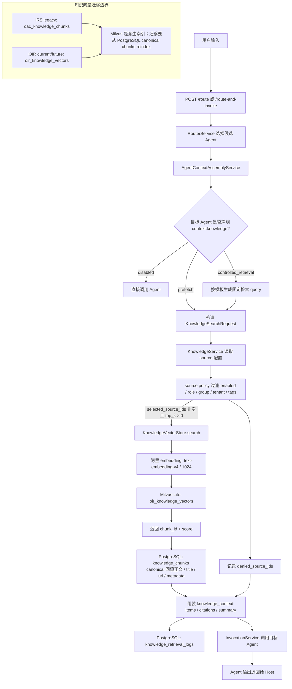

# Evidence Provider

Evidence Provider 是可选插件，运行在 LLM 路由之前，用于向路由器提供外部证据、意图提示或固定问题命中结果。

它的定位不是 Agent Registry，也不是 Agent 执行阶段的知识库工具，而是“给路由决策提供上下文”的轻量扩展点。

## 输出能力

Evidence Provider 可以返回：

- `intent_hint`：弱意图提示，帮助 LLM 理解用户可能想做什么。
- `candidate_agent_ids`：弱候选提示，仅用于上下文和调试；当前版本不用于裁剪 LLM 候选集。
- `route_override`：强固定问题路由，例如固定问法直接映射到某个 Agent。
- `evidence`：可安全记录的证据片段和元数据，用于上下文、调试和审计。

## MVP 插件

当前包含：

- `NoopEvidenceProvider`：空实现，不提供任何证据。
- `FileFixedQuestionEvidenceProvider`：基于本地 YAML 文件的固定问题命中插件。

固定问题配置示例：

```yaml
fixed_questions:
  - question: 帮我打开客户画像页面
    match_type: exact
    strength: strong
    intent_hint: open_customer_profile_help
    candidate_agent_ids:
      - system_usage_guide
    route_override:
      action: open_agent
      target_agent_id: system_usage_guide
      message: 已定位到系统使用指引，将由宿主系统打开客户画像相关页面。
```

## 固定问题命中规则

固定问题适合处理“用户问题与预设问题完全一致或高度稳定”的场景，例如：

- 常见入口问题。
- 高频固定问法。
- 需要稳定映射到特定 Agent 的标准问题。
- 从旧系统知识库迁移来的固定问与意图映射。

强路由覆盖必须在 Registry 可用性过滤之后执行。也就是说，即使固定问题命中了某个 Agent，如果该 Agent 对当前用户不可用，路由器也必须拒绝该覆盖结果，返回无权限提示，并且不进入 LLM 兜底判断。

当前路由顺序为：权限过滤 > 固定问强命中 > 标签/语义观察信号 > LLM 判断。标签/语义信号不会覆盖固定问强命中，也不会裁剪传给 LLM 的候选 Agent。

M6 引入 Evidence Provider Scheduler 后，固定问题仍保留特殊地位：

- 强固定问命中可在目标 Agent 可用时直接返回 `route_override`，不受普通证据片段预算裁剪影响。
- 强固定问命中但目标 Agent 不可用时返回无权限，不再进入 LLM 兜底。
- 弱固定问只进入上下文和调试 metadata，不缩小权限过滤后的候选集。
- 固定问只做“问题到意图/路由”的映射，本 change 不定义固定 FAQ 答案绕过。

## 与知识库检索的关系

从 `intent_recon_sys` 迁移而来的路由阶段知识证据，可以作为 Evidence Provider 插件；Agent 执行阶段知识检索则通过 `AgentDefinition.context.knowledge` 和 `/api/v1/knowledge/search` 治理。

推荐方式：

- 路由阶段知识库检索插件返回证据片段、来源、分数和候选意图。
- 路由器将检索结果作为 LLM 路由上下文。
- 如果检索结果来自固定问映射，可返回强 `route_override`；强命中目标无权限时应保留 denied 信号，供路由器返回无权限提示。
- Agent 执行阶段需要文档证据时，使用 `knowledge_context` 预取或固定 workflow node 的 controlled retrieval。
- 知识库文件管理、向量索引、召回策略等能力保留在 Knowledge Source、向量存储或后续 adapter 内部。

这样可以让核心项目保持通用，同时保留“固定问命中到固定意图”的扩展能力。

## Agent 执行阶段 Knowledge 流程

Evidence Provider 运行在路由前，主要服务于“该路由到谁”的判断；Agent 执行阶段的文档证据则由 `knowledge_context` 承接。用户输入后的整体流程如下：



关键边界：

- `oac_knowledge_chunks` 是 IRS legacy collection，过渡期保留。
- `oir_knowledge_vectors` 是 OIR knowledge collection，当前真实 smoke 写入和检索它。
- Milvus 只作为派生向量索引；正文、引用、权限和迁移事实以 PostgreSQL `knowledge_sources` / `knowledge_chunks` 为准。
- `knowledge_context` 会进入 Agent invocation input，供目标 Agent 使用。

## Milvus 正文与 Canonical 正文

检索结果不直接信任 Milvus 里的正文，而是用 Milvus 返回的 `chunk_id` 回 PostgreSQL 回填 canonical chunk。两种做法的区别：

| 方案 | 优点 | 风险 |
| --- | --- | --- |
| Milvus 只存索引字段，例如 `chunk_id`、`source_id`、向量 | PostgreSQL 是唯一事实源；权限、引用、删除、迁移和审计更一致；embedding 或 chunk 策略变化时可以重建索引 | 检索后多一次 PostgreSQL 回填 |
| Milvus 同时存正文并直接返回正文 | 少一次数据库读取，局部实现更简单 | 正文可能与 PostgreSQL 不一致；权限或删除后容易残留旧内容；IRS/OIR 双 collection 迁移时难判断哪个正文可信；引用和审计链路更容易漂移 |

因此 OIR 当前采用第一种：Milvus 命中只证明“哪个 chunk 语义相关”，不证明“正文事实是什么”。真正传给 Agent 的内容来自 PostgreSQL canonical chunk。

## Agent Invocation Input

`Agent invocation input` 是 OIR 调用目标 Agent 时传给 Invoker 的结构化输入对象。它不是用户原始文本本身，而是“用户输入 + 平台组装的运行上下文”的合并结果。

典型字段包括：

```json
{
  "text": "用户原始问题",
  "memory_context": {
    "summary": "...",
    "items": [],
    "status": "ok"
  },
  "knowledge_context": {
    "summary": "...",
    "items": [],
    "citations": [],
    "source_ids": [],
    "status": "ok"
  }
}
```

不同 Invoker 会用同一个 invocation input 调用不同类型的 Agent：mock、本地函数、HTTP Agent、UI handoff 或后续 workflow node。这样 Agent 不需要知道 mem0、Milvus、PostgreSQL 或 Evidence Provider 的内部实现，只消费稳定的 `memory_context` / `knowledge_context` 合约。

## 安全与审计

Evidence Provider 返回的内容可能进入路由日志，因此应遵守以下约束：

- 不返回未脱敏的密钥、Token 或敏感凭证。
- 证据片段应尽量短，避免写入大段原始文档。
- 元数据中保留来源 ID、命中分数和匹配类型，方便排查。
- 强路由覆盖必须记录命中来源，便于审计为什么绕过了普通 LLM 路由。
