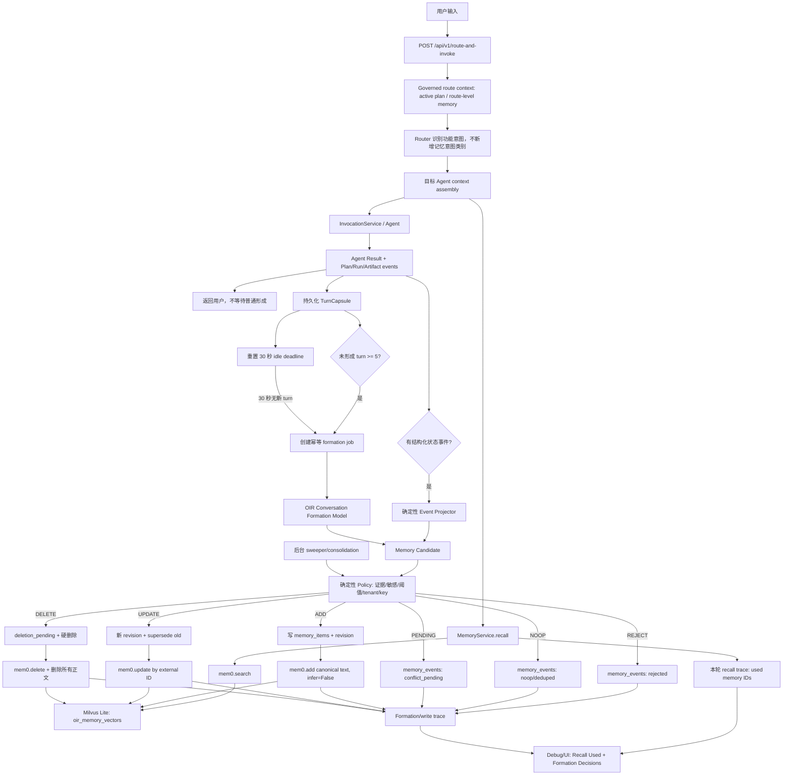

# OIR 对话记忆自动形成与生命周期治理方案

状态：已实现设计记录；首版实现与上线契约见本文第 18 节

首次收敛日期：2026-07-10；实现契约更新：2026-07-14

> 本文保留调研、方案比较和设计取舍。当前部署、门禁与回退操作以 [Conversation Memory Formation 上线与回退](../../App-Adr/develop/skills/runbooks/conversation-memory-formation-rollout.md) 为准。

适用范围：自托管 `mem0ai 2.0.11`、Milvus Lite `oir_memory_vectors`、OIR PostgreSQL `memory_items` / `memory_events`

## 1. 结论摘要

本方案不再采用“P0 每轮同步抽取、P1 每轮异步抽取、P2 固定轮次抽取”三套并行实现。推荐只建设一个 `MemoryFormationPipeline`，由不同事实源和触发器复用：

1. Plan、Run、Result、Artifact 等结构化事实源发生变化时，立即生成确定性的 memory projection。
2. 普通对话按完整 turn 累计，默认每 5 轮或空闲 30 秒触发一次形成；Host 暂无可靠 session close 事件，因此 correctness 不依赖 close。
3. 后台任务负责 consolidation、TTL 硬删除、冲突复核、revision/superseded 和索引修复。
4. 一轮是同一请求关联的一组 user + assistant，以及必要的 Agent Result、Plan/Event/Artifact 引用；“进入形成窗口”不等于“写入长期记忆”。
5. 普通对话由 OIR 形成模型提出结构化候选和 `ADD/UPDATE/DELETE/IGNORE` 建议，确定性 policy 才有最终裁决权；模型不能直接执行硬删除。
6. OIR 审核通过后，以单条 canonical memory 文本调用 mem0 `add(..., infer=False)`；更新调用 mem0 `update`，删除调用 mem0 `delete`。不让 mem0 再次从 transcript 推理。
7. `memory_items` 保存当前 active projection，新增 `memory_revisions` 保存版本链，`memory_events` 保存不含敏感正文的操作审计。PostgreSQL 始终是 canonical ledger，mem0/Milvus 是派生向量索引。
8. 普通更新保留同一逻辑 `memory_id` 的 revision/superseded 关系；用户删除和 TTL 到期均硬删除 `memory_items` 正文、全部 revision 正文和 mem0 vector，只保留不含正文的 tombstone event。
9. 默认自动变更阈值配置化：`>= 0.90` 可自动执行，`0.70-0.90` 进入 pending/conflict，`< 0.70` 拒绝。DELETE 还必须满足显式用户证据或确定性生命周期原因，并唯一命中目标。
10. 不增加 Router 功能意图类别。未完成任务通过 Plan/Task 的 canonical ID 和状态投影支持“继续上次任务”；它是上下文事实，不是强指令，不能覆盖用户当前的新任务。

P0/P1/P2 在本文中表示累积实施阶段，不是运行时三选一，也不是三套抽取链路。

## 2. 已确认决策

| 决策项 | 结论 |
| --- | --- |
| mem0 范围 | 首版只面向自托管 `mem0ai 2.0.11 + Milvus Lite` |
| 形成责任 | OIR 形成模型生成并审核普通对话候选，mem0 使用 `infer=False` 存储 |
| turn 定义 | 一组 user + assistant，以及该请求关联的其他结果信息 |
| 普通对话触发 | 默认 5 轮窗口或 30 秒 idle，先到者触发 |
| session close | Host 暂无可靠事件，不作为首版必要触发器 |
| 显式自然语言记忆 | 不要求立即生效，随 5 轮/idle 形成；不实现脆弱的纯关键词写入器 |
| 结构化任务/结果 | Event 产生时立即形成确定性 projection |
| 更新历史 | 保留 revision/superseded 关系 |
| 用户删除 | 硬删除正文、revision 正文和 mem0 vector |
| TTL | 到期即不可召回，并在最近一个 sweeper 周期内硬删除正文和 vector |
| 模型权限 | 模型只提出操作，确定性 policy 决定，模型不能直接硬删除 |
| 更新阈值 | `>=0.90` 自动、`0.70-0.90` pending/conflict、`<0.70` 拒绝，全部配置化 |
| 数据模型 | 新增独立 `memory_revisions`，不只依赖 `memory_events` 保存旧版本 |
| Router | 不新增功能意图；route-level context 通过现有 governed context pipeline 处理 |
| 本需求边界 | 只包含“自动形成与生命周期治理” |

待人工确认项：无。

## 3. 调研范围与来源

### 3.1 当前仓库

本次重点复核：

- `docs/App-Desc/architecture/mem0-memory-integration.md`
- `docs/App-Research/validation/memory-knowledge-debug-console-e2e-test-plan.md`
- `docs/App-Research/validation/memory-knowledge-debug-console-e2e-test-report.md`
- `app/services/memory_service.py`
- `app/services/memory_adapter.py`
- `app/services/invocation_service.py`
- `app/services/agent_context_service.py`
- `app/services/context_pipeline_service.py`
- `app/services/context_providers.py`
- `app/schemas/memory.py`
- `app/db/models.py`
- `sql/postgresql_schema.sql`
- `web/src/App.tsx`
- `web/src/types.ts`
- `openspec/changes/refactor-governed-context-pipeline/design.md`

当前工作树中的 `refactor-governed-context-pipeline` 正在实现 Router 前的受治理 context projection，但其设计明确不包含自动记忆写入。本方案应作为独立 change，消费其 route/agent context 边界，不混入当前 refactor。

### 3.2 Context7 与本地锁定版本

按项目规则使用 Context7：

```text
npx ctx7@latest library mem0 "..."
npx ctx7@latest docs /mem0ai/mem0 "..."
npx ctx7@latest docs /websites/mem0_ai "..."
```

本地运行环境确认安装版本为 `mem0ai 2.0.11`。除官方文档外，本次还直接复核了该版本 `mem0/memory/main.py`，避免把托管 Platform 或历史实现行为误认为当前 OSS 行为。

### 3.3 公开资料

| 来源 | 用于支持的结论 |
| --- | --- |
| [Mem0 How It Works](https://docs.mem0.ai/core-concepts/how-it-works) | 记忆系统包含 extraction、update、storage/retrieval 等阶段，不应把向量 append 当完整生命周期。 |
| [Mem0 Add Memory](https://docs.mem0.ai/core-concepts/memory-operations/add) | OSS `add` 接收文本或有序 messages；`infer=False` 跳过 LLM 推理并直接存储输入。 |
| [Mem0 Update Memory](https://docs.mem0.ai/core-concepts/memory-operations/update) | OSS 支持按 memory ID 更新正文。 |
| [Mem0 Delete Memory](https://docs.mem0.ai/core-concepts/memory-operations/delete) | OSS 支持按 memory ID 删除以及按 scope 删除全部。 |
| [Mem0 Custom Instructions](https://docs.mem0.ai/open-source/features/custom-instructions) | 可以控制抽取范围和排除项，但本方案不把 policy 主权交给 mem0 prompt。 |
| [Mem0 Platform vs OSS](https://docs.mem0.ai/platform/platform-vs-oss) | Graph、temporal、decay、webhook、export 等托管能力不能默认视为当前 OSS 能力。 |
| [Mem0 论文](https://arxiv.org/abs/2504.19413) | 论文采用消息对增量抽取、近期消息窗口和异步 summary，并在候选与相似记忆间执行 ADD/UPDATE/DELETE/NOOP。 |
| [LangGraph Memory Overview](https://docs.langchain.com/oss/python/concepts/memory) | 长期记忆可以在 hot path 或 background 更新；后台可由延时、cron 或显式动作触发。 |
| [Zep Adding Messages](https://help.getzep.com/adding-messages) | conversation ingest 通常按顺序保存 human/assistant turn，以 assistant 回复补全用户短句语义。 |
| [Zep Batch Ingestion](https://help.getzep.com/adding-batch-data) | 历史回填、迁移和大批量形成应与实时链路分离，并提供异步状态。 |
| [Zep Key Concepts](https://help.getzep.com/concepts) | temporal facts 需要失效旧事实并保留历史，而非持续堆叠冲突向量。 |
| [OpenAI Memory FAQ](https://help.openai.com/en/articles/8590148-memory-faq) | 产品需要提供自动维护、用户纠错/删除、关闭记忆、临时会话和敏感信息治理。 |
| [Letta Stateful Agents](https://docs.letta.com/guides/core-concepts/stateful-agents) | Agent state、消息和可编辑 memory 是不同层次，工作流状态不能简单等同用户长期事实。 |

Firecrawl 已用于补查公开页面和主流集成实践。公开资料与 Context7、本地 `2.0.11` 源码在“增量形成、写前治理、后台维护”的总体方向上一致；具体 OSS API 行为以本地锁定版本为准。

## 4. Mem0 能力边界

### 4.1 当前 OSS 2.0.11 可用能力

| 能力 | 当前行为 | OIR 采用方式 |
| --- | --- | --- |
| `Memory` / `AsyncMemory` | 同步/异步自托管客户端 | adapter 层封装，不向业务服务泄漏 SDK |
| `add` | 支持文本/messages、`user_id/agent_id/run_id`、metadata、`infer` | OIR 传单条 canonical 文本并强制 `infer=False` |
| `search` | 支持 scope/filter、top-k、过期隐藏、内部混合打分 | 继续作为 recall 派生索引 |
| `get/get_all` | 按 ID 或 scope 读取 | 可用于修复/管理工具，不作为 canonical read |
| `update` | 按 memory ID 更新 data/metadata/expiration | OIR adapter 需补齐 `update` |
| `delete/delete_all/reset` | 按 ID、scope 或全库删除 | 用户撤回和 TTL 使用按 ID 删除 |
| `history` | SDK 内部 history store | 仅辅助诊断，不能替代 PostgreSQL ledger |
| `expiration_date` | 默认从 search/get_all 隐藏过期项 | 不能当物理删除；OIR sweeper 仍必须硬删除 |
| `infer=True` | 2.0.11 V3 pipeline 读取近期消息和近似记忆、LLM 抽取、exact hash 去重并新增 | 本方案不使用，避免双重形成和绕过 OIR policy |
| `infer=False` | 每个非 system message 直接写为 raw memory，不推理、不语义去重 | 必须传单条 canonical 文本，禁止传整段 transcript |
| metadata/filter | 支持 user/agent/run 与 metadata filters | tenant/user/subject/scope 必须全部带入 |
| procedural/vision/entity boost | OSS 有部分能力或内部实现 | 不纳入首版需求和稳定契约 |

本地 `2.0.11` 源码中的 V3 additive pipeline 只对新抽取文本做 hash 去重后 ADD，不应依赖它自动完成 OIR 所需的 revision、superseded、冲突治理或用户硬删除。其 `add` docstring 与论文会提到 update/delete 决策，但本项目锁定版本的实际主路径必须以源码和回归测试为准。

### 4.2 Platform 能力不纳入首版

Native Graph、temporal reasoning、decay、criteria retrieval、custom categories、group-chat attribution、webhooks、feedback、export、批量管理和托管 dashboard 等能力属于 Platform 或非稳定 OSS 公共契约。

首版不增加 Graph、reranker、criteria、多模态、export 等检索增强。未来若采用 Platform，应通过 adapter capability negotiation 新增，不改变 OIR canonical ledger。

### 4.3 当前 OIR adapter 的明确缺口

当前实现已有 `add/search/delete_many`，但还需要在后续 change 中修正：

1. `_call_mem0_add()` 当前没有显式传 `infer=False`，会使用 mem0 默认推理。
2. `MemoryStrategyAdapter` 没有 `update`，无法维护同一 external memory ID。
3. `extract()` 当前只是候选透传，不是 OIR 形成模型。
4. 当前 `MemoryWriteCandidate` 假设显式单候选，缺少 operation、memory key、evidence、turn range、job/idempotency 等字段。
5. 当前 policy 只检查空内容、`confidence < 0.5` 和 `metadata.sensitive`，不足以支持本方案阈值、敏感分类、冲突和删除权限。

## 5. 市面上的形成时机归纳

| 模式 | 常见做法 | 适用点 | 主要问题 |
| --- | --- | --- | --- |
| 每轮自动形成 | 回复后把 user/assistant pair 交给形成器；Mem0 论文和多种集成示例采用该模式 | 新偏好很快可用 | 每轮 LLM/embedding 成本高，错误容易快速固化 |
| 定期/异步形成 | turn 先进入短期状态，后台 job 延时、cron 或 idle 后形成 | 不阻塞主响应，便于重试和批处理 | 新记忆不会立即生效，需处理并发和幂等 |
| 固定轮次形成 | 每 N 轮形成事实或 summary | 能用跨轮上下文理解短句，降低成本 | N 太大时延迟，N 太小时仍碎片化 |
| 会话结束形成 | close/end 时做一次总结 | 形成边界清楚 | Host close 往往不可靠，不能作为唯一触发 |
| 用户显式确认 | 用户管理页确认、纠错、删除；敏感/高风险候选 pending | 可控、可解释 | 全量确认会打断对话，用户负担高 |
| 混合策略 | 结构化事件实时、普通对话窗口/idle、后台治理 | 兼顾时效、成本和治理 | 需要统一状态机和完整观测 |

OIR 选择最后一种，但所有触发都进入同一个 pipeline。形成时机和记忆是否被接受是两个不同问题：触发只决定“何时评估”，policy 决定“是否写入以及执行什么操作”。

## 6. 目标与非目标

### 6.1 目标

- 为 `route-and-invoke` 及结构化 Agent 生命周期补齐自动形成闭环。
- 让普通对话以 5-turn/30-second idle 批次形成，不增加每轮同步 LLM 延迟。
- 让 Plan/Run/Result/Artifact 的可续接状态在事件产生后立即形成 projection。
- 将 OIR 形成、审核、去重、冲突、更新、删除与 mem0 向量存储分离。
- 提供 current projection、revision history、操作审计和外部索引映射。
- 每轮可看到 recall 使用了哪些 memory；每个形成批次可看到产生、拒绝、NOOP、更新、pending 和删除了哪些 memory。
- 保持 tenant/user/subject/agent 隔离，支持用户撤回、TTL 和 provider 迁移。
- 不改变 Router 功能意图分类。

### 6.2 非目标

- 不实现新的 Router 意图类别或把“继续上次任务”建模为业务功能意图。
- 不把完整 transcript、Plan、Result 或 Artifact 正文复制进长期记忆。
- 不把 memory 当 Plan/Run/Result 的事实源。
- 不在本需求中实现 Graph、reranker、criteria retrieval、多模态记忆或 Platform 专属能力。
- 不依赖 Host session close。
- 不把纯关键词规则当作自然语言记忆形成器。
- 不把 mem0 SDK history 当 canonical revision ledger。

## 7. 推荐抽取时机策略（P0/P1/P2）

P0/P1/P2 是累积交付阶段。运行时同时存在“结构化事件立即形成、普通对话窗口/idle 形成、后台治理”，不是让部署方三选一。

### 7.1 P0：统一形成闭环

P0 必须实现最小可用、可治理闭环：

- 新增单一 `MemoryFormationPipeline`。
- Plan/Run/Result/Artifact 事件触发确定性 projector，立即产生候选。
- 每个已完成 turn 写入短期 `formation buffer`，默认累计 5 轮触发。
- 每次新 turn 重置 idle deadline；30 秒无新 turn 时，对尚未形成的 turn range 触发。
- 同一 turn range 只允许一个 formation job，使用 `session_id + first_turn_id + last_turn_id + formation_policy_version` 幂等。
- 普通对话由形成模型输出严格 schema，确定性 policy 执行 ADD/UPDATE/DELETE/NOOP/PENDING/REJECT。
- mem0 add 强制 `infer=False`，补齐 update/delete。
- 新增 `memory_revisions`，完成更新版本链。
- TTL 到期和用户 API/UI 删除完成硬删除。
- Debug API/UI 能关联 source turns、formation job 和 memory events。

P0 不要求自然语言“记住……”立即生效。它和普通表达一样在 5 轮或 30 秒 idle 时被语义识别；不建设单独的关键词写入路径。

### 7.2 P1：可靠异步与冲突处置

P1 在 P0 同一 pipeline 上增强运行可靠性：

- durable formation job/outbox、retry、dead-letter、worker lease 和崩溃恢复。
- Host/进程重启后根据 formation watermark 补扫未形成 turn。
- conflict/pending 管理 API 和 UI，允许用户确认某个 UPDATE/DELETE。
- 索引 out-of-sync 修复任务，校验 `memory_id <-> mem0_memory_id`。
- 后台 consolidation 基础版：exact/semantic duplicate 合并、session summary 压缩、完成任务投影收敛。
- 指标化形成成本、延迟、拒绝率、冲突率、错误修正率和召回使用率。

### 7.3 P2：质量优化与高级治理

P2 仍不新建第二条形成链路，而是优化 policy：

- 按 scope 校准阈值、TTL、importance 和 consolidation 周期。
- 基于离线中文对话集评估形成 precision/recall 和错误记忆率。
- 引入受控的 semantic key/linking，但最终操作仍由 deterministic policy 裁决。
- 根据当前任务、recency 和使用频率调整优先级；衰减只影响召回排序，不替代删除。
- 可选支持可靠 session close，作为 idle 的提前触发器，而不是 correctness 依赖。
- 评估 Platform/Graph 等新 provider capability，保持 adapter 可替换。

## 8. 触发与缓冲语义

### 8.1 普通对话窗口

形成窗口只保存有界的 `TurnCapsule`：

```json
{
  "turn_id": "turn_x",
  "request_id": "req_x",
  "session_id": "sess_x",
  "run_id": "run_x",
  "user_id": "u_x",
  "tenant_id": "t_x",
  "agent_id": "agent_x",
  "user_message": "...",
  "assistant_message": "...",
  "result_refs": ["result_x"],
  "plan_refs": ["plan_x"],
  "artifact_refs": ["artifact_x"],
  "used_memory_ids": ["mem_x"],
  "completed_at": "..."
}
```

要求：

- 文本按配置截断，不复制无界 history。
- `used_memory_ids` 用于来源追踪和防止旧 memory 被复述后重新写入，不把 recall summary 当新证据。
- Assistant 输出只能补充语义，不能单独证明用户长期事实。
- 五轮窗口形成后推进 watermark；job 运行期间到达的新 turn 进入下一个窗口。
- 5-turn 和 idle 竞态通过同一 idempotency key 收敛，不能重复形成。
- 形成失败不推进 successful watermark；重试不能重复写 memory。

### 8.2 结构化事件

Plan/Run/Result/Artifact 由后端事实源直接触发，不等待窗口：

| 事件 | projection 示例 | canonical 指针 |
| --- | --- | --- |
| Plan created/updated | 当前目标、状态、下一未完成 step、最后活动时间 | `plan_id` |
| Run started/completed/failed | 任务执行状态和目标 Agent | `run_id`、`plan_id` |
| Result created | 结果状态、bounded summary、artifact refs | `result_id`、`run_id` |
| Artifact created/updated | 名称、类型、URI/ID、所属任务 | `artifact_id`、`result_id` |

状态、ID 和关联关系必须由 repository event 确定性生成。形成模型可以压缩可读摘要，但不能创造或覆盖 canonical status。

### 8.3 未完成任务的跨会话语义

未完成 Plan 会形成 `task_memory`，但只保存摘要、状态和 canonical ID 指针：

```json
{
  "memory_key": "plan:plan_x:task_status",
  "scope": "task_memory",
  "status": "active",
  "plan_id": "plan_x",
  "next_step_id": "step_y",
  "last_activity_at": "..."
}
```

- Plan 未完成时，该 projection 可以跨会话存在并随 Plan event 立即更新。
- 用户说“继续上次任务”时，Router 前的 governed context pipeline 应提供 active Plan/task projection，完成上下文引用解析，不新增功能意图类别。
- 用户发起全新且无关的任务时，当前输入权威性高于历史 `task_memory`；task projection 只能作为低权威背景，不得改变功能意图或要求 Agent 继续旧任务。
- Agent 只能通过 `plan_id` 回读 canonical Plan，不能把 memory 摘要当完整执行状态。
- Plan completed/cancelled 后立即 UPDATE projection；随后按 task TTL 或 consolidation 删除，不把“已完成任务”长期置顶。

route-level recall 与 projection budget 属于 `refactor-governed-context-pipeline` 的职责。本方案负责生成可治理、可过滤的 task projection，不在记忆模块内修改 Router 分类。

## 9. 分类、生成、去重、更新与删除流程

### 9.1 候选 schema

普通对话形成模型输出：

```json
{
  "proposed_operation": "ADD|UPDATE|DELETE|IGNORE",
  "scope": "user_preference|stable_fact|task_memory|artifact_reference|session_summary",
  "memory_key_hint": "user:u1:preference:response_language",
  "content": "用户偏好使用中文、简洁回答。",
  "structured_value": {},
  "subject_type": "user",
  "subject_id": "u1",
  "confidence": 0.94,
  "importance": 0.6,
  "sensitivity": "none|personal|secret|regulated|unknown",
  "evidence": [
    {"turn_id": "turn_x", "role": "user", "quote": "请一直用中文简洁回答"}
  ],
  "target_memory_ids": [],
  "reason": "用户明确表达长期偏好"
}
```

形成模型同时生成候选和自检结果，但不执行数据库或 mem0 操作。Policy 必须重新验证 scope、subject、evidence、sensitivity、confidence、目标唯一性和租户边界。

### 9.2 写前分类

| scope | 内容 | 默认生命周期 |
| --- | --- | --- |
| `user_preference` | 稳定的语言、格式、风格和选择偏好 | 默认无 TTL，更新/撤回时处理 |
| `stable_fact` | 用户或组织的长期、可验证事实 | 默认无 TTL，变化时 revision update |
| `task_memory` | 当前目标、待办、状态和下一步的 projection | 使用 task TTL，canonical source 为 Plan/Run/Result |
| `artifact_reference` | 生成物的 ID、URI、类型和任务关联 | 使用 artifact TTL，只存引用和短摘要 |
| `session_summary` | 多轮主题与未决事项压缩 | 使用 summary TTL，不作为用户长期事实 |

直接拒绝：

- 空内容、寒暄、无长期价值的单轮措辞。
- 只来自 assistant 幻觉或旧 recall 的复述。
- API key、password、token、cookie、验证码、私钥、连接串凭证。
- 证件号、金融账户、医疗等 regulated 数据，除非未来建立单独合规白名单和用户授权。
- subject 不清、跨用户归因、跨租户目标。
- 无 evidence 或 evidence 与候选不一致。

### 9.3 memory key

`memory_key` 是逻辑槽位，不等于内容 hash：

```text
tenant:t1:user:u1:preference:response_language
tenant:t1:user:u1:stable_fact:job_title
tenant:t1:plan:plan_x:task_status
tenant:t1:artifact:artifact_x:reference
```

- 结构化 projection 的 key 由 canonical ID 确定性生成。
- 普通事实由模型提出 predicate/slot hint，policy 归一化后生成。
- tenant/user/subject 必须进入 key 或唯一索引，禁止跨租户碰撞。
- `candidate_hash` 另行基于 normalized content + evidence refs 生成，用于重放幂等和 exact dedupe。

### 9.4 确定性状态机

```text
证据无效 / 敏感拒绝 / confidence < 0.70
  -> REJECT

相同 idempotency key 或 candidate_hash
  -> NOOP

无相同 memory_key 且 confidence >= 0.90
  -> ADD

相同 memory_key + 同值
  -> NOOP

相同 memory_key + 明确新值 + confidence >= 0.90
  -> UPDATE，旧 revision SUPERSEDED

相同 memory_key + 含糊冲突，或 0.70 <= confidence < 0.90
  -> CONFLICT_PENDING

显式用户删除 + 唯一目标 + scope/tenant 校验通过
  -> DELETE

DELETE 目标不唯一，或仅由模型推断“可能过时”
  -> PENDING，不执行硬删除

TTL 到期 / canonical source 确认失效
  -> LIFECYCLE_DELETE
```

首版可对所有自动变更统一使用该保守阈值；后续按 scope 校准。无论模型置信度多高，DELETE 仍须额外满足明确删除证据或确定性生命周期原因。

### 9.5 去重和冲突

顺序必须固定：

1. idempotency key 去重，防止 job 重放。
2. exact candidate hash 去重。
3. 按 tenant/subject/scope/memory key 查询 PostgreSQL current projection。
4. 必要时用 mem0 search 找近似候选，但只作为 potential match，不能作为 canonical 决策源。
5. 比较当前值、evidence authority、freshness 和临时/长期语义。
6. 输出 NOOP、UPDATE 或 CONFLICT_PENDING。

“这次请用英文”只能覆盖当前 turn，不能自动把长期 `response_language=中文` 更新为英文；“以后都用英文”有明确长期证据时才可 UPDATE。

### 9.6 revision/superseded

新增 `memory_revisions`，建议字段：

| 字段 | 说明 |
| --- | --- |
| `revision_id` | 版本主键 |
| `memory_id` | 稳定逻辑 memory ID |
| `revision_no` | 单 memory 单调递增版本 |
| `memory_key` | 逻辑槽位 |
| `operation` | ADD/UPDATE/CONSOLIDATE |
| `content` / `structured_value_text` | 该版本正文，用户/TTL 删除时硬删除 |
| `evidence_refs_text` | turn/event/plan/result 引用，不保存无界原文 |
| `confidence` / `policy_version` | 决策依据 |
| `supersedes_revision_id` | 上一版本 |
| `created_at` | 版本时间 |

`memory_items` 只保留当前 active projection，并增加/派生：`memory_key`、`current_revision_id`、`lifecycle_status`、`index_status`、`formation_job_id`。

UPDATE 流程：

1. 对 tenant + memory key 加行锁/唯一约束。
2. 插入新 revision，旧 revision 标记 superseded 或由关系推导。
3. 更新 `memory_items` 当前 projection。
4. 调用 mem0 `update(mem0_memory_id, data=canonical_content, metadata=...)`。
5. 成功后 `index_status=ready`；失败则 `index_status=out_of_sync` 并排入修复，不能静默丢失 canonical 更新。

### 9.7 用户删除和 TTL 硬删除

自然语言删除由形成模型提出 DELETE，可能等待最多一个普通形成触发周期；管理 API/UI 删除是确定性命令，可立即执行。两者都必须先唯一解析目标。

硬删除顺序：

1. 将目标置为 `deletion_pending` 并立即从 recall 排除。
2. 读取并冻结 `mem0_memory_id`，调用 mem0 delete。
3. 删除 `memory_revisions` 中该 memory 的全部正文。
4. 删除 `memory_items` 当前正文/记录。
5. 写不含 content、quote、structured value 的 tombstone `memory_events`，只保留 operation、scope、actor、reason、时间和外部删除状态。

若 mem0 暂时失败，memory 仍必须 fail-closed 不可召回，后台持续重试 vector 删除；在完成外部删除前不能丢失用于重试的 external ID。

TTL 语义：到期时间一到即从 OIR recall 和 mem0 查询结果中排除；sweeper 应在配置周期内调用同一硬删除流程。mem0 `expiration_date` 只能作为第二层防护，因为它默认隐藏而不会物理删除。

### 9.8 后台 consolidation

后台按 tenant/user/subject/scope 分区处理：

- 合并 exact/semantic duplicates，保留新的 current projection 和 revision 关系。
- 压缩过碎的 `session_summary`，不把 summary 反向升级为无证据 stable fact。
- 读取 canonical Plan/Run/Result，修正陈旧 task projection。
- 对冲突候选生成 pending，不自动覆盖 regulated/high-risk facts。
- 清理 TTL 到期内容和孤儿 mem0 vector。
- 校验 `memory_id <-> mem0_memory_id` 映射并重建派生索引。

## 10. 与现有 OIR 的集成方式

### 10.1 建议服务边界

```text
ConversationTurnBuffer
  -> FormationTriggerCoordinator
  -> MemoryFormationPipeline
       -> StructuredEventProjector / ConversationFormationModel
       -> MemoryCandidatePolicy
       -> MemoryLifecycleService
       -> MemoryService / MemoryStrategyAdapter
```

- `ConversationTurnBuffer`：保存尚未形成的有界 turn capsule 和 watermark。
- `FormationTriggerCoordinator`：处理 5-turn、30-second idle、event 和 sweeper 触发。
- `MemoryFormationPipeline`：统一 job、候选、policy、trace 和幂等。
- `StructuredEventProjector`：从 canonical event 生成 task/result/artifact projection。
- `ConversationFormationModel`：普通对话语义形成，输出严格 JSON。
- `MemoryCandidatePolicy`：确定性分类、阈值、敏感、租户、key、dedupe、冲突和删除权限。
- `MemoryLifecycleService`：ADD/UPDATE/DELETE、revision、TTL、consolidation 和索引同步。

### 10.2 route-and-invoke hook

`InvocationService` 记录 AgentRun/AgentResult 后：

1. 构建完整 TurnCapsule。
2. 持久化到 formation buffer。
3. 更新 session idle deadline。
4. 若达到 5 轮，仅 enqueue formation job，不阻塞主响应。
5. Result/Plan/Artifact event 同时走结构化 projector，立即 enqueue/执行对应 projection。

主对话响应不等待普通对话形成。下一轮是否能召回刚产生的普通记忆取决于 5-turn/idle job 是否完成，这是已接受的一致性模型。

### 10.3 mem0 adapter

需要扩展 adapter 契约：

```python
async def add(self, item, *, infer: bool = False): ...
async def update(self, item, *, previous_item): ...
async def delete_many(self, memory_ids, *, items): ...
async def search(self, request): ...
```

关键要求：

- add 只传 `item.content` 单条 canonical 文本，明确 `infer=False`。
- 不把 TurnCapsule messages 传给 mem0 `infer=False`，否则每条 user/assistant message 会各自变成 raw memory。
- update 优先复用已有 `mem0_memory_id`。
- metadata 至少包含 tenant/user/subject/scope/memory key/revision/current status/canonical refs。
- `memory_items` 先于或通过 outbox 可靠地表达 canonical state；mem0 失败必须可重试和观测。

### 10.4 PostgreSQL ledger

| 存储 | 职责 |
| --- | --- |
| `memory_items` | 当前 active projection 和 mem0 mapping |
| `memory_revisions` | ADD/UPDATE/CONSOLIDATE 的版本正文和 superseded 链 |
| `memory_events` | extraction、policy、NOOP、pending、index、delete、TTL 的无正文审计 |
| `memory_formation_jobs` 或等价 outbox | turn range、watermark、幂等、retry、状态和错误 |
| Milvus `oir_memory_vectors` | mem0 派生向量索引，可从 ledger 重建 |

P0 若暂不引入完整 worker 表，也至少需要可持久化的 formation watermark 和幂等记录；只用进程内 timer 会在重启时丢失 idle job。

### 10.5 与 governed context pipeline 的关系

- memory formation 负责生产和治理 memory。
- context pipeline 负责在 Router/Agent 使用前做 authority、权限、时效、去重、冲突、预算和 projection。
- route-level task/memory context 必须在 Router 前注入，才能理解“继续上次任务”。
- Agent 专属 memory/knowledge 仍可在目标 Agent 确定后按其声明注入。
- 当前用户输入始终高于历史 task/preference memory；memory 不得成为 Router 功能意图的硬覆盖项。

## 11. 从用户输入开始的流程图



## 12. Debug/UI 可观测设计

普通形成是异步的，不能假设 write trace 总能随同一 `RouteAndInvokeResponse` 返回。UI 应使用 request/session/turn/job 关联，而不是把全局 debug 数据冒充本轮结果。

### 12.1 每轮 Recall Used

每个 conversation turn 保存：

- `memory_id`、`current_revision_id`、scope、subject。
- relevance/importance/confidence。
- included/overridden/dropped 原因。
- canonical refs，例如 `plan_id`。
- 是否真正进入 Router projection、Agent projection 或两者。

聊天气泡显示 `Recall used N`；详情展示内容预览和来源，敏感字段后端先脱敏。

### 12.2 Formation/Write Decisions

形成 job 关联 `source_turn_ids` 和 turn range，并展示：

- trigger：`structured_event|turn_window|idle|sweeper|manual`。
- extractor/projector/policy version。
- candidate count 和每个决策：ADD、UPDATE、DELETE、NOOP、REJECT、PENDING。
- memory key、memory ID、revision、external mem0 ID。
- reason code：low confidence、sensitive、duplicate、ambiguous target、conflict、index error 等。
- job status、attempt、latency、LLM/embedding usage 和 retry state。

对于一个 5-turn job，UI 可在第 5 个 turn 或独立 “Memory formation” 时间线显示总结果，同时允许按 `source_turn_id` 回看 evidence。idle job 完成后由轮询、SSE 或刷新更新，不修改历史 assistant 正文。

### 12.3 建议事件类型

| event_type | 说明 |
| --- | --- |
| `memory_formation_queued/started/completed/failed` | formation job 生命周期 |
| `memory_candidate_rejected` | policy 拒绝，只保留脱敏摘要/原因 |
| `memory_candidate_pending` | 冲突或删除目标不唯一 |
| `memory_candidate_noop` | exact/idempotent/same-value duplicate |
| `memory_added` | canonical ADD |
| `memory_updated` | revision UPDATE |
| `memory_superseded` | 旧 revision 失效 |
| `memory_deletion_pending` | 立即停止召回并等待外部删除 |
| `memory_deleted_by_user` | 用户硬删除完成 |
| `memory_deleted_by_ttl` | TTL 硬删除完成 |
| `memory_index_out_of_sync/repaired` | canonical 与 mem0 映射修复 |
| `mem0_add/search/update/delete` | adapter provider 事件 |

`GET /api/v1/memories/debug` 建议增加 `request_id/session_id/turn_id/formation_job_id/memory_key` 过滤。拒绝项不得在 UI/事件中显示 secret 原文。

## 13. 风险与治理

### 13.1 隐私与敏感信息

- 形成模型 prompt 排除 credentials、regulated data 和第三方隐私。
- 确定性 DLP/policy 二次过滤，不能只信模型标签。
- Request-level temporary/private mode 在进入 formation buffer 前直接禁写；自然语言“不要记住”由形成 pipeline 识别并拒绝相关候选。
- formation buffer 本身设置短 TTL、加密和访问控制，不能演变为第二套永久 transcript。
- 用户/TTL 删除覆盖 current、revisions、vector 和可能存在的 job payload 正文。

### 13.2 错误记忆和幻觉

- 用户 evidence 或 canonical event 必须存在。
- Assistant 只能补上下文，不能单独证明 user stable fact。
- 旧 recall 被 assistant 复述时，通过 `used_memory_ids` 阻止自我强化。
- 当前输入的临时覆盖不更新长期偏好。
- pending/conflict 必须可在 UI 纠正；更新保留 revision 直到用户硬删除。

### 13.3 跨租户和跨主体隔离

- idempotency key、memory key、repository query、mem0 metadata/filter 都包含 tenant/user/subject。
- 模型输出的 subject/target 不能直接信任，policy 从请求和 canonical event 重建。
- Debug 管理接口按当前权限过滤，管理员查询也记录审计。
- consolidation/TTL worker 按 tenant 分区，禁止无 scope 的全局 semantic dedupe。

### 13.4 未完成任务污染新任务

- `task_memory` 标记为 derived projection，不是 instruction。
- route context 按当前输入 relevance、active status、freshness 和 budget 选择。
- 当前输入是新功能任务时，不得因为存在 active Plan 就强制续接。
- 只有“继续/接着做/上次任务”等上下文引用无法独立解析时，active Plan projection 才成为高价值候选。
- 最终执行前回读 canonical Plan，memory 只提供定位指针。

### 13.5 一致性与故障

- PostgreSQL 是 canonical；mem0/Milvus 可重建。
- 使用 outbox/index status 处理 PostgreSQL 成功而 mem0 失败的情况。
- 删除先阻断 recall，再重试外部 vector 删除。
- job 重放使用 source range、policy version 和 candidate hash 幂等。
- 进程内 30 秒 timer 不能作为唯一 idle 机制，必须有持久化 deadline/sweeper。

### 13.6 可迁移性

- canonical content、scope、key、revision、TTL 和 refs 不使用 mem0 私有 schema。
- external ID、provider、collection、embedding model/dims 只存在映射/metadata。
- 提供从 PostgreSQL active projection 重建 `oir_memory_vectors` 的工具和 smoke test。
- Platform 专属能力通过 capability flag 接入，不能改变核心生命周期语义。

## 14. 验收测试建议

### 14.1 形成触发

- 4 个完整 turn 不触发窗口形成，第 5 个触发且主响应不被阻塞。
- 1 到 4 个 turn 后空闲 30 秒触发；新 turn 到来会重置 deadline。
- 5-turn 与 idle 同时到达只创建一个 job。
- Host 不发送 close，仍能完成形成。
- 进程在 idle 前重启，sweeper 能从 watermark 补触发。
- Plan/Run/Result/Artifact event 不等待 5 轮，立即更新 projection。

### 14.2 形成质量和 policy

- 窗口内偏好被形成，但寒暄和普通问答不写入。
- 短句依赖前几轮语义时能形成正确候选。
- Assistant 幻觉、旧 memory 复述和无 evidence 候选被拒绝。
- `>=0.90` 明确更新自动执行；`0.70-0.90` pending；`<0.70` 拒绝。
- “这次用英文”不更新长期偏好，“以后都用英文”可更新。
- 模型提出 DELETE 但目标不唯一时不硬删除。

### 14.3 mem0/ledger

- mem0 fake/spy 断言 add 必须带 `infer=False` 且 payload 只有一条 canonical content。
- 同一候选重放不产生第二个 `memory_items`、revision 或 vector。
- UPDATE 保持逻辑 memory ID 和 external mem0 ID，revision_no 增长，旧 revision superseded。
- mem0 update 失败时 canonical revision 保留且 `index_status=out_of_sync`，修复后恢复。
- PostgreSQL active projection 可重建 Milvus collection。

### 14.4 删除和 TTL

- 用户管理 API 删除后，current/revisions 正文和 mem0 vector 全部消失。
- 自然语言删除唯一命中时在 formation job 后硬删除；多目标时 pending。
- TTL 到期后立即不可召回，并在 sweeper 周期内物理删除。
- mem0 delete 失败时仍不可召回，external ID 保留到重试成功。
- tombstone event 不含 content、quote、structured value 或 secret。

### 14.5 任务续接与隔离

- 未完成 Plan event 形成 active task projection，包含 `plan_id/next_step_id`。
- 新会话“继续上次任务”能通过 route-level context 定位 canonical Plan，不新增 Router 意图。
- 新会话发起无关任务时，active task memory 不改变 Agent 选择和回复目标。
- Plan completed/cancelled 后 projection 立即更新，不再表现为 active。
- tenant A 的 Plan/memory 不会出现在 tenant B 的 route/agent context。

### 14.6 Debug/UI

- 每轮展示真正进入 Router/Agent projection 的 recall memories。
- 5-turn/idle job 完成后，源 turn range 能看到 ADD/UPDATE/NOOP/REJECT/PENDING/DELETE。
- request/session/turn/job/memory key 过滤可以从 UI 一路定位到 revision 和 mem0 event。
- 敏感拒绝只显示 reason，不显示原文。
- 重试、out-of-sync、deletion pending 和 repaired 状态可见。

### 14.7 真实基础设施 smoke

在真实 PostgreSQL + mem0 2.0.11 + Milvus Lite `oir_memory_vectors` 环境验证：

1. 连续 5 轮形成一个用户偏好，PostgreSQL 有 item/revision/event，mem0 只有一条 canonical vector。
2. 下一轮 recall 可命中该偏好。
3. 用户更新偏好产生 revision 和 mem0 update，不新增冲突 item。
4. 用户删除后 PostgreSQL 正文、revisions 和 Milvus vector 均不可查。
5. 未完成 Plan 可被“继续上次任务”定位，但不干扰一条无关新任务。

## 15. 最小实施任务拆分

### P0

1. 定义 formation schema：TurnCapsule、FormationJob、MemoryCandidate、PolicyDecision、FormationTrace。
2. 增加 formation buffer、session watermark、5-turn trigger 和 30-second durable idle deadline。
3. 实现 `MemoryFormationPipeline`、普通对话形成模型和严格 JSON 校验。
4. 实现 `StructuredEventProjector`，接入 Plan/Run/Result/Artifact event。
5. 实现 deterministic policy：evidence、DLP、threshold、key、idempotency、dedupe、conflict、delete guard。
6. 新增 `memory_revisions`，扩展 `memory_items` lifecycle/index/current revision 字段和索引。
7. 扩展 adapter：`add(... infer=False)`、`update`、可靠 delete 和 external mapping。
8. 实现用户删除与 TTL 硬删除流程，包括 deletion pending 和无正文 tombstone。
9. 增强 Debug API/UI：Recall Used、Formation Decisions、turn/job/revision 关联。
10. 补单元、集成、跨租户、真实 mem0/Milvus smoke 测试。

### P1

1. durable worker/outbox、lease、retry、dead-letter 和重启补扫。
2. conflict/pending 管理 API/UI。
3. consolidation、index repair 和 orphan vector cleanup。
4. 形成质量、成本、延迟、错误率和使用率指标。

### P2

1. 中文评估集和按 scope 阈值/TTL 校准。
2. 高级 semantic linking、priority/decay 排序和更细治理策略。
3. 可选 session close accelerator 和 provider capability negotiation。

## 16. 后续建议（不阻塞首版）

- 先用固定 5 轮/30 秒获得真实分布，再决定是否按 token、scope 或会话活跃度动态调整窗口。
- 首版不要依赖 mem0 内部 entity linking 或 Graph；等 adapter contract、迁移和评估基线稳定后再试验。
- 对 `stable_fact`、regulated domain 和 DELETE 维持比普通偏好更高的自动化门槛。
- 将“形成正确率”定义为可测产品指标：错误写入率、用户纠正率、NOOP 率、pending 命中率、被召回后实际使用率。
- route-level task context 的上线应与 governed context pipeline 的 observe/enforced rollout 协调，但自动形成 change 不修改 Router 意图体系。

## 17. 推荐结论

OIR 应采用“一个形成 pipeline、三类触发、两层事实边界”：结构化任务/结果事件立即投影，普通对话 5 轮或空闲 30 秒形成，后台执行 consolidation 和硬生命周期治理；PostgreSQL 保存 current + revisions + events，mem0/Milvus 只保存可重建的派生向量。

这解决了两个容易混淆的问题：第一，普通 turn 进入形成窗口不代表每轮都被记住；第二，未完成任务可以跨会话被定位，但 `task_memory` 只是 canonical Plan 的软上下文指针，不会成为新任务的意图覆盖规则。

## 18. 最终实现与上线契约

截至 2026-07-14，首版实现已统一为 `FormationJob -> CandidatePolicy -> MemoryLifecycleService -> durable index outbox`。PostgreSQL 是 current、revision、event、job 和 operation 的唯一事实源；mem0/Milvus 是 `infer=False` 的可重建派生索引。Plan 强制使用服务端绑定的 `tenant_id + user_id`，task projection 不新增 Router intent，执行前必须回读 owner-scoped canonical Plan。

当前配置已收敛为 `MEMORY_MODE=off|observe|on`，上线顺序固定为 off、observe、隔离 tenant 的 on、逐步扩展。紧急回退到 off 时仍继续已有 provider delete、index repair 和 TTL 硬删除。具体环境变量、健康/质量/成本 gate、真实 smoke 与 emergency-off 演练见 [`conversation-memory-formation-rollout.md`](../../App-Adr/develop/skills/runbooks/conversation-memory-formation-rollout.md)。

### 三层候选治理边界

普通对话自然语言只由 `ConversationFormationModel` 投影为 `target/slot/value/temporal_scope/polarity/certainty/change_intent`。`MemoryCandidateHardRules` 负责 identity、scope、frozen evidence、DLP、target ownership、TTL、key/hash、去重和删除授权；`MemoryCandidateSemanticValidator` 只校验结构化字段与 operation/current projection 一致性；`MemoryCandidatePolicy` 只编排阈值、current state 和可选 verifier。

语义缺失、unknown、字段冲突或 verifier 无确定结论时保持 PENDING。verifier 只接收 bounded candidate/evidence，confirmed 后仍重新执行 hard rules 和 current-state 检查。回答语言正则仅作为独立临时安全过滤器，只能降级为 PENDING，不能授权 ADD、UPDATE 或 DELETE；不得继续扩展为通用多语言解析器。
