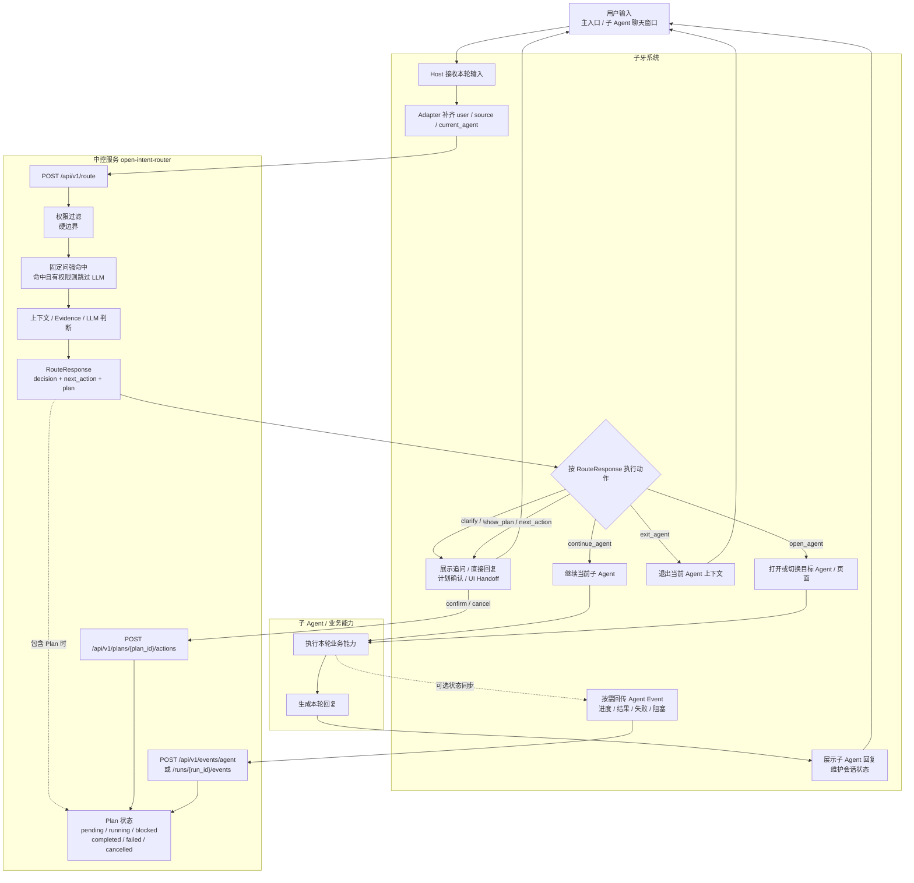

# 中控系统交付说明

> 状态：2026-07-01 前后的历史演示交付快照。Context、Memory、Knowledge、Canonical Turn 和 OAC Host Adapter 等能力已在后续迭代中演进，本文中的“后续增强”和待确认项不代表当前状态。当前说明见 [文档中心](../../README.md) 和 [应用地图](../../App-Desc/README.md)。

## 1. 文档定位

本文用于说明 `open-intent-router` 当前作为中控系统工程样例的交付范围、部署方式、接入边界和验证路径。

背景
目前设计的中控主要承担：
用户一句话 → 规则 + LLM分类 → 返回对应模块标签
本次中控的目标是：
将「意图识别器」升级为「智能体编排中枢」。

## 2. 交付目标

1. 可本地启动的中控后端服务。
2. 可视化测试台，用于演示如何调用中控、配置 Agent、观察路由结果。
3. 一组子牙风格的演示 Agent 和固定演示问题。
4. 提供 API、配置、部署和验证说明，便于评估后续研发迭代。

## 3. 当前工程能力

当前已具备的核心能力：

| 能力 | 当前状态 | 说明 |
| --- | --- | --- |
| FastAPI 后端服务 | 已具备 | 提供路由、调用、计划、事件、运行状态等接口 |
| Agent Registry | 已具备 | 支持文件、数据库和混合模式 |
| 意图识别与路由 | 已具备 | 支持 Mock 和 OpenAI-compatible LLM |
| Agent 候选过滤 | 已具备 | 权限过滤是硬边界；标签/语义筛选当前只做召回观察，不裁剪候选；固定问规则 |
| 多意图识别 | 已具备 | 支持多意图执行计划生成、确认、执行、恢复和取消 |
| 会话消息与日志 | 已具备基础能力 | 支持消息、运行结果、Route Log 等持久化 |
| 可视化测试台 | 已具备 | 用于本地演示和联调，不是生产 UI |

后续增强模块：

| 模块 | 建议优先级 | 说明 |
| --- | --- | --- |
| Context Pack / 上下文预算 | P0 | 长对话、知识证据、记忆统一入模型前的预算和压缩入口 |
| 记忆模块 | P1 | 先做 Session / Task Memory，再考虑长期 User Memory |
| 评估与回放 | P1 | 建立标准测试集、路由准确率和长对话回归 |

## 4. 交付形态

```text
独立中控服务
+ 子牙风格示例 Agent 配置
+ 可视化测试台
+ API / 部署 / 联调文档
+ Demo 验证问题集
```

部署方式：

1. 本地或测试环境启动中控服务。
2. 子牙通过 HTTP API 调用中控。
3. 子牙前端继续使用自身页面，中控只返回结构化路由结果、Plan、UI Handoff 或调用预览。
4. 子牙专有字段通过 Adapter 或配置映射


## 5. 工程结构

关键目录：

| 路径 | 说明 |
| --- | --- |
| `app/api` | FastAPI HTTP 接口 |
| `app/schemas` | 请求、响应和领域模型 |
| `app/services/router_service.py` | 意图识别、候选过滤、路由决策和 Plan 生成 |
| `app/services/invocation_service.py` | Agent 调用执行 |
| `app/services/plan_service.py` | 多意图Plan 保存、确认、取消和状态更新 |
| `app/plugins/evidence.py` | Evidence Provider 插件接口 |
| `config/agents.example.yaml` | 演示 Agent 配置 |
| `config/fixed_questions.example.yaml` | 固定问题 Evidence 示例 |
| `config/prompts/router.zh.yaml` | 默认中文路由 Prompt |
| `web` | 本地可视化测试台 |
| `docs` | 设计、API 和交付文档 |
| `tests` | 后端测试 |

## 6. 本地启动

后端：

```bash
cd /Users/lijingtong/project/open_intent_router
. .venv/bin/activate
uvicorn app.main:app --reload
```

前端：

```bash
cd /Users/lijingtong/project/open_intent_router/web
npm install
npm run dev
```

默认地址：

| 服务 | 地址 |
| --- | --- |
| 后端 | `http://127.0.0.1:8000` |
| API 文档 | `http://127.0.0.1:8000/docs` |
| 前端测试台 | `http://127.0.0.1:5173` |

## 7. 演示 Agent

当前示例配置提供四个子牙风格 Agent：

| Agent ID | 名称 | 类型 | 演示重点 |
| --- | --- | --- | --- |
| `script_writer` | 话术生成 | `mock` | 单意图路由与后端调用 |
| `visit_preparation` | 访前准备 | `mock` | 单意图路由、多步骤计划中的前置步骤 |
| `system_usage_guide` | 系统使用指引 | `ui_handoff` | 宿主系统页面跳转、强 Evidence 命中 |
| `wealth_knowledge` | 理财知识 | `mock` | 知识问答和后续知识库适配入口 |

这些 Agent 是演示配置。正式接入时，子牙需要提供真实 Agent / Tool / Workflow 清单，并映射成中控的 Agent Definition。

## 8. 固定演示问题

| 场景 | 问题 | 推荐观察点 |
| --- | --- | --- |
| 单意图：话术生成 | 帮我生成一段客户邀约话术，语气专业一点。 | Route 目标为 `script_writer`，可查看调用预览和调用结果 |
| 单意图：访前准备 | 明天要拜访一位关注稳健理财的客户，帮我做一下访前准备。 | Route 目标为 `visit_preparation` |
| Evidence 强命中：系统指引 | 帮我打开客户画像页面 | Evidence 命中并路由到 `system_usage_guide`，Debug 可查看 UI Handoff |
| 多意图：计划 | 先做访前准备，再生成一段客户沟通话术。 | 返回 Plan，右侧 Plan 面板展示步骤和确认动作 |
| 知识问答：理财知识 | 理财产品风险等级怎么理解 | Route 目标为 `wealth_knowledge`，后续可替换为子牙知识库 Evidence |

演示：

1. 先在左侧展示运行状态和 Agent 列表。
2. 点击固定演示问题填入输入框。
3. 点击发送。
4. 中间看用户可见回答。
5. 右侧依次查看 Route、Plan、Evidence、Debug。

## 9. 子牙接入边界

中控核心负责：

1. 接收子牙传入的用户问题和上下文。
2. 根据用户权限和 Agent 配置筛选候选 Agent。
3. 调用 LLM 或 Mock 进行意图识别。
4. 返回结构化路由结果、Plan、澄清问题、调用预览或 UI Handoff。
5. 记录路由、执行、Evidence、Plan 等调试信息。

子牙侧负责：

1. 提供用户身份、角色、分组、租户和业务权限来源。
2. 提供真实 Agent / Tool / Workflow 清单。
3. 承载正式用户界面和页面跳转。
4. 管理真实知识库、业务数据和生产密钥。
5. 执行生产环境日志、审计、监控和数据生命周期策略。

建议新增子牙 Adapter，负责：

1. 子牙用户字段到 `UserContext` 的映射。
2. 子牙 Agent 配置到 `AgentDefinition` 的映射。
3. 子牙页面到 `ui_handoff.route` 的映射。
4. 子牙知识库到 Evidence Provider 的映射。
5. 子牙鉴权、审计和脱敏策略的接入。

## 10. `/route` 主流程

子牙正式接入建议以 `POST /api/v1/route` 作为主接口。无论用户是在主入口聊天，还是已经进入某个聊天类子 Agent，每一轮用户输入都先经过中控做轻量路由判断。

聊天类子 Agent 的每轮用户输入应传入：

- `source=agent_chat`
- `current_agent.agent_id`
- 可选 `current_agent.agent_session_id`
- 本轮用户输入文本

中控根据本轮输入判断：

- `continue_agent`：继续交给当前聊天类子 Agent。
- `open_agent`：切换到另一个 Agent 或意图。
- `exit_agent`：退出当前 Agent 上下文。
- `clarify`：需要补充信息。
- `reply` / `plan` / `next_action`：由中控返回直接回复、多步骤计划或宿主协作指令。



这里的约定是：每轮用户输入都先走 `/route`，再由子牙根据中控返回的动作决定继续当前子 Agent、切换 Agent、退出上下文、展示追问、确认 Plan 或执行 UI Handoff。Plan 状态属于中控与宿主系统之间的协作状态，常见状态包括 `pending`、`running`、`blocked`、`completed`、`failed` 和 `cancelled`。Agent Event 不是每轮路由的入口，而是子 Agent 执行后的状态回传机制，用于同步阶段进度、执行结果、失败、阻塞或摘要，并可推动 Plan Step 状态更新。

## 11. 核心 API

演示和接入优先关注：

| API | 用途 |
| --- | --- |
| `GET /health` | 服务健康检查 |
| `GET /ready` | 服务就绪与 Registry 状态 |
| `GET /api/v1/runtime/config` | 查看运行配置 |
| `GET /api/v1/agents` | 查询可用 Agent |
| `POST /api/v1/route` | 生产主链路：每轮用户输入的路由、继续、切换、退出和计划判断 |
| `GET /api/v1/plans/{plan_id}` | 查询计划 |
| `POST /api/v1/plans/{plan_id}/actions` | 确认或取消计划 |
| `POST /api/v1/events/agent` | 子 Agent 执行状态回传，可用于推进 Plan Step 状态 |


1. `POST /api/v1/route` 是子牙接入的主契约。它返回决策、Plan、NextAction、调用预览和调试上下文，由子牙决定是否继续当前聊天 Agent、切换 Agent、打开页面或追问用户。
2. 聊天类子 Agent 的每一轮用户输入也走 `/route`，并带上 `source=agent_chat` 与 `current_agent`。这保证用户中途改意图时，中控可以及时返回 `open_agent` 或 `exit_agent`。
3. `route-and-invoke`、`route-and-execute` 只作为测试台、演示或后端托管执行的便利接口，不作为子牙正式接入的主链路。
4. Agent Event 属于路由后的执行状态回传。第一阶段可以先约定事件协议和接入位置，正式接入时由子牙判断哪些子 Agent 需要回传进度、结果、失败、阻塞或摘要。

示例请求：

```json
{
  "session_id": "demo_session",
  "source": "host_chat",
  "user": {
    "id": "u1",
    "roles": ["operator"],
    "groups": ["default"],
    "attributes": {
      "tenant_id": "tenant_a"
    }
  },
  "input": {
    "type": "text",
    "text": "帮我生成一段客户邀约话术，语气专业一点。",
    "attachments": []
  },
  "frontend_context": {}
}
```

## 12. 验证计划

| 验证项 | 通过标准 |
| --- | --- |
| 服务启动 | 后端、前端均可本地启动，`/health` 返回 `ok` |
| Agent 加载 | 左侧能看到四个演示 Agent |
| 单意图路由 | 话术生成、访前准备、理财知识能路由到对应 Agent |
| UI Handoff | 系统使用指引能返回宿主页面跳转信息 |
| 多意图 Plan | “先...再...”请求能生成 Plan |
| Evidence 命中 | 固定问题命中后 Evidence 面板可观察 |
| 权限过滤 | 修改角色、分组或租户后，候选 Agent 按策略变化 |
| 调试追踪 | Route / Plan / Evidence / Debug 面板能解释路由过程 |

后续生产前还需要补充：

1. 长对话上下文预算和压缩测试。
2. 记忆召回准确性和权限隔离测试。
3. 子牙知识库 Evidence 准确性测试。
4. 响应时延和并发压测。
5. 日志脱敏和审计验证。
6. 故障降级和回滚方案。

## 13. 确认事项

1. 子牙用户、角色、组织、租户字段如何映射。
2. 子牙页面跳转如何。
3. 子牙知识库是否提供 HTTP 检索接口。
4. 第一批接入哪些 Agent，验收问题集由谁提供。
5. 下个月或下下个月如何进入哪个研发迭代。
