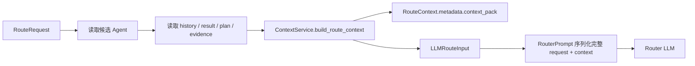
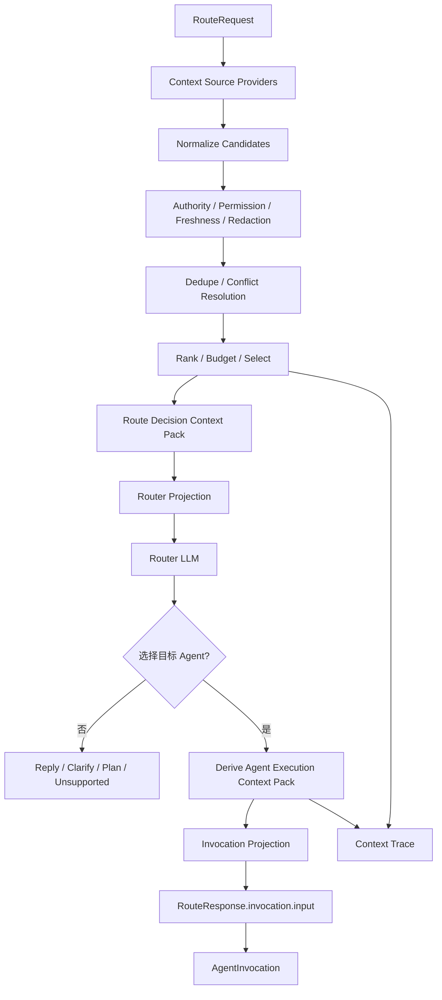

# 上下文模块改造需求分析文档

> 状态：已实现的历史需求基线。本文描述改造前问题和目标，不再用于判断当前实现是否完成。当前行为以 [Governed Context Pipeline 验收记录](../validation/governed-context-pipeline-acceptance.md)、相关 OpenSpec、代码和测试为准。

## 1. 文档信息

| 项目 | 内容 |
| --- | --- |
| 项目名称 | open-intent-router |
| 文档类型 | 需求分析文档 |
| 文档版本 | v1.0-draft |
| 编写日期 | 2026-07-10 |
| 当前状态 | 历史需求基线；相关 Context Pipeline 已实现并验收 |
| 改造范围 | 仅 OIR 上下文链路 |
| 目标读者 | OIR 维护者、后端开发、测试、架构评审人员 |

## 2. 已确认决策

本需求分析基于以下人工确认结果：

1. 本次只改造 OIR，不实现 OAC 接入层、IRS 兼容层或 OAC Host Profile；后续 OIR 替代 IRS 时再单独设计适配层。
2. OIR 后端持久化的消息、事件、Plan、Result 等状态是权威事实源；请求和前端传入信息只作为补充信号，不能覆盖后端权威状态或权限结果。
3. 本次只改造上下文的采集、检索、治理、选择、注入、复用和追踪链路；不实现自动记忆抽取/写入、知识文件导入、知识索引构建或 OAC 迁移。
4. OIR 直接回答用户时继续使用现有 `assistant_message`，本次不新增用户可展示 Citation 公共字段，不对现有公开 Schema 做破坏性调整。

## 3. 结论摘要

当前 OIR 已经具备 Context Pack、Context Budget、Memory Context、Knowledge Context 和调试能力，但它们尚未形成真正统一、可治理的上下文链路。

核心问题不是单纯“把 `memory_context` 或 `knowledge_context` 提前注入”，而是当前存在两套彼此分离的上下文机制：

- 路由前：`ContextService` 构建 `RouteContext` 和 Context Pack，供 Router LLM 判断意图。
- 路由后：`AgentContextAssemblyService` 根据目标 Agent 获取 memory/knowledge，并写入 `RouteResponse.invocation.input`。

更严重的是，当前 Context Pack 虽然计算了预算、保留项和丢弃项，但 Router Prompt 仍序列化完整 `RouteRequest` 和完整 `RouteContext`。原始 history、frontend context、debug items 和 `structured_value` 仍可能绕过预算进入模型。因此 Context Pack 目前更多承担调试和记录职责，还没有成为唯一的模型输入闸门。

本次改造的目标是建立一条统一的 Context Pipeline：所有进入 Router LLM 或目标 Agent 的上下文，都必须经过来源归一化、权限校验、时效处理、冲突处理、预算选择、消费者投影和可追踪记录，不允许存在旁路。

## 4. 背景与问题定义

OIR 的长期定位不是单一意图分类器，而是多 Agent 系统的通用路由和中控编排后端。它需要同时承担：

1. 理解用户当前请求。
2. 判断继续当前 Agent、切换 Agent、退出、澄清、直接回复或生成 Plan。
3. 感知会话历史、当前 Agent、事件、结果、Plan、Artifact 和宿主状态。
4. 在需要时检索记忆和知识证据。
5. 为目标 Agent 准备可执行输入。
6. 解释本轮实际使用了哪些上下文，以及为什么保留、丢弃或降级。

随着上下文来源增加，如果继续采用“各服务直接往 Prompt 或 invocation input 塞字段”的方式，系统会快速出现以下问题：

- Prompt 不可控，预算形同虚设。
- 同一事实在 history、memory、result、event 中重复出现。
- 当前输入和长期记忆冲突时行为不稳定。
- 调试页面显示的上下文与模型实际看到的上下文不一致。
- 新增一个上下文来源就需要修改 Router、Prompt、Invocation 和日志多个位置。
- OIR 无法可靠回答用户，也无法稳定判断 Agent Event 和 Plan 后续动作。

## 5. 改造目标

### 5.1 业务目标

1. 让 OIR 中控在路由决策前获得必要、可信、有界的上下文。
2. 让 OIR 能基于受控知识证据直接返回 `reply`，也能基于上下文选择正确 Agent。
3. 让 Agent Event、Plan、Result 和 Artifact 能参与中控后续判断。
4. 让目标 Agent 获得与其声明和权限匹配的执行上下文。
5. 保持现有 Router、Invocation、Plan、Registry 和 API 核心行为兼容。

### 5.2 工程目标

1. Context Pack 成为唯一模型输入闸门，而不是附加在 metadata 中的调试副本。
2. 路由上下文和调用上下文复用同一套 Context Contract、治理策略和追踪机制。
3. API Request、领域状态、模型输入和 Debug Trace 使用不同投影，避免相互污染。
4. 所有上下文来源具备来源、用途、权限、时效、可信度和选择原因。
5. 上下文选择过程可确定性测试、回放和比较。
6. 新增上下文来源时通过 Provider/Adapter 扩展，不修改多条核心链路。

### 5.3 成功标准

1. Router Prompt 中不存在未经 Context Pipeline 选择的 history、frontend context、memory、knowledge、event、result 或 artifact 内容。
2. 模型实际使用的每条上下文都能在 Context Trace 中找到来源和选择理由。
3. 被预算、权限、过期或冲突策略淘汰的内容不会进入模型输入。
4. Route 阶段和 Invocation 阶段不重复执行同一请求内可复用的检索。
5. 现有 OIR 公开 API 不发生破坏性变更。
6. 当前 97 个 OIR 后端测试持续通过，并新增覆盖本次上下文链路的完整 TDD 测试。

## 6. 范围说明

### 6.1 本次范围

1. Context Contract 和内部模型输入契约。
2. Router Decision Context 的组装和注入。
3. Agent Invocation Context 的组装、派生和复用。
4. History、Agent State、Event、Plan、Result、Evidence、Memory、Knowledge、Artifact、Frontend Context 等通用来源的归一化入口。
5. 权限、来源可信度、时效、冲突、去重、脱敏和预算治理。
6. Router Prompt 的受控投影。
7. Context Trace、日志摘要和回放基础信息。
8. 兼容开关、回滚路径和全量回归测试。

### 6.2 明确不在本次范围

1. OAC API、OAC 前端、OAC Go 代理或 IRS 兼容接口。
2. OAC 的 `user_tags`、页面路由、`active_agent` 等专有字段映射。
3. 自动记忆抽取、自动记忆写入、后台 consolidation 和用户记忆管理 UI。
4. 知识文件上传、解析、切块、Embedding、索引构建和知识管理后台。
5. 新增完整 Artifact 存储平台；本次只要求 Artifact 引用进入上下文链路，并预留解析接口。
6. 引入额外 LLM 调用做上下文摘要、分类或选择。
7. 改造 Router 的意图体系、Plan 执行语义或 Agent Registry 权限模型。
8. 新增用户可展示的结构化 Citation 公共 Schema。

## 7. 已审阅资源

本需求分析已对照以下资源：

### 7.1 OIR 代码与测试

- `app/services/router_service.py`
- `app/services/context_service.py`
- `app/services/agent_context_service.py`
- `app/services/invocation_service.py`
- `app/services/memory_service.py`
- `app/services/knowledge_service.py`
- `app/services/event_service.py`
- `app/services/plan_service.py`
- `app/services/plan_executor.py`
- `app/prompts/router_prompt.py`
- `app/schemas/routing.py`
- `app/schemas/context.py`
- `app/schemas/agent_context.py`
- `app/schemas/invocation.py`
- `app/schemas/events.py`
- `app/schemas/plans.py`
- `app/repositories/context_stores.py`
- `tests/test_context_pack.py`
- `tests/test_router_prompt.py`
- `tests/test_agent_context_memory_knowledge.py`
- `tests/test_agent_context_memory_knowledge_edge_cases.py`
- `tests/test_routing_invocation.py`
- `tests/test_events_plans_evidence.py`

### 7.2 OIR 规格与设计

- `docs/App-Research/designs/中控能力设计文档.md`
- `docs/App-Research/requirements/开源意图识别项目需求分析文档.md`
- `docs/App-Research/designs/oac-irs-to-oir-seamless-migration-plan.md`
- `docs/App-Research/designs/oir-conversation-memory-auto-write-strategy.md`
- `openspec/specs/session-context/spec.md`
- `openspec/specs/context-pack-contract/spec.md`
- `openspec/specs/context-budget-control/spec.md`
- `openspec/specs/context-observability/spec.md`
- `openspec/specs/agent-context-contract/spec.md`
- `openspec/specs/memory-context-governance/spec.md`
- `openspec/specs/knowledge-context-retrieval/spec.md`
- `openspec/specs/evidence-provider-scheduling/spec.md`
- `openspec/specs/intent-routing/spec.md`
- `openspec/specs/agent-invocation/spec.md`
- M4 Context Pack 和 Agent Context Memory/Knowledge 的归档 proposal/design/spec。

### 7.3 IRS/OAC 背景参考

IRS/OAC 资料仅用于理解中控职责和行为背景，不作为本次 OIR 核心字段设计来源：

- IRS 中控需求、架构、Prompt、ContextService、Central Route 和相关测试。
- OAC `central-api.ts`、AI Sidebar 当前请求字段、Agent Event、Plan Control 和会话状态规格。

## 8. 当前实现分析

### 8.1 当前路由阶段



`RouterService.route()` 在调用 LLM 前会构建 `RouteContext`。`ContextService` 同时创建 Context Pack，并记录预算、选择项和丢弃项。

但 Prompt 构造器会序列化：

- 完整 `RouteRequest`。
- 完整 `RouteContext`。
- `RouteContext.metadata` 中的原始 history/results/frontend context。
- `metadata.context_pack` 中用于 Debug 的 items 和 selection。

因此“Context Pack 中被丢弃”不等于“模型看不到”。

### 8.2 当前调用阶段

Router 选择目标 Agent 后，`RouterService._clarify_or_attach_invocation()` 构造 `invocation_input`，随后调用：

```text
AgentContextAssemblyService.assemble_for_route()
  -> MemoryService.recall()
  -> KnowledgeService.search()
  -> invocation_input["memory_context"]
  -> invocation_input["knowledge_context"]
  -> RouteResponse.invocation.input
```

`RouteResponse.invocation.input` 是目标 Agent 的执行输入预览，不是 Router LLM 的决策上下文。`InvocationService.invoke_from_route()` 会把该 input 转成正式 `AgentInvocation.input`。

InvocationService 在真正执行前还有一次 `_with_agent_context()` 补齐逻辑，用于直接 `/invoke` 或缺失上下文的调用路径。

### 8.3 当前已有能力

1. Context Item、Context Pack、Context Budget 和 Context Usage Schema。
2. 当前输入、当前 Agent、Plan、History、Result、Event、Evidence 和 Frontend Context 的候选项类型。
3. 总预算、来源预算、单项字符/token 限制和选择记录。
4. Agent Definition 的 memory/knowledge 声明。
5. `memory_context` 和 `knowledge_context` 的稳定调用字段。
6. Memory/Knowledge 的权限、超时、空结果和降级基础能力。
7. Context Pack 日志摘要、脱敏和调试台展示。

## 9. 当前主要问题

| 编号 | 问题 | 影响 | 优先级 |
| --- | --- | --- | --- |
| P-01 | Context Pack 不是唯一 Prompt 输入 | 预算、丢弃和权限结果可被旁路 | P0 |
| P-02 | Prompt 序列化完整 `RouteRequest.frontend_context` | 前端任意大对象可绕过预算和治理 | P0 |
| P-03 | `RouteContext.metadata` 同时保存原始上下文和 Debug Pack | 模型输入、API 响应和调试数据职责混合 | P0 |
| P-04 | dropped items 及完整 `structured_value` 仍可能进入 Prompt | 超预算、敏感数据和重复内容泄漏 | P0 |
| P-05 | 路由上下文和 Agent Runtime Context 是两套模型 | 策略、预算、Trace 和扩展方式不一致 | P0 |
| P-06 | memory/knowledge 主要在目标 Agent 选定后检索 | 中控直接回答和路由判断无法稳定使用 | P0 |
| P-07 | Router 没有读取 referenced/recent Agent Event | `source=agent_event` 缺少实际事件语义 | P0 |
| P-08 | 只有显式 `plan_id` 才读取 Plan | 会话中的活动计划可能无法参与后续判断 | P1 |
| P-09 | Artifact 主要藏在 Result metadata 中 | “刚才那条”“上一版”等引用不稳定 | P1 |
| P-10 | Context Item 缺少 audience、authority、freshness、policy 等治理字段 | 无法维护长期来源和消费者边界 | P0 |
| P-11 | 当前 `must_include` 可以突破总预算 | Context Budget 不是严格上限 | P0 |
| P-12 | Agent Context 只做单项截断，未真正走统一 Context Pack 总预算 | Agent 输入可能持续膨胀 | P1 |
| P-13 | 缺少事实冲突和来源优先级机制 | 当前输入、历史和长期记忆冲突时行为不确定 | P0 |
| P-14 | 缺少 policy/context/render 版本 | 无法可靠回放和解释行为变化 | P1 |
| P-15 | 现有测试验证 Pack 被生成，但未验证旁路内容不进入 Prompt | 测试通过不能证明预算真实生效 | P0 |

## 10. 目标上下文模型

### 10.1 四类对象边界

| 对象 | 职责 | 是否允许包含 dropped/raw debug 内容 |
| --- | --- | --- |
| Context Candidate | 从各来源读取的候选上下文 | 允许，仅限内存处理 |
| Context Pack | 某个消费者实际可用的受控上下文 | 不允许 |
| Context Projection | 发送给 Router LLM 或 Agent 的最终输入 | 不允许 |
| Context Trace | 记录候选、策略、选择、丢弃和降级原因 | 允许受控摘要，不默认保存无界原文 |

### 10.2 Context Item 最低语义要求

现有字段继续兼容，但内部 Context Item 至少需要表达：

1. 稳定标识：`item_id`、`source_ref`、`dedupe_key`。
2. 内容：受控文本、结构化值或引用，不要求所有来源复制完整原文。
3. 来源：source、provider、repository、request/事件/结果引用。
4. 范围：request、session、agent、plan、user、tenant、global。
5. 用途和受众：router、invocation、agent、debug、replay。
6. 权威性：authoritative、derived、host_asserted、model_generated 等通用等级。
7. 质量：priority、relevance、confidence、freshness、created/updated/expires time。
8. 安全：权限判定、sensitivity、redaction 状态和拒绝原因。
9. 选择：included、drop reason、truncated、token estimate。
10. 冲突：conflict key、被覆盖项、覆盖原因或 unresolved 状态。

这些字段是内部 Context Contract，不要求一次性提升为公开 API 一等字段。

### 10.3 Context Pack 语义

Context Pack 必须绑定明确的：

- `purpose`：例如 `route_decision`、`agent_execution`。
- `consumer`：Router 或具体 Agent。
- `request_id`、`session_id` 和可选 `agent_id`。
- `policy_version`、`budget_version`、`projection_version`。
- 实际 included items。
- 预算使用情况。
- Trace 引用或 Trace ID。

Context Pack 只包含实际允许进入消费者输入的内容。候选项和 dropped items 应进入 Context Trace，而不是继续混在 model-bound pack 中。

## 11. 目标处理流程



关键约束：

1. Router LLM 只接收 Router Projection。
2. Router Projection 不直接序列化 API Request 或 Debug metadata。
3. Invocation Context 可以复用本请求已完成的检索结果，但必须按目标 Agent 的声明和受众重新选择。
4. Context Trace 不作为模型输入。
5. 所有 Provider 输出都必须进入统一治理链路。

## 12. 功能需求

### CTX-FR-001 统一上下文编排入口

系统必须提供统一的上下文编排服务，分别支持 `route_decision` 和 `agent_execution` purpose。

验收要求：

1. Router 调用 LLM 前必须先完成 `route_decision` Context Pack。
2. 目标 Agent 确定后必须从统一编排服务获得或派生 `agent_execution` Context Pack。
3. Router、Prompt、Invocation 不得自行拼接未登记的上下文来源。

### CTX-FR-002 模型输入投影

系统必须将外部 API Request 与模型输入 DTO 分离。

验收要求：

1. Prompt Builder 不再直接调用完整 `RouteRequest.model_dump()`。
2. Prompt Builder 不再直接序列化完整 `RouteContext.metadata`。
3. 当前输入、当前 Agent、事件引用等必要控制字段必须通过白名单投影进入模型。
4. Debug、预算配置、密钥样字段和 dropped items 不得进入模型投影。

### CTX-FR-003 上下文来源归一化

系统必须支持以下通用来源进入 Context Candidate：

1. 当前用户输入和附件引用。
2. 当前 Agent 和 Agent Session。
3. Host/Agent 聊天历史。
4. referenced event 和 recent events。
5. recent Agent results。
6. active Plan 和当前步骤。
7. Artifact refs 和必要摘要。
8. frontend/host context。
9. route-stage Evidence。
10. route-stage Memory 和 Knowledge。
11. 系统或策略生成的必要控制项。

所有来源必须通过 Provider/Adapter 接口归一化，不允许直接写入 Prompt。

### CTX-FR-004 后端事实源优先

系统必须对相同语义的多来源信息执行权威性判断。

默认规则：

1. 权限和策略结果高于所有内容来源。
2. 后端保存的 Plan、Event、Run 和 Result 状态高于请求中的同名断言。
3. 当前用户显式输入控制当前轮行为，高于历史偏好和长期记忆。
4. Host/Frontend Context 是补充信号，不得修改后端权威状态。
5. 模型生成内容不能单独证明用户稳定事实。

冲突内容必须保留 Trace，不得静默拼接成一个新事实。

### CTX-FR-005 用途与可见范围

每条 Context Item 必须声明可用于哪些消费者。

至少支持：

- Router decision only。
- Invocation/Agent execution only。
- Router 与 Invocation 均可用。
- Debug/Replay only。

Agent 私有上下文不得默认暴露给 Router 或其他 Agent；Router 调试数据不得传给目标 Agent。

### CTX-FR-006 权限、脱敏和时效治理

所有 Context Item 在预算排序前必须先经过：

1. 用户、租户、主体和调用方权限检查。
2. 敏感字段检测与脱敏。
3. TTL、过期、删除和禁用状态检查。
4. Knowledge source 权限和 Memory scope 检查。
5. 不可用来源的拒绝或降级记录。

无权限内容必须在排序前排除，不能依赖 Prompt 指示模型忽略。

### CTX-FR-007 去重与冲突处理

系统必须避免同一事实通过 history、memory、result、event 和 evidence 重复占用预算。

验收要求：

1. 支持稳定引用或 dedupe key 去重。
2. 同一 Result 的正文、事件摘要和 Artifact 引用不得无条件重复注入。
3. 当前输入与长期记忆冲突时，当前轮按当前输入执行，并记录 override/conflict。
4. 无法自动解决的高风险冲突应保留多个候选并降低确定性，必要时触发 clarify。

### CTX-FR-008 严格预算控制

Context Budget 必须约束最终 Projection，而不是只约束调试 Pack。

验收要求：

1. 总预算和来源预算对最终 rendered/model-bound 内容生效。
2. `must_include` 只能提高保留优先级，不能突破模型硬上限。
3. 当前输入过长时必须截断、引用化、拒绝或返回受控错误，不允许无限突破预算。
4. `structured_value` 与文本内容适用同一预算和安全规则。
5. 为 system prompt、候选 Agent 和模型输出预留预算，Context Budget 不得假设自己拥有整个模型窗口。
6. 不调用额外 LLM 做上下文压缩；首版采用确定性截断、摘要占位和引用。

### CTX-FR-009 Router 阶段检索

系统必须允许 Router 在决策前按策略检索 Memory、Knowledge 或 Evidence。

验收要求：

1. 路由检索使用明确的 `caller_type=router` 和 route purpose。
2. 是否检索由确定性策略、配置或 Provider applicability 决定，不增加专用 LLM 分类调用。
3. 直接知识问答可以基于受控 evidence 返回 `decision.action=reply` 和 `assistant_message`。
4. 本阶段依据继续放在现有 `context.evidence` 和 Trace 中，不新增用户 Citation Schema。
5. 知识证据不得绕过候选 Agent、用户权限或来源权限。

### CTX-FR-010 Event、Plan、Result 和 Artifact 感知

系统必须补齐中控状态感知能力。

验收要求：

1. `source=agent_event` 时按 `event_id` 读取 referenced event。
2. Router 可以读取受控数量的 recent events。
3. Router 可以读取显式 Plan 或会话内活动 Plan。
4. recent results 以摘要、结构化字段和 ArtifactRef 进入上下文，不默认复制完整输出。
5. ArtifactRef 使用稳定对象形式；解析失败或多候选时可触发 clarify。

### CTX-FR-011 Router Context Pack

Router Context Pack 必须包含完成决策所需的最小上下文，并与公开 `RouteContext` 解耦。

Router 必须能够处理：

1. 新任务。
2. 继续当前 Agent。
3. 切换或退出 Agent。
4. 多步骤 Plan。
5. Agent Event 后续回复或下一步。
6. Plan Control。
7. 上下文引用。
8. 基于知识证据的直接回答。

### CTX-FR-012 Invocation Context Pack

目标 Agent 的执行上下文必须根据 Agent Definition 和目的重新投影。

验收要求：

1. `RouteResponse.invocation.input` 继续作为目标 Agent 输入预览。
2. `memory_context` 和 `knowledge_context` 保持稳定字段和现有结构。
3. Agent 未声明的 Memory scope 或 Knowledge source 不得注入。
4. Router 已检索且对 Agent 可见的结果应在同一请求内复用，避免无意义重复检索。
5. Agent 输入必须应用总预算、来源预算、单项限制和权限策略。

### CTX-FR-013 降级与失败隔离

非必需上下文来源失败不得让基础路由或调用不可用。

至少覆盖：

- Provider timeout。
- Provider error。
- 空结果。
- 全部来源被权限拒绝。
- Context Item 格式错误。
- 超预算。
- Trace 持久化失败。

降级结果必须记录 status、error code 和 provider/source 信息。除未来显式 required policy 外，Memory/Knowledge 检索失败默认继续执行。

### CTX-FR-014 Context Trace 与回放

系统必须为每次 Context Assembly 生成可追踪记录。

Trace 至少包含：

1. request、session、purpose、consumer 和 pack 标识。
2. provider 调用、跳过、超时和错误。
3. 候选 Item 的稳定引用。
4. 权限、过期、去重、冲突、截断和预算决策。
5. 最终 included item 列表和 token/字符使用。
6. policy、budget、projection 版本。
7. 最终 Projection 的受控 hash 或摘要。

持久化日志默认不保存无界原文；Debug 响应也必须应用脱敏和长度限制。

### CTX-FR-015 可扩展 Provider

系统必须允许后续新增 Context Source Provider，而不修改 Router 和 Invocation 主流程。

Provider 至少需要声明：

- source/type。
- applicable purpose/consumer。
- 输入依赖。
- 权限和策略信息。
- timeout/failure policy。
- 输出 Candidate Items 和 Trace metadata。

核心接口不得出现 OAC、Coze、Feishu 或其他宿主专有字段。

### CTX-FR-016 兼容和回滚

本次改造必须保持现有公开 API 兼容。

验收要求：

1. 现有 `RouteRequest`、`RouteResponse`、`InvocationPreview`、`AgentInvocation` 字段继续可用。
2. 新内部模型不要求 Host 立即修改请求。
3. `RouteContext.metadata.context_pack` 在迁移期继续提供兼容 Debug 摘要。
4. 上线过程支持 legacy/observe/enforced 或等价模式。
5. Context Pipeline 异常时有明确回滚开关，但安全权限检查不能因回滚而放宽。

### CTX-FR-017 直接回复契约

Router 基于上下文直接回答用户时：

1. 使用现有 `decision.action=reply`。
2. 用户可见正文使用现有 `assistant_message`。
3. `decision.message` 继续作为兼容路由文案。
4. Evidence 和来源 Trace 使用现有 `context.evidence`、metadata 或日志承载。
5. 本次不新增结构化用户 Citation 字段；未来如有明确展示需求，单独做增量契约。

### CTX-FR-018 生命周期边界

本次 Context Pipeline 只负责读取、选择和传递上下文。

以下行为只提供 hook/trace，不在本次实现：

- 自动从对话抽取长期记忆。
- 自动新增、更新或删除长期记忆。
- 知识文件入库和索引。
- 后台会话摘要 consolidation。

这样可以避免上下文读取改造与高风险写入治理混在同一变更中。

## 13. 典型场景与验收

### 场景 1：继续当前 Agent

给定当前 Agent、Agent History 和用户输入“再简短一点”，Router Projection 应包含当前 Agent 和受控 Agent History，返回 `continue_agent`。其他 Agent 的私有历史不得进入 Prompt。

### 场景 2：切换 Agent 并引用结果

用户说“把刚才那版做成海报”时，系统应从 recent results 和 ArtifactRef 中解析引用。只有一个明确候选时路由到新 Agent；多候选时返回 clarify。

### 场景 3：Agent Event 后续处理

请求携带 `source=agent_event` 和 `event_id` 时，Router 必须看到 referenced event、相关 result 和 active Plan，再决定回复、继续下一步或等待用户确认。

### 场景 4：基于知识直接回答

用户询问通用操作说明，路由策略触发 Knowledge/Evidence 检索。可靠证据存在时返回 `reply + assistant_message`；无证据、低置信或检索失败时不得编造确定答案。

### 场景 5：当前输入覆盖长期偏好

Memory 表示用户偏好中文，但用户本轮明确要求英文。Router 和 Agent 均按本轮英文要求执行，同时 Trace 记录 session override，不修改长期记忆。

### 场景 6：超预算

大量 History、Result 和 Evidence 同时存在时，最终 Projection 必须在硬预算内。当前输入、当前 Agent 和 Plan 状态优先保留，低价值历史先被裁剪。

### 场景 7：权限拒绝

Knowledge Provider 返回用户无权访问的来源时，该来源不得进入 Context Pack、Prompt 或 Agent input；Trace 记录 denied，不暴露原文。

### 场景 8：检索失败降级

Memory 或 Knowledge 超时后，Route/Invocation 继续执行，稳定返回对应 context status 和 errors，不产生未处理异常。

### 场景 9：同请求复用

Router 阶段已经获得且目标 Agent 有权使用的 Knowledge Item，应通过 request-scoped cache/assembly result 复用，不再次调用同一 Provider。

### 场景 10：Debug 与模型输入隔离

Context Trace 可以显示某项因预算被丢弃，但 Router Prompt 中不得出现该项正文、完整结构值或 Debug metadata。

## 14. 非功能需求

### 14.1 兼容性

1. 不删除或重命名现有公开字段。
2. 行为调整必须通过 characterization tests 固化现有兼容路径。
3. OIR Native 能力优先，宿主适配留待独立变更。

### 14.2 安全性

1. 权限检查发生在模型输入之前。
2. Context Trace、Route Log 和 Debug API 不泄露密钥、Token、密码或无界敏感原文。
3. Memory、Knowledge、History 和 Result 必须保持 user/tenant/subject 隔离。
4. Host Context 不得作为权限证明。

### 14.3 性能与稳定性

1. Context 选择和预算计算使用确定性本地逻辑，不增加专用 LLM 调用。
2. 外部检索必须配置独立 timeout 和降级策略。
3. 同一请求内同一 purpose/source 的等价检索最多执行一次。
4. Trace 持久化失败不得阻塞正常路由，但必须产生可观测错误。

### 14.4 可维护性

1. Context Source、Policy、Budget、Projection 和 Trace 职责分层。
2. 新增 Provider 不应要求修改 Router Prompt 拼接逻辑。
3. 公共 Schema 与内部 Model-bound DTO 分离。
4. Policy、Budget 和 Projection 必须版本化。

### 14.5 可测试性

1. Context Assembly 对相同输入和固定 Provider 输出应产生确定性结果。
2. 所有选择、裁剪、冲突和降级规则均可使用 Mock Provider 测试。
3. CI 不依赖真实 LLM、mem0、Milvus 或外部知识服务凭证。

## 15. TDD 与测试要求

### 15.1 强制 TDD 流程

后续实现必须按以下顺序进行：

1. 先补 characterization tests，固定当前公开行为和响应契约。
2. 为一个最小需求写失败测试。
3. 实现使该测试通过的最小代码。
4. 运行受影响模块测试。
5. 重构后再次运行测试。
6. 每个阶段完成后运行全量后端测试、Ruff 和 OpenSpec 严格校验。

不得先完成整套实现后再补测试。

### 15.2 必须新增的测试组

建议按职责拆分：

- `tests/test_router_context_assembly.py`
- `tests/test_context_prompt_projection.py`
- `tests/test_context_authority_policy.py`
- `tests/test_context_budget_enforcement.py`
- `tests/test_context_retrieval_orchestration.py`
- `tests/test_context_invocation_projection.py`
- `tests/test_context_trace_replay.py`
- `tests/test_context_backward_compatibility.py`

### 15.3 P0 失败测试清单

以下测试应在改造前先写，并能够暴露当前问题：

1. dropped history 正文不出现在 Router Prompt。
2. dropped evidence 的 `structured_value` 不出现在 Router Prompt。
3. `frontend_context` 未被选中时不进入 Prompt。
4. Prompt 不包含完整 Context Trace/Debug Pack。
5. 最终 Projection token estimate 不超过硬预算。
6. `must_include` 不突破硬预算。
7. denied Knowledge/Memory 不进入 Prompt。
8. `event_id` 能解析 referenced event 并进入 Router Pack。
9. 会话 active Plan 在未显式传 `plan_id` 时仍可按策略读取。
10. 当前输入与 Memory 冲突时当前输入生效并记录 Trace。
11. Router 阶段检索结果可以被 Invocation 阶段复用。
12. Memory/Knowledge timeout 不影响基础 Route/Invoke。
13. 直接 `reply` 继续返回现有 `assistant_message` Schema。
14. 现有 Context Pack debug 响应仍保持兼容，但不作为 Prompt 输入。

### 15.4 回归门禁

每个实现阶段至少运行：

```bash
.venv/bin/python -m pytest
.venv/bin/python -m ruff check .
.venv/bin/python -m ruff format --check .
openspec validate <change-name> --strict
```

当前基线：

- OIR 后端：97 passed。
- IRS 中控参考测试：9 passed，仅用于确认旧中控行为背景，不作为本次 OIR 代码门禁。
- 当前两套测试均存在 TestClient 依赖弃用警告，不属于本次上下文改造范围。

## 16. 分阶段实施建议

### 阶段 0：行为冻结与 OpenSpec

1. 建立独立 OpenSpec change。
2. 补 P0 characterization tests。
3. 冻结现有公开 Route/Invocation 契约。
4. 明确 legacy/observe/enforced 开关。

退出标准：现有行为、当前旁路问题和目标行为都有测试表达。

### 阶段 1：Context Contract 与内部 Pipeline

1. 拆分 Candidate、Pack、Projection 和 Trace。
2. 增加 purpose、consumer、authority、visibility、freshness 和 policy version。
3. 实现 Provider 接口、治理顺序和确定性去重/冲突规则。

退出标准：不接 Router 也能完整单测组装、治理、预算和 Trace。

### 阶段 2：Router 决策上下文接入

1. 增加 Router Context Assembly。
2. 增加 Event、Active Plan、Artifact 和 route-stage retrieval 来源。
3. Prompt 改为只消费 Router Projection。
4. 在 observe 模式比较旧/新上下文，不直接改变生产行为。

退出标准：Router Prompt 无上下文旁路，现有 Router 回归全部通过。

### 阶段 3：Invocation 上下文统一

1. 将 `AgentContextAssemblyService` 纳入统一 Context Pipeline。
2. 保留稳定 `memory_context` 和 `knowledge_context` 输出。
3. 对 Agent 输入执行总预算和消费者权限。
4. 复用 Router 阶段可复用检索结果。

退出标准：route-only、route-and-invoke、route-and-execute 和直接 invoke 行为一致。

### 阶段 4：Trace、回放与强制模式

1. 完善 Context Trace 和日志摘要。
2. 增加 projection hash、policy/budget/projection version。
3. 切换到 enforced 模式。
4. 保留一个版本周期的 legacy 回滚能力。

退出标准：全量测试、静态检查、OpenSpec 校验通过，且可以解释每轮模型输入。

### 后续独立阶段

以下事项另开需求和 OpenSpec：

1. OAC/IRS 兼容和 Host Adapter。
2. 自动 Memory Write。
3. 用户可展示 Citation 契约。
4. Artifact Store。
5. 生产级评估集和 Route Replay 平台。

## 17. 风险审视

### 17.1 当前最没有把握的事情

不是代码结构，而是“中控应该知道多少、决定多少”的语义边界。尤其是 Route Context 中哪些事实足以支持直接回答，哪些只能用于路由提示，哪些必须留给目标 Agent 执行。

本需求通过 purpose、consumer 和 authority 明确边界，但具体 Provider applicability 和业务证据充分性仍需要后续评估集验证。

### 17.2 最容易遗漏的问题

最大的遗漏不是某个 Context 字段，而是 Context Governance：

- 谁是事实源。
- 谁能看。
- 内容何时过期。
- 冲突如何解决。
- 哪条内容真正进入模型。
- 如何证明当时为什么这样选择。

如果只移动注入位置，不建立这些规则，系统会在新增几个来源后再次失控。

### 17.3 三个月后最可能失效的原因

1. 新功能继续绕过 Pipeline，直接往 Prompt 或 metadata 塞字段。
2. Context Pack 只记录选择结果，但最终 Prompt 仍包含其他原始对象。
3. 没有真实回归样例，只验证 Schema 和字段存在。
4. Context Item 过度通用却没有 authority、purpose 和 policy 语义。
5. Router 和 Invocation 再次发展成两套独立上下文体系。
6. Trace 保存过多原文，引发安全和存储问题。
7. 为追求效果引入额外 LLM 摘要/选择调用，导致延迟、成本和失败路径增加。

## 18. 风险与应对

| 风险 | 应对 |
| --- | --- |
| Prompt 行为变化导致路由回归 | characterization tests、observe 模式、可回滚开关 |
| 新 Pipeline 过度抽象 | 先覆盖现有真实来源，不提前设计宿主专有概念 |
| Context 预算仍被结构化字段绕过 | 最终 Projection 统一计量，禁止直接序列化领域对象 |
| 权限内容进入 Trace 或 Debug | 权限前置、Trace 摘要化、统一脱敏 |
| 检索增加延迟 | applicability policy、并发检索、request-scope 复用、timeout 降级 |
| 冲突规则误覆盖事实 | 当前输入只覆盖当前轮，冲突保留 Trace，不自动写长期记忆 |
| 兼容层长期残留 | 明确 legacy 生命周期，稳定后删除内部旧拼接路径 |
| 测试只看字段不看实际 Prompt | 对最终 Prompt/Projection 做负向断言和预算断言 |

## 19. 最终验收条件

本次改造只有同时满足以下条件才可视为完成：

1. 所有模型输入上下文均来自 Context Projection。
2. 不存在 RouteRequest、RouteContext.metadata 或 Debug Trace 的原始序列化旁路。
3. Router 能读取受控 History、Event、Plan、Result、Artifact、Memory、Knowledge 和 Evidence。
4. Invocation 继续稳定输出 `memory_context` 和 `knowledge_context`。
5. Context Budget 对最终 Router/Agent 输入真实生效。
6. 权限、过期、冲突、去重、截断和降级均有测试和 Trace。
7. 直接回复继续使用现有 `assistant_message`，公共 Schema 无破坏性变更。
8. 当前 97 个 OIR 后端测试和新增测试全部通过。
9. Ruff lint、format check 和 OpenSpec strict validation 全部通过。
10. 提供 rollout、observe、enforced 和 rollback 说明。

## 20. 后续动作

需求文档评审通过后，下一步应建立独立 OpenSpec change，输出：

1. Proposal：说明 Context Pipeline 改造范围和兼容策略。
2. Design：明确 Candidate、Pack、Projection、Trace、Provider 和 Policy 的代码边界。
3. Specs：把本文件 P0/P1 功能需求转换为可校验场景。
4. Tasks：按 TDD 顺序拆分 characterization tests、内部 Pipeline、Router 接入、Invocation 接入和 rollout。

在 OpenSpec 评审通过前，不进入后端功能代码实现。

## 21. 版本记录

| 日期 | 版本 | 变更 |
| --- | --- | --- |
| 2026-07-10 | v1.0-draft | 基于 OIR 当前代码、规格、IRS/OAC 背景和人工确认形成首版需求分析 |
