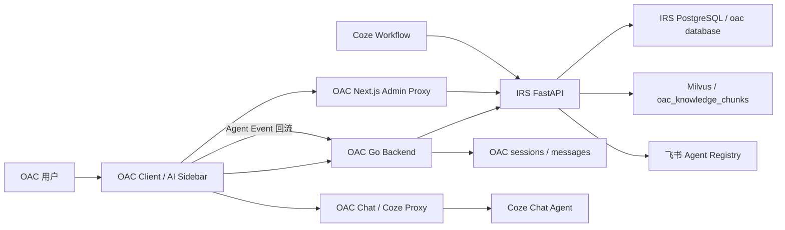
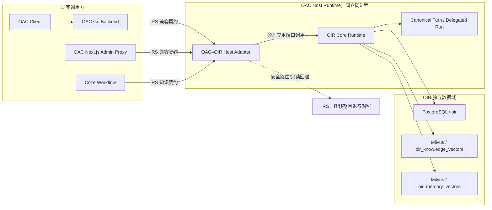
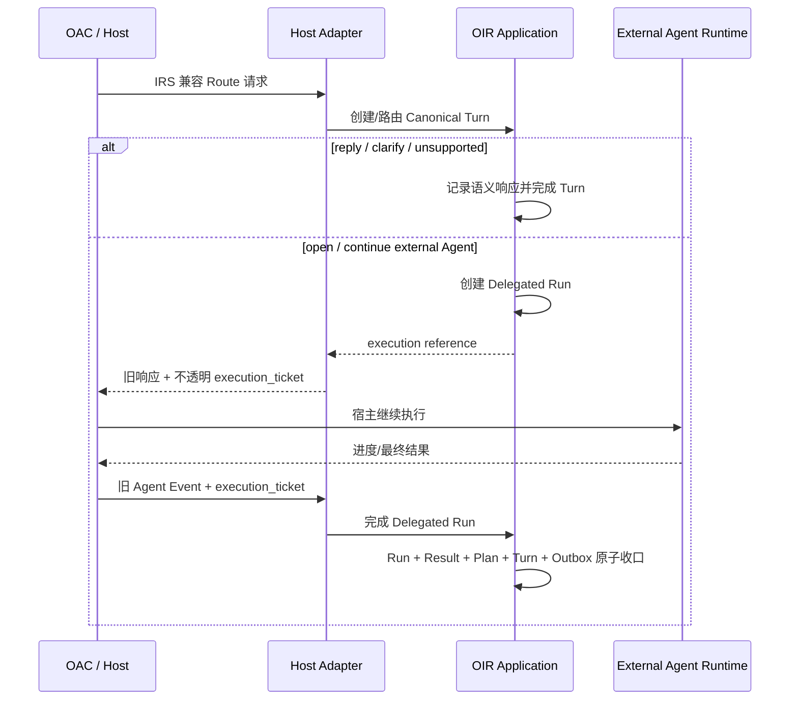
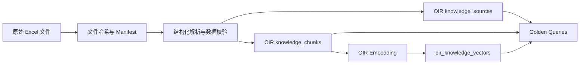

# OIR 替换 IRS 中控系统需求分析文档

> 文档版本：v1.5<br>
> 文档状态：需求基线已确认，可进入方案设计与任务拆分<br>
> 编制日期：2026-07-15<br>
> 适用范围：本地环境、测试环境；当前不包含生产发布<br>
> 目标系统：OIR、OAC–OIR Host Adapter、OAC、Coze Workflow、IRS

## 1. 文档摘要

### 1.1 一句话结论

本项目将由 OIR 全面替代 IRS 的中控路由、Agent Registry、共享知识库和运行态能力；通过逻辑独立的 **OAC–OIR Host Adapter** 保持 OAC 与 Coze Workflow 继续使用 IRS 既有契约，同时确保 OIR Core 不被 OAC 专有语义反向侵入。

### 1.2 推荐迁移路径

```text
先冻结 IRS 行为与调用契约
-> 建立 OAC–OIR Host Adapter
-> 建立 OIR Canonical Turn 与 Delegated Run 闭环
-> 导入 Agent 与原始知识文件
-> 本地完整联调
-> 测试环境 100% Shadow
-> 切换 OIR 为唯一事实源
-> 停止 IRS 写入并确认零流量
-> 下线 IRS
```

迁移不是把 OAC 改造成 OIR Native Client，也不是把 IRS 代码合并进 OIR Core。首期应由 Adapter 对外保持 IRS 契约，对内调用 OIR 通用服务。

### 1.3 已确认决策

| 编号 | 决策 | 状态 |
| --- | --- | --- |
| D-01 | OIR 最终全面替代 IRS，IRS 完成迁移后下线 | 已确认 |
| D-02 | 现有 Coze Workflow 直接访问 IRS 知识库接口；迁移只保证接口可调用和响应契约兼容，不负责 Coze 如何处理返回 | 已确认 |
| D-03 | OIR 是 Agent 与知识数据的唯一事实源 | 已确认 |
| D-04 | 停用飞书 Agent Registry，不保留双向或单向同步 | 已确认 |
| D-05 | 首期固定 `tenant_id=oac` | 已确认 |
| D-06 | 知识原始文件来自 `/Users/lijingtong/project/data/内容生产` | 已确认 |
| D-07 | 为 OIR 新建独立 PostgreSQL database，不复用 IRS/OAC 的 `oac` database | 已确认 |
| D-08 | 客群表当前无数据，后续补充 | 已确认 |
| D-09 | OIR 的受治理上下文、记忆召回和自动记忆写入直接同步上线 | 已确认 |
| D-10 | 测试环境允许 100% Shadow；当前没有生产环境 | 已确认 |
| D-11 | 路由和只读知识查询允许安全熔断回退 IRS | 已确认 |
| D-12 | 所有写操作默认禁止盲目自动回退 | 已确认 |
| D-13 | 首次接入顺序为本地环境、测试环境；暂无固定日期和冻结窗口 | 已确认 |
| D-14 | 建设逻辑独立的 OAC–OIR Host Adapter；首期与 OIR 同仓、同进程部署 | 已确认 |
| D-15 | Adapter 可以依赖 OIR 的公开应用端口，OIR Core 禁止反向依赖 Adapter | 已确认 |
| D-16 | Coze Workflow 节点解析、变量提取、分支判断和后续动作不在本需求验收范围 | 已确认 |
| D-17 | 原始知识重新解析后默认保持业务知识语义一致，不要求旧 Chunk/向量物理结构一致 | 已确认 |
| D-18 | 将 Canonical Conversation Turn 与 Delegated External Run 建设为 OIR 通用能力，由 OIR 管理 Turn/Run/Result 状态和不变量 | 已确认 |
| D-19 | Adapter 仅负责 IRS/OAC 协议转换、身份桥接、Ticket 传输和关联，不负责判断或拼装完整 Host Turn | 已确认 |
| D-20 | OAC 可做最小向后兼容增强，透传不透明 `execution_ticket`；OAC/Coze 专有字段不进入 OIR Core | 已确认 |
| D-21 | 删除 OAC 展示会话默认不删除 `user_preference/stable_fact` 长期记忆；长期记忆只通过显式记忆管理、策略或其自身 TTL 变更 | 已确认 |
| D-22 | OAC 会话切换运行态恢复、UI/OIR 活动 Plan 对齐和会话删除向 OIR 传播延后到 IRS 迁移完成后开发 | 已确认 |
| D-23 | OAC 已停止运营，当前完全处于开发状态；本次是无在线用户和无生产流量的开发环境迁移 | 已确认 |
| D-24 | IRS 存量 Session/Message/Event/Plan/Result 等运行态与历史消息不迁移、不继续保留；排空后切流，切流后由 OIR 从空运行态开始 | 已确认 |

## 2. 背景与问题定义

### 2.1 当前背景

IRS 已经承担 OAC 的中控后端职责，包括：

1. 用户意图识别与 Agent 路由。
2. 当前 Agent 延续、切换和退出。
3. 多意图 Plan 生成、确认和事件推进。
4. Agent Registry 管理及 OAC 页面/Bot 映射。
5. 知识文件上传、解析、切块、检索和精确读取。
6. 为 OAC、子智能体及 Coze Workflow 提供知识接口。

OAC 已停止运营，目前完全处于开发状态，没有需要无感接续的在线用户或生产运行态。因此本项目不做 IRS 历史会话和运行态搬迁，而是在排空旧运行态后建立全新的 OIR 运行纪元。

OIR 已形成更通用的 Router、Registry、Invoker、Plan、Context、Memory 和 Knowledge 能力，并在 2026-07-13 至 2026-07-15 完成受治理上下文管线与会话记忆自动形成能力。但 OIR Native API 与 IRS/OAC 契约并不一致，不能通过简单修改服务地址完成替换。

OAC 当前还在自身 `sessions/messages` 中保存中控展示历史，并由前端直接调用外部聊天 Agent 后再回流 Event。OIR 现有自动记忆形成主要依赖完整 Run/Result/Turn Capsule。因此，仅转换 Route 和 Event Schema 不能保证 OIR 看到唯一、完整、有序且可信的会话轮次。

### 2.2 核心问题

本项目需要同时解决以下五个问题：

1. **业务连续性**：OAC 前端、OAC Go 后端和 Coze Workflow 不应因 OIR 内部契约不同而中断。
2. **事实源切换**：Agent、知识、Plan、Event、Memory 等对象不能在 IRS 与 OIR 之间形成双主或无主状态。
3. **核心通用性**：OAC 是 OIR 的第一个重要宿主，但不能把 OIR 变成 OAC 专用中控。
4. **可证明迁移**：接口可调用不等于行为等价，必须通过契约测试、Golden Queries、Shadow Diff、权限门禁和回退演练证明迁移可用。
5. **轮次完整性**：OAC 展示历史、OIR 语义运行态和外部 Agent 会话不得各自推断“一轮已完成”；必须由 OIR 的 Canonical Turn/Run 状态机给出唯一结论。

### 2.3 本需求的产品判断

```text
OAC 可以是一等宿主，
但不能成为 OIR 的隐形核心。
```

因此，所有 OAC 专有协议、身份、权限标签、页面路由、Coze Bot 信息、兼容响应和 IRS 回退逻辑都必须留在 Host Adapter 中。Conversation Turn、Delegated Run、Result、幂等、所有权和完成不变量则属于 OIR 通用能力，不得由任一 Host Adapter 自行定义第二套状态机。

## 3. 建设目标与非目标

### 3.1 业务目标

1. OIR 全面承接 IRS 当前服务能力，最终允许 IRS 下线。
2. OAC 的中控侧栏、聊天 Agent、非聊天页面跳转、多步骤任务和后台管理继续可用。
3. Coze Workflow 在迁移期间继续使用原知识库调用契约。
4. OIR 上线后成为 Agent、知识、Conversation Turn、Run/Result、Plan、上下文和记忆的唯一语义事实源。
5. 迁移具备完整的 Shadow、差异分析、熔断、回退、审计和下线证据。

### 3.2 产品目标

1. 对 OAC 和 Coze 保持 IRS 兼容接口，不要求首期升级为 OIR Native API。
2. 对未来宿主保持 OIR Core 通用、可插拔和可复用。
3. 将迁移过程产品化为可重复的 Host Adapter 接入模式，而不是一次性硬编码。
4. 对路由、知识、权限、Turn/Run 和记忆建立可解释、可回放的运行证据。

### 3.3 工程目标

1. 建立逻辑独立的 OAC–OIR Host Adapter。
2. 建立 IRS/OAC 与 OIR Native Schema 的双向映射。
3. 新建 OIR 独立 PostgreSQL database 和独立 Milvus collections。
4. 从原始文件重新解析、切块和索引知识，不复制 IRS 向量。
5. 建立 100% 测试 Shadow 和按风险分级的 Diff 门禁。
6. 建立写栅栏，禁止 Registry、知识管理、Event、Plan、Memory 等写操作盲目回退或双写。
7. 建立通用 Canonical Conversation Turn 与 Delegated External Run，支持宿主执行、外部 Agent 回调和完整 Turn 形成。

### 3.4 明确非目标

1. 首期不要求 OAC 前端改用 OIR Native `RouteResponse`、`next_action` 或 Native Plan。
2. 首期不把 OAC 页面、银行业务、运营版/展业版、Coze 或飞书概念放入 OIR Core。
3. 不保留飞书 Agent Registry 同步。
4. 不复制 IRS 的 Milvus `oac_knowledge_chunks` 向量到 OIR。
5. 不在本阶段承诺生产 SLA、生产灰度比例或生产切换日期。
6. 不在客群数据缺失时虚构客群知识或将客群召回列为已完成能力。
7. 不负责 Coze Workflow 收到接口响应后的变量解析、条件分支、内容生成或其他后续处理。
8. 首期不强制将 Coze 调用、SSE 流式传输或 OAC 消息展示全部迁入 OIR；OAC 可继续执行外部 Agent，但必须通过受信 Delegated Run 完成运行态闭环。
9. OAC 会话切换时恢复 Agent/Plan UI 运行态、活动 Plan 对齐和会话删除级联清理不作为首期 IRS 迁移下线门禁，纳入迁移后增强。
10. 不迁移 IRS 存量 `session_states/chat_messages/conversation_events/plans/plan_steps/agent_results`，不承诺旧会话的展示、恢复或续跑。

## 4. 已审阅资源与事实边界

### 4.1 代码与文档范围

本分析基于以下项目当前代码和文档：

- `open_intent_router`：OIR Core、Context、Memory、Knowledge、Plan、Registry、API 与测试。
- `intent_recon_sys`：IRS Central API、Agent Registry、Knowledge API、知识管理和 PostgreSQL Schema。
- `OAC`：AI Sidebar、Central API Client、Go Central Proxy、后台 Registry、知识管理代理和 Next.js 知识精确读取代理。
- `data/内容生产`：6 份知识原始工作簿。

重点参考文档：

- [OAC 共享知识库接口文档](../../intent_recon_sys/docs/OAC共享知识库接口文档.md)（IRS 知识库主要接口契约，知识兼容规范基线）
- [OAC 从 IRS 无感迁移到 OIR 方案记录](./oac-irs-to-oir-seamless-migration-plan.md)
- [中控能力设计文档](./中控能力设计文档.md)
- [上下文模块改造需求分析文档](./上下文模块改造需求分析文档.md)
- [Governed Context Pipeline 验收记录](./governed-context-pipeline-acceptance.md)
- [Conversation Memory Formation 上线与回退](./conversation-memory-formation-rollout.md)
- [IRS 共享知识库需求分析文档](../../intent_recon_sys/docs/OAC共享知识库需求分析文档.md)
- [OAC API 文档](../../OAC/docs/architecture/API.md)

知识兼容结论必须按以下证据层级交叉确认：

1. **规范基线**：《OAC 共享知识库接口文档》定义预期路径、Schema、枚举、治理和错误语义。
2. **实现事实**：IRS 当前代码、Pydantic Schema、OpenAPI 和自动化测试定义实际可执行行为。
3. **运行事实**：OAC/Coze 的真实请求、响应和网关日志可用于验证传输与接口兼容；Coze Workflow 的响应后处理不属于验收范围。

三者冲突时不得静默选择其一，必须形成契约差异记录，并由接口负责人确认兼容口径。Adapter 必须实现《OAC 共享知识库接口文档》定义的完整知识接口，不以消费者盘点结果裁剪能力。

### 4.2 事实有效期

本分析的代码事实截止 2026-07-15。已有 2026-07-09 迁移方案早于 OIR 近期的 Context/Memory 更新，因此本文件覆盖并更新其中与当前实现不一致的部分。

### 4.3 当前验证限制

分析时本机 `8000`、`8084`、`8082` 等服务端口均未运行，因此当前结论来自代码、Schema、测试和静态 API Surface。由于 OAC 已停止运营，阶段 0 不能假设存在真实用户流量；应通过 IRS 本地可执行样本、历史样本（如可获取）、契约数据集和合成 E2E 回放建立延迟、错误、权限和 Coze 传输基线。

## 5. 当前系统与依赖分析

### 5.1 当前调用架构



其中 OAC `sessions/messages` 承担中控展示历史，而 IRS 另行沉淀路由历史、Event 和 Plan。聊天 Agent 的实际执行结果由 OAC 从外部 Agent 平台获得，再通过 Agent Event 回流中控。这三类状态在迁移前没有统一的 Canonical Turn 完成契约。

### 5.2 OAC 中控兼容面

| 方法 | OAC 外部路径 | IRS 目标路径 | 主要行为 |
| --- | --- | --- | --- |
| POST | `/api/central/route` | `/api/v1/central/route` | 路由、澄清、Agent 切换、Plan |
| POST | `/api/central/events/navigation` | `/api/v1/central/events/navigation` | 页面跳转事件 |
| POST | `/api/central/events/agent` | `/api/v1/central/events/agent` | Agent 进度、结果、错误、澄清 |
| POST | `/api/central/plans/{plan_id}/confirm` | `/api/v1/central/plans/{plan_id}/confirm` | 确认 Plan |

OAC 前端实际依赖以下动作语义：

- `reply`
- `clarify`
- `open_agent`
- `continue_agent`
- `exit_agent`
- `show_plan`
- `unsupported`
- `silent`

OAC 还依赖 `route_required` 决定 Agent Event 后是否继续发起中控路由；这与 OIR Native `AgentEventResponse` 当前结构不同。

### 5.3 Agent Registry 兼容面

| 方法 | IRS 路径 | 用途 |
| --- | --- | --- |
| GET | `/api/v1/admin/agent-registry` | 查询全部或已启用 Agent |
| POST | `/api/v1/admin/agent-registry` | 新建 Agent |
| PUT | `/api/v1/admin/agent-registry/{agent_id}` | 更新 Agent |
| PATCH | `/api/v1/admin/agent-registry/{agent_id}/enabled` | 启停 Agent |
| DELETE | `/api/v1/admin/agent-registry/{agent_id}` | 删除 Agent |

IRS 旧字段包括 `bot_id`、`route_path`、`allowed_user_tags`、`positive_keywords` 和 `negative_keywords`。OIR 使用通用的 `invocation`、`ui_handoff`、`access_policy`、`trigger` 和 `metadata`。

当前 IRS CSV 中存在 9 个 Agent，OAC 前端硬编码兜底表也覆盖相同的 9 个主要 `agent_id`。迁移时必须逐条校验，不允许仅按数量判断成功。

### 5.4 知识库兼容面

#### 5.4.1 查询与读取接口

| 方法 | IRS 路径 | 当前 OIR 状态 |
| --- | --- | --- |
| POST | `/api/v1/knowledge/search` | 路径同名但请求/响应不兼容 |
| POST | `/api/v1/knowledge/grouped-search` | 缺失 |
| POST | `/api/v1/knowledge/read` | 缺失 |
| GET | `/api/v1/knowledge/assets` | 缺失 |
| GET | `/api/v1/knowledge/assets/{asset_id}` | 缺失 |
| GET | `/api/v1/knowledge/assets/{asset_id}/chunks` | 缺失 |
| GET | `/api/v1/knowledge/chunks/{chunk_id}` | 缺失 |

#### 5.4.2 知识管理接口

| 方法 | IRS 路径 | 当前 OIR 状态 |
| --- | --- | --- |
| GET | `/api/v1/admin/knowledge/files` | 缺失 |
| POST | `/api/v1/admin/knowledge/files` | 缺失 |
| GET | `/api/v1/admin/knowledge/files/{asset_id}` | 缺失 |
| DELETE | `/api/v1/admin/knowledge/files/{asset_id}` | 缺失 |
| GET | `/api/v1/admin/knowledge/files/{asset_id}/chunks` | 缺失 |
| POST | `/api/v1/admin/knowledge/files/{asset_id}/retry` | 缺失 |

OAC 后台知识管理存在两条调用链：

1. OAC Go 后端代理 `/api/admin/knowledge/files*`。
2. OAC Next.js Route Handler 直接读取 `CENTRAL_API_BASE_URL`，并通过 `/api/v1/knowledge/read` 精确读取完整内容。

迁移时只切换 Go 配置无法覆盖全部路径，必须同时校验 Next.js 服务端环境变量。

#### 5.4.3 Search 契约细节

IRS `POST /api/v1/knowledge/search` 不只是一个 query-to-evidence 接口，还包含调用身份、用途、范围、返回预算和降级语义：

| 契约维度 | 现有语义 |
| --- | --- |
| 必填身份 | `request_id/session_id/user_id/consumer/consumer_id/purpose` |
| Consumer | `central`、`agent`、`coze_workflow`、`admin` |
| Purpose | `answer`、`route`、`plan`、`execute`、`validate`、`explain`、`workflow` |
| 旧范围字段 | `filters.business_domain/source_types/asset_ids/freshness` |
| 新范围字段 | `scope.business_domain/source_types/asset_ids/freshness` |
| 范围优先级 | 传入 `scope` 时使用 `scope`；否则兼容 `filters` |
| Return Options | 控制 content、structured payload、asset/chunk metadata、index refs 和字符预算 |
| 主要输出 | `matched/confidence/evidence/warnings/trace_id` |

兼容层必须保留可选字段的“按请求返回”语义，不能始终返回大字段，也不能因为 OIR Native Schema 不同而丢失 `structured_payload`、`content_hash` 或 `index_refs`。

#### 5.4.4 Grouped Search 稳定结构

IRS 已注册通用资产组 `content_production`，并使用稳定资产键和资产 ID：

| asset_key | asset_name | asset_id | source_file |
| --- | --- | --- | --- |
| `01` | 要素表 | `asset_content_production_01` | `01 要素表.xlsx` |
| `02` | KPI + 场景 | `asset_content_production_02` | `02 KPI + 场景.xlsx` |
| `03` | 客群表 | `asset_content_production_03` | `03 客群表.xlsx` |
| `04` | 活动表 | `asset_content_production_04` | `04 活动表.xlsx` |
| `05` | 权益表 | `asset_content_production_05` | `05 权益表.xlsx` |
| `06` | 企微模板 | `asset_content_production_06` | `06 企微模板.xlsx` |

`include_empty_assets=true` 时，未命中的资产也必须出现在 `assets.<asset_key>`，并返回 `matched=false`、空 `evidence`、独立 warnings 和 trace。该结构便于 Coze Workflow 稳定读取 JSON 变量，是兼容门禁，不是展示偏好。

`grouped-search` 只提供分组后的 canonical evidence，不负责解释业务字段、推断活动/权益/客群关系或生成工作流入参。

#### 5.4.5 Exact Read 契约细节

`POST /api/v1/knowledge/read` 支持五种 target：

| target.type | 定位字段 | 关键语义 |
| --- | --- | --- |
| `asset` | `asset_id` | 分页读取单个资产 |
| `assets` | `asset_ids` | 批量读取多个资产 |
| `chunk` | `chunk_id` | 读取单个 Chunk |
| `chunks` | `chunk_ids` | 尽量保持请求顺序批量读取 |
| `source_ref` | `asset_id + source_ref` | 按 sheet/row/page/paragraph 等来源定位 |

Exact Read 读取 PostgreSQL canonical Asset/Chunk，不调用 Milvus，也不重新解析原始文件。拥有 ID 不代表有权访问，仍必须执行状态、敏感级和用户标签过滤。

#### 5.4.6 Warning 与 HTTP 语义

IRS 对 embedding、Milvus、超时、截断和治理过滤大量使用结构化 `warnings`。向量检索失败通常返回 HTTP 200、`matched=false` 和空 evidence，而不是 5xx。

兼容层至少支持以下 warning code：

| 分类 | warning code |
| --- | --- |
| 未命中/治理 | `no_match`、`permission_filtered`、`secret_filtered`、`disabled`、`low_confidence` |
| Provider | `embedding_error`、`vector_search_error`、`timeout`、`configuration_error` |
| 导入/清理 | `unsupported_file_type`、`file_too_large`、`parse_warning`、`import_failed`、`cleanup_warning` |
| 预算/截断 | `top_k_capped`、`limit_capped`、`max_chars_capped`、`result_truncated` |
| 精确读取 | `missing_ids`、`filtered_ids`、`ambiguous_source_ref`、`unsupported_source_ref` |

Adapter 的 Shadow、熔断和调用成功率不能只看 HTTP 状态码，必须同时判断 `matched`、warnings 严重度和 evidence 完整性。

#### 5.4.7 Admin 入库状态机

IRS 当前上传为同步处理：保存原文件、创建 Import Job、解析、切块、Embedding、写 Milvus，然后返回 Asset 和 Job。支持 `xlsx/xls/docx/pdf/md/txt`，默认单文件上限 50 MB。

必须兼容的对象与语义包括：

- Asset：owner、sensitivity、allowed_user_tags、freshness、searchable、status、checksum、chunk_count。
- File Metadata：文件名、content type、扩展名、大小、SHA-256、storage URI、parser/chunking/embedding 版本。
- Import Job：`uploaded/processing/indexed/failed/disabled/deleted` 状态与 `parsing/chunking/embedding/indexing/cleanup` 阶段。
- `replace_asset_id`：替换成功后保持原 asset ID。
- Retry：依赖已保存的原始文件和 canonical chunks 重建索引。
- Delete：先软删除/禁用 canonical Asset/Chunk，再清理向量；向量清理失败以 `cleanup_warnings` 返回，已删除知识不得重新被检索。

### 5.5 当前 IRS 与 OIR 的主要差距

| 维度 | IRS/OAC 当前行为 | OIR Native 当前行为 | 迁移要求 |
| --- | --- | --- | --- |
| Route 输入 | `user_id/user_tags/user_query/history` | `user/input/current_agent` | Adapter 转换 |
| Route 输出 | `route/context/plan` | `decision/context/next_action/plan/invocation` | Adapter 保持旧语义 |
| Plan | 旧 Plan 简化结构 | 有 owner、状态、依赖和执行策略 | 映射并保持所有权 |
| Agent Event | 顶层 `status/message/output`，返回 `route_required` | 通用 Event，Plan Event 要求可信 Run 关联 | Adapter 绑定 Run/owner 并转换响应 |
| 会话历史 | OAC `sessions/messages` 保存展示文本，IRS 另存路由历史 | OIR 可保存 Message，但完整 Turn 仍主要由同步 Invocation 生成 | OIR Canonical Turn 为语义主源，OAC 历史降为展示读模型 |
| 外部 Agent 执行 | OAC 直接调用 Coze，再异步回流 Event | `host_managed/wait_for_agent_event` 已预留，但尚未创建可回调的受信 Run | OIR 创建 Delegated Run，宿主凭不透明 Ticket 完成 |
| Memory Turn | IRS 无完整自动形成闭环 | 主要从 Run/Result 构造 Turn Capsule | 只有 OIR 判定完成的 Canonical Turn 可触发自动形成 |
| 身份 | OAC JWT + `X-User-ID`/角色 | `user_id + tenant_id + HMAC signature` | Adapter 建立身份桥 |
| Registry | OAC 字段，并写飞书 | 通用 AgentDefinition | OIR 唯一事实源，停飞书 |
| Knowledge | Asset/Chunk/Group/Read/Admin 完整面 | Source/Chunk/Search/Debug 基础面 | 补齐 Adapter 和 OIR 通用能力 |
| Memory | IRS 无 OIR 完整长期记忆闭环 | OIR 支持 recall/formation/lifecycle | 直接上线并加强隔离 |
| 控制面 | IRS、飞书、OAC 后台共同参与 | OIR Registry 可作为主源 | 切为单一主写 |
| 回退 | OAC 单一 Base URL | 尚无 IRS fallback | Adapter 实现安全回退 |

## 6. 目标架构

### 6.1 总体架构



### 6.2 Host Adapter 定位

Host Adapter 是 OAC 与 OIR 之间的防腐层，负责：

| 模块 | 职责 |
| --- | --- |
| Contract Facade | 暴露 IRS/OAC 旧路径、请求和响应 |
| Schema Mapper | IRS/OAC Schema 与 OIR Native Schema 双向转换 |
| Identity Bridge | 验证 OAC/Coze 调用方，注入 `tenant_id=oac` 与 OIR 身份签名 |
| Registry Mapper | `bot_id/route_path/user_tags` 与 AgentDefinition 映射 |
| Knowledge Facade | 兼容 search/grouped/read/assets/admin files |
| Shadow Comparator | 100% 测试旁路、Diff、行为指纹和报告 |
| Fallback Gateway | 路由和只读知识的安全熔断回退 |
| Write Fence | 阻止双写、盲目写回退和事实源分裂 |
| Execution Correlator | 在旧 `request/event/plan/step` 与 OIR `turn/run` 之间传递不透明 Ticket，不拼装 Turn |
| Capability Endpoint | 暴露兼容版本、模式、能力和非敏感健康状态 |

### 6.3 同仓同进程的边界要求

首期同仓、同进程不等于同模块。推荐逻辑结构如下，最终目录名可在设计阶段调整：

```text
open_intent_router/
  app/                         # OIR Core，仅通用能力
  host_adapters/
    oac/                       # OAC–OIR Host Adapter
      api/
      schemas/
      mappers/
      identity/
      shadow/
      fallback/
      repositories/
  host_apps/
    oac.py                     # OAC Host Composition Root
```

强制依赖方向：

```text
host_apps/oac -> host_adapters/oac -> OIR application ports
host_apps/oac -> OIR Core bootstrap
OIR Core -X-> host_adapters/oac
```

OIR Core 的 API、Schema、Service、Prompt、默认配置和数据库模型不得 import OAC Adapter，也不得出现以下专有概念：

- `OAC`
- `IRS`
- `运营版`
- `展业版`
- `bot_id`
- `route_path`
- `Coze`
- 飞书字段或 OAC 页面路径

### 6.4 同路径不同协议的处理

IRS 与 OIR 都存在 `POST /api/v1/knowledge/search`，但 Schema 不同。禁止通过请求体字段猜测调用方，也禁止在 OIR Core 路由中加入 OAC 分支。

首期必须采用以下方式：

1. OAC Host 入口对外拥有 IRS 兼容 API Surface。
2. Adapter 在进程内调用 OIR Application Service，不通过 HTTP 回环调用 OIR。
3. OIR Core 原生入口保持独立，可供未来其他宿主部署。
4. 如需在 OAC Host 进程暴露 Native API，只能使用内部受限前缀或独立监听入口，不与 Legacy 路径复用。
5. 禁止在同一路径同时注册两个 FastAPI Handler 并依赖注册顺序决定行为。

### 6.5 Canonical Turn 与 Delegated External Run

Canonical Conversation Turn 是 OIR 对“一次用户输入及其最终语义结果”的通用运行记录。它不是 OAC 展示消息的副本，也不要求每个 Turn 都有 Agent Run。



OIR 通用边界必须包含：

1. Turn 的可信 `tenant/user/session/request` 所有权。
2. Route-only Turn 与包含 Agent Run 的 Turn。
3. Delegated Run 的开始、进度、完成、失败、取消、超时和幂等不变量。
4. 只有完成且所有权可信的 Turn 可进入 Memory Formation。
5. 通用 Application Ports，概念上对应 `start_delegated_execution` 和 `complete_delegated_execution`；最终命名在设计阶段确定。

OAC Adapter 只负责把旧 Route/Event 投影为上述通用命令，并传输签名或服务端保管的不透明 Ticket。`bot_id`、`route_path`、Coze `conversation_id`、SSE 事件和 OAC 页面状态不得进入 Turn/Run 公共 Schema。

### 6.6 面向未来宿主的扩展方式

未来接入其他平台时，按相同模式新增 Host Adapter：

```text
Host A Adapter ─┐
Host B Adapter ─┼─> OIR Core Application Ports
OAC Adapter    ─┘
```

第二个宿主也需要的能力，经过评审后才可从 Adapter 提升为 OIR 通用 Contract；只有 OAC 需要的字段必须继续留在 Adapter。Canonical Turn 和 Delegated Run 已确认为多宿主可复用能力，不属于 OAC Adapter 特例。

## 7. 用户、调用方与核心场景

### 7.1 角色

| 角色 | 目标 |
| --- | --- |
| OAC 普通用户 | 无感使用中控、聊天 Agent、页面能力和多步骤任务 |
| OAC 运营/展业用户 | 仅看到自身权限允许的 Agent 和知识 |
| OAC 管理员 | 管理 Agent、知识文件和启停状态 |
| Coze Workflow | 继续调用结构化知识接口并获得兼容结果 |
| OIR 运维人员 | 查看能力、Shadow Diff、熔断、错误和迁移状态 |
| OIR Core 维护者 | 保持核心通用，不承担 OAC 业务语义 |

### 7.2 核心场景

1. 用户从 OAC 中控发起单意图请求，OIR 返回旧 `RouterOutput`。
2. 用户在当前聊天 Agent 中继续任务或退出 Agent。
3. 用户发起多意图任务，OAC 展示旧 Plan 并确认推进。
4. 非聊天 Agent 打开 OAC 内部页面并回流导航/结果事件。
5. OAC 管理员通过旧后台管理 Agent，实际写入 OIR AgentDefinition。
6. OAC 管理员上传、查看、精确读取、重试和删除知识文件。
7. Coze Workflow 使用旧知识检索接口，不感知 OIR Native Schema。
8. OIR 路由或只读知识暂时不可用时，Adapter 在满足安全条件时回退 IRS。
9. OIR 写请求失败时停止并返回可恢复错误，不向 IRS 盲目重放。
10. OIR 从第一阶段开始使用受治理上下文、记忆召回和自动记忆形成。
11. OIR 对直接回复/澄清请求建立并完成 Route-only Canonical Turn。
12. OAC 继续执行外部聊天 Agent，但在执行前获得 OIR Delegated Run Ticket，并用最终结果完成该 Run/Turn。
13. 迁移后增强阶段，用户新建、刷新、切换或删除 OAC 展示会话时，OIR Turn/Run/Plan/Memory 按明确生命周期处理，不产生隐式续接或残留。

## 8. 功能需求

### 8.1 架构与边界需求

| ID | 需求 | 优先级 | 验收要点 |
| --- | --- | --- | --- |
| ARC-001 | 建设逻辑独立的 OAC–OIR Host Adapter | P0 | Adapter 有独立 API、Schema、Mapper、配置和测试 |
| ARC-002 | 首期 Adapter 与 OIR 同仓、同进程部署 | P0 | 单个 Host Runtime 可启动完整兼容面 |
| ARC-003 | OIR Core 禁止反向依赖 Adapter | P0 | 依赖测试和静态扫描无反向 import |
| ARC-004 | OAC 专有字段不得进入 OIR Core 公共 Schema | P0 | Core 专有词扫描为零 |
| ARC-005 | Adapter 只能通过 OIR 公开应用端口调用核心能力 | P0 | 不直接修改 Core repository 私有状态 |
| ARC-006 | Legacy 与 Native 同路径冲突不得使用 Schema 猜测分流 | P0 | `knowledge/search` 只有明确入口所有权 |
| ARC-007 | Adapter 暴露能力与版本端点 | P1 | 可读取 compat version、shadow、fallback、memory 和 knowledge mode |
| ARC-008 | Adapter 数据表使用独立命名空间或 `host_oac_*` 前缀 | P1 | 与 OIR Core 表职责可区分 |
| ARC-009 | OIR 提供通用 Canonical Conversation Turn 与 Delegated External Run 能力 | P0 | 不依赖 OAC/IRS/Coze 也能独立测试 |
| ARC-010 | Adapter 不拼装完整 Turn，只调用 OIR 公开的 Turn/Run 应用端口 | P0 | Adapter 无第二套 Turn 完成状态机 |
| ARC-011 | Turn/Run 公共 Schema 禁止 OAC 页面、`bot_id`、`route_path`、Coze `conversation_id` 等宿主字段 | P0 | Core Boundary Fitness Tests 通过 |

### 8.2 身份与权限需求

| ID | 需求 | 优先级 | 验收要点 |
| --- | --- | --- | --- |
| IDN-001 | Adapter 将所有 OAC 运行态请求绑定为 `tenant_id=oac` | P0 | Body 中伪造 tenant 不生效 |
| IDN-002 | OAC 用户身份必须来自可信代理签名或受信服务身份 | P0 | 不能只信任公网可伪造的 `X-User-ID` |
| IDN-003 | Adapter 为 OIR Core 生成有效的身份签名 | P0 | OIR ownership 与 Memory 鉴权通过 |
| IDN-004 | `运营版/展业版` 仅在 Adapter 映射为 OIR groups/attributes | P0 | Core 无对应中文枚举 |
| IDN-005 | Coze 使用独立、可轮换、最小权限的调用凭证 | P0 | 不复用 OAC 管理员 Token |
| IDN-006 | 管理写接口继续验证 `X-Admin-Sync-Token` 或迁移后的等价服务 Token | P0 | 普通用户不能调用管理写接口 |
| IDN-007 | 身份、权限和敏感级过滤必须在模型与向量结果返回前完成 | P0 | 无权数据进入模型/响应数量为零 |

### 8.3 Central Route 兼容需求

| ID | 需求 | 优先级 | 验收要点 |
| --- | --- | --- | --- |
| CEN-001 | 兼容 `POST /api/v1/central/route` | P0 | 旧请求与响应 Contract Tests 全通过 |
| CEN-002 | 映射 `user_id/user_tags/user_query/current_agent/history/frontend_context` | P0 | 字段语义与 IRS 一致 |
| CEN-003 | 兼容 8 种旧 `route.action` | P0 | OAC 所有 UI 分支可执行 |
| CEN-004 | OIR `assistant_message/decision/next_action` 正确投影为旧 `route` | P0 | 不向旧客户端泄漏 Native 必填差异 |
| CEN-005 | 旧 Plan 形状和 `show_plan` 行为保持兼容 | P0 | OAC 可展示并确认多步骤计划 |
| CEN-006 | OIR Plan 必须保留 `user_id/tenant_id/session_id` 所有权 | P0 | 跨用户/租户读取和推进被拒绝 |
| CEN-007 | 兼容 navigation event | P0 | 导航事件可落库并参与后续上下文 |
| CEN-008 | 兼容 agent event 及 `route_required` 响应 | P0 | 进度、完成、失败、阻塞、澄清均覆盖 |
| CEN-009 | Adapter 通过不透明 Ticket 将 IRS Event 关联到 OIR 预先创建的 Run/Plan/Step | P0 | 禁止仅用 `session_id + agent_id` 猜测 Run |
| CEN-010 | 兼容 plan confirm | P0 | 重复确认幂等，越权确认失败 |
| CEN-011 | OAC session 与 OIR session 建立稳定映射 | P0 | 切换页面/Agent 后上下文不串线 |
| CEN-012 | `request_id/event_id` 全链路幂等 | P0 | 重试不重复创建 Plan、Event、Memory |
| CEN-013 | 兼容 IRS HTTP 状态和错误体的用户可见语义 | P1 | OAC 不展示无法解析的错误对象 |
| CEN-014 | 每个被 OIR 接受的语义路由请求只创建一个 Canonical Turn | P0 | 相同 `tenant/user/request_id` 重试返回同一逻辑 Turn |
| CEN-015 | `reply/clarify/unsupported` 等无 Agent 执行路径由 OIR 直接完成 Route-only Turn | P0 | 用户输入与语义响应成对且无伪 Run |
| CEN-016 | 宿主执行的 `open_agent/continue_agent` 在 OIR 预先创建 Delegated Run | P0 | 返回可关联但不泄漏业务数据的 execution reference |
| CEN-017 | Delegated Run 完成时在一个事务边界内收口 Run、Result、Plan Step、Turn 与 Outbox | P0 | 不出现 Result 已成功但 Turn/Plan 未更新 |
| CEN-018 | OAC 透传可选不透明 `execution_ticket`，Adapter 负责签名/校验、过期和重放防护 | P0 | 旧字段不变；伪造、过期和跨用户 Ticket 被拒绝 |
| CEN-019 | OAC `sessions/messages` 作为展示读模型，不在切换后反向覆盖 OIR Turn/Plan/Memory | P2 | 迁移后完成；页面刷新和历史加载不改写 OIR 语义状态 |
| CEN-020 | 定义新会话、刷新恢复、Agent 切换、会话删除、超时和回退的 Turn/Run 生命周期 | P2 | 迁移后完成；无孤儿 Run、跨会话隐式续接或删除残留 |

### 8.4 Agent Registry 需求

| ID | 需求 | 优先级 | 验收要点 |
| --- | --- | --- | --- |
| REG-001 | 兼容旧 Registry 的 GET/POST/PUT/PATCH/DELETE 五类操作 | P0 | OAC 后台增删改查通过 |
| REG-002 | OIR AgentDefinition 是唯一事实源 | P0 | 切换后 IRS 与飞书不再主写 |
| REG-003 | 停用并移除飞书写入、同步和恢复链路 | P0 | 删除 Agent 后不会被飞书重新写回 |
| REG-004 | 完成 9 个现有 Agent 的逐条迁移和映射校验 | P0 | ID、权限、关键词、Bot/Route、启用状态一致 |
| REG-005 | `bot_id` 映射到 Adapter metadata 或 `invocation.config` | P0 | 不进入 Core 一等字段 |
| REG-006 | `route_path` 映射到 `ui_handoff.route` | P0 | 仅允许 OAC 内部安全路径 |
| REG-007 | `allowed_user_tags` 映射到通用 access policy | P0 | 运营版/展业版行为保持 |
| REG-008 | Registry 变更记录版本、操作者、时间和前后差异 | P1 | 可追溯、可回滚到上一合法定义 |
| REG-009 | 更新使用乐观锁或版本条件 | P1 | 并发编辑不会静默覆盖 |

### 8.5 知识查询与读取需求

| ID | 需求 | 优先级 | 验收要点 |
| --- | --- | --- | --- |
| KNW-001 | 兼容 search/grouped-search/read/assets/chunks 七类查询读取接口 | P0 | 旧请求响应 Contract Tests 全通过 |
| KNW-002 | 兼容 files 上传、列表、详情、删除、chunks、retry 六类管理方法 | P0 | OAC 知识后台全流程通过 |
| KNW-003 | 保持 `matched/confidence/evidence/warnings/trace_id` 等旧语义 | P0 | 响应结构符合 IRS 接口文档 |
| KNW-004 | 精确读取结果必须保持 canonical 业务字段、值和来源语义一致 | P0 | 代表性资产的业务事实和 source_ref 可对账 |
| KNW-005 | grouped-search 保持 asset group、asset key 和分组顺序语义 | P0 | 内容生产分组用例通过 |
| KNW-006 | 证据必须保留 source、asset、chunk、citation 和 provenance | P0 | 每条结果可定位原始文件和行/块 |
| KNW-007 | `secret/deleted/disabled/failed` 不进入有效结果 | P0 | 负向权限集 100% 通过 |
| KNW-008 | `restricted` 内容按调用方与用户权限处理 | P0 | OAC Admin 与普通用户结果正确区分 |
| KNW-009 | 查询失败可降级为空证据或安全回退，不得编造证据 | P0 | 无命中和故障路径可区分 |
| KNW-010 | Adapter 无条件实现 IRS 文档定义的全部知识接口 | P0 | 不依赖 Coze 消费者盘点裁剪接口 |
| KNW-011 | 每次检索记录 consumer、purpose、权限过滤、结果和耗时 | P1 | Trace 不包含密钥或不必要正文 |
| KNW-012 | `filters` 与 `scope` 双版本范围字段保持兼容 | P0 | scope 优先、filters fallback 的 Contract Tests 通过 |
| KNW-013 | `return_options` 的可选字段和字符预算保持兼容 | P0 | 大字段按请求返回，截断有 warning |
| KNW-014 | 保持 HTTP 200 + structured warnings 的 Provider 降级语义 | P0 | 向量异常不会被误判为正常无命中 |
| KNW-015 | 保持 `content_production` 与 `01`~`06` 稳定资产键/ID | P0 | Grouped response 的 JSON 路径不变化 |
| KNW-016 | `include_empty_assets=true` 时返回未命中资产槽位 | P0 | 空 `03` 仍可被 Workflow 稳定读取 |
| KNW-017 | Exact Read 支持 asset/assets/chunk/chunks/source_ref 五类 target | P0 | 顺序、分页、missing/filtered/ambiguous 均覆盖 |
| KNW-018 | Exact Read 只读 canonical 数据，不依赖向量索引 | P0 | Milvus 不可用时授权精确读取仍可工作 |
| KNW-019 | 保持同步上传响应中的 Asset + Import Job 状态机 | P0 | OAC 后台可继续显示处理结果 |
| KNW-020 | 保持 replace/retry/soft-delete/cleanup warning 语义 | P0 | 重建和删除不产生幽灵证据 |
| KNW-021 | 将当前无强制 Token 的查询接口收口到 Adapter/网关鉴权 | P0 | 不再信任公网请求体身份，旧 Body Contract 保持 |

### 8.6 知识入库与数据需求

| ID | 需求 | 优先级 | 验收要点 |
| --- | --- | --- | --- |
| DAT-001 | 新建 OIR 独立 `oir` PostgreSQL database | P0 | OIR 表不写入 `oac` database |
| DAT-002 | 原始文件是首批知识重建输入 | P0 | 6 份文件均有 manifest |
| DAT-003 | 不复制 IRS Milvus 向量 | P0 | `oir_knowledge_vectors` 全部由 OIR 重建 |
| DAT-004 | 每个 Source/Chunk/Vector 建立迁移映射与内容哈希 | P0 | 可追溯原文件、工作表和数据行 |
| DAT-005 | 客群表在无数据时标记 `empty/deferred`，但保留 `03` 资产组槽位 | P0 | 不生成空白 Chunk；Grouped response 可返回 `03` 空结果 |
| DAT-006 | 后续补充客群数据时走相同导入、版本和 Golden Query 流程 | P1 | 不需要修改 OIR Core |
| DAT-007 | 活动和权益知识必须记录时效、来源和版本 | P0 | 过期内容可停用或重建 |
| DAT-008 | 原始文件解析失败时记录失败原因并允许幂等 retry | P0 | 重试不产生重复 Source/Chunk |
| DAT-009 | 重新解析默认保持业务知识语义一致 | P0 | 业务事实、权限、来源和 Golden Query 等价；不要求旧 Chunk/向量物理同构 |

### 8.7 Context 与 Memory 需求

| ID | 需求 | 优先级 | 验收要点 |
| --- | --- | --- | --- |
| MEM-001 | 本地和测试环境直接启用受治理 Context Pipeline | P0 | Router Prompt 只消费受控 Projection |
| MEM-002 | 直接启用 OIR Memory Recall | P0 | 同用户历史可召回，跨用户为零 |
| MEM-003 | 直接启用自动 Memory Formation/Write | P0 | ADD/UPDATE/DELETE/NOOP 有完整决策记录 |
| MEM-004 | Shadow 期间 Memory 写入隔离命名空间 | P0 | 不影响 IRS 主链路或其他测试用户 |
| MEM-005 | Memory 使用 `tenant_id=oac` 并绑定可信 `user_id` | P0 | 跨租户、跨用户、跨主体命中为零 |
| MEM-006 | 支持一键关闭 formation、recall 和后台 worker | P0 | Mode-off 演练通过且不破坏 canonical ledger |
| MEM-007 | 记忆写入必须受隐私、敏感信息、证据和 TTL 策略约束 | P0 | 敏感或无证据候选不能自动持久化 |
| MEM-008 | Shadow Diff 区分由 Memory 引起的预期行为差异 | P1 | 不把所有差异误判为 Router 回归 |
| MEM-009 | 自动 Formation 只消费所有权可信且已完成的 Canonical Turn | P0 | pending/failed/orphan/shadow-only Turn 不进入形成窗口 |
| MEM-010 | 迟到、重复和乱序的外部 Agent Event 不得生成第二个 Turn 或 Memory | P0 | 幂等与乱序回调测试通过 |
| MEM-011 | OAC 直接执行外部 Agent 时，最终用户可见响应必须经 Delegated Run Result 进入 Turn | P0 | 自动形成输入不缺失 Agent 回答 |
| MEM-012 | 删除 OAC 展示会话不级联删除 `user_preference/stable_fact` 长期记忆 | P2 | 迁移后会话删除开发时验证长期记忆仍可按权限召回 |
| MEM-013 | `task_memory` 只是指向 canonical Plan/Run/Result 的低权威派生投影，不是执行指令 | P0 | 不相关新任务不被历史 task 强制续接；执行前回读 canonical 对象 |

#### 8.7.1 `task_memory` 现状与待确认边界

`task_memory` 不是长对话文本，而是 Plan/Run/Result 状态的可治理派生投影。当前 OIR 默认为 `task_memory` 设置 14 天 TTL，其内容只保留 bounded summary、canonical ID、状态和必要关联，PostgreSQL 中的 Plan/Run/Result 才是最终事实。

当前已有行为：

1. 新会话中只有用户明确表达“继续/恢复上次任务”时，Router 才会按 `tenant_id + user_id` 召回 `task_memory`。
2. Resolver 只接受仍为 `pending/running/blocked` 的 canonical Plan，已 `completed/failed/cancelled` 的 Plan 不会被当作可续接任务。
3. Memory 只用于定位 `plan_id`，Router/Executor 必须重新按当前所有权读取 canonical Plan，不直接信任 Memory 中的状态摘要。
4. 用户发起无关新任务时，当前输入权威高于历史 `task_memory`，不允许强制续接旧 Plan。

当前尚未完整解决：

1. 新会话定位到旧会话活动 Plan 后，是引导用户切回原会话继续，还是创建带 lineage 的新 Plan/Task 分支。禁止直接将旧 Plan `session_id` 静默改绑到新会话。
2. “查看上次任务结果”应只读打开 canonical Result/Artifact；“使用上次结果”应创建新 Turn/Run 并引用旧 `result_id/artifact_id`，不得复活已完成 Run。对应路由、授权和 UI 契约尚未实现完整闭环。
3. `task_memory/artifact_reference` 默认 14 天 TTL 是否满足 OAC 查看和复用历史任务结果的产品周期，需在迁移后结合真实使用数据确认。

### 8.8 Shadow、熔断与写栅栏需求

| ID | 需求 | 优先级 | 验收要点 |
| --- | --- | --- | --- |
| MIG-001 | 测试环境支持 100% Route 与只读 Knowledge Shadow | P0 | IRS 主结果不受 Shadow 失败影响 |
| MIG-002 | Shadow 请求继承相同身份、权限、输入和超时上下文 | P0 | Diff 比较口径一致 |
| MIG-003 | Shadow 不得重复触发外部 Agent、页面动作或业务写入 | P0 | 外部副作用次数不增加 |
| MIG-004 | 建立 Route Diff：action、agent、relation、plan、message 类型、latency | P0 | 每个差异有 trace |
| MIG-005 | 建立 Knowledge Diff：matched、evidence、排序、权限、latency | P0 | 权限放宽立即阻塞切流 |
| MIG-006 | 路由和只读知识支持安全熔断回退 IRS | P0 | 仅在明确安全条件下执行 |
| MIG-007 | Registry、知识管理、Event、Plan Action、Memory 等写操作禁止自动回退 | P0 | 写失败不会转发到 IRS |
| MIG-008 | 切换后禁止 IRS/OIR 双主写 | P0 | 任一控制对象同时只有一个主写方 |
| MIG-009 | 所有回退和阻止回退事件均需审计 | P0 | 可区分 fallback、blocked、ambiguous |
| MIG-010 | 熔断阈值、半开探测和恢复条件可配置 | P1 | 无需改代码即可调整 |
| MIG-011 | Decision Shadow 使用无持久副作用模式或完全隔离的 Turn 命名空间 | P0 | 不创建可被主链路召回的 Plan/Run/Memory |
| MIG-012 | State Rehearsal 需要在隔离命名空间跑通 Ticket、Delegated Run 和 Turn 完成闭环 | P0 | 可证明每个演练 Turn 的完成或终止状态 |
| MIG-013 | 无真实用户流量时，100% Shadow 以全量契约/黄金数据集回放和合成 E2E 作为验收总体 | P0 | 每个基线样本均同时产生 IRS/OIR 结果和可追溯 Diff |
| MIG-014 | IRS 存量运行态和历史消息不迁移，切流前必须排空或终止所有活动对象 | P0 | 切流时 IRS 无活动 Plan/在途 Event，OIR 从空运行态开始 |

### 8.9 可观测与运维需求

| ID | 需求 | 优先级 | 验收要点 |
| --- | --- | --- | --- |
| OBS-001 | `request_id/session_id/event_id/plan_id/run_id` 全链路关联 | P0 | 单次请求可跨 Adapter/OIR/IRS 查询 |
| OBS-002 | 暴露 Route、Knowledge、Registry、Memory、Shadow 和 Fallback 指标 | P0 | 可按 consumer、action、status 聚合 |
| OBS-003 | 记录 Adapter 版本、Core 版本、Schema 版本和策略版本 | P0 | Diff 可解释版本变化 |
| OBS-004 | 提供 Shadow Diff 报告或只读页面 | P1 | 支持筛选严重度和已批准差异 |
| OBS-005 | 提供 OIR/IRS 活跃流量计数 | P0 | IRS 下线前可证明连续零流量 |
| OBS-006 | 日志、Trace 和 Debug 输出执行脱敏与长度限制 | P0 | 不出现 Token、密码、完整敏感正文 |
| OBS-007 | `turn_id/request_id/run_id/result_id/event_id/plan_id` 可全链路关联 | P0 | 可从 OAC 旧请求定位唯一 Canonical Turn |
| OBS-008 | `execution_ticket` 不写入明文日志、Trace、Diff 或 Debug 响应 | P0 | 安全扫描与日志抽查无 Ticket 泄漏 |

## 9. 关键映射设计

### 9.1 用户身份映射

| OAC/IRS | OIR | 规则 |
| --- | --- | --- |
| `user_id` | `user.id` + trusted header | Body 只作业务输入，最终以可信身份覆盖 |
| 固定宿主 | `tenant_id=oac` | 首期固定，不接受客户端覆盖 |
| `user_tags` | `user.groups` | 仅 Adapter 理解运营版/展业版 |
| OAC 其他用户属性 | `user.attributes` | 采用允许列表，不透传任意字段 |
| OAC JWT/服务身份 | Adapter Identity | Adapter 校验后为 OIR 生成 HMAC signature |

### 9.2 Agent Registry 映射

| IRS/OAC 字段 | OIR 映射 | 约束 |
| --- | --- | --- |
| `agent_id` | `agent_id` | 稳定不变 |
| `name` | `name` | 保持展示名称 |
| `description` | `description` | 参与语义路由 |
| `enabled` | `enabled` | 强制过滤 |
| `bot_id` | `invocation.config` 或 Adapter metadata | 不进入 Core 一等字段 |
| `route_path` | `ui_handoff.route` | 仅允许 `/` 开头的 OAC 内部路径 |
| `allowed_user_tags` | `access_policy.allow_groups` | Adapter 负责中文标签转换 |
| `positive_keywords` | `trigger.keywords/positive_examples` | 去重并保留原顺序 |
| `negative_keywords` | `trigger.negative_examples` | 不得丢失 |
| 业务域 | `domain/tags/metadata` | 使用通用命名 |

### 9.3 Route 映射

| IRS/OAC 输入 | OIR 输入 |
| --- | --- |
| `request_id` | `request_id` |
| `session_id` | `session_id` |
| `user_query` | `input.text` |
| `source=central_chat` | `source=host_chat` |
| `source=agent_chat` | `source=agent_chat` |
| `source=agent_event` | `source=agent_event` |
| `source=plan_control` | `source=plan_control` |
| `current_agent_id` | `current_agent.agent_id` |
| `current_agent_session_id` | `current_agent.agent_session_id` |
| `event_id/plan_id/step_id` | 同名字段 |
| `frontend_context` | 受治理 Frontend Context Provider |

| OIR 输出 | IRS/OAC 输出 |
| --- | --- |
| `decision.status` | `route.status` |
| `decision.action` | `route.action` |
| `decision.target_agent_id` | `route.agent_id` |
| `assistant_message` 或兼容 message | `route.message` |
| `context.current_agent_id` | `context.current_agent_id` |
| `context.relation` | `context.relation` |
| `context.artifact_refs` | 旧字符串引用列表 |
| Native Plan | 旧 `plan_id/current_step/steps` |

### 9.4 Turn/Run 与宿主执行映射

| 宿主事实 | OIR Canonical 对象 | 规则 |
| --- | --- | --- |
| OAC 中控展示会话 | `session_id` 关联 | OAC 保留展示读模型，OIR 保留语义运行态 |
| 一次受信 Route 请求 | Canonical Conversation Turn | `tenant/user/request_id` 幂等，不以客户端消息 ID 单独判定 |
| OIR 直接回复/澄清 | Route-only Turn completion | 无 AgentRun，但必须有用户输入与语义响应 |
| OAC 开始执行外部 Agent | Delegated AgentRun | Run 必须在外部副作用开始前由 OIR 创建 |
| `execution_ticket` | execution reference/claim | Ticket 是不透明传输凭证，不是业务主键，不入日志 |
| IRS Agent Event | Run progress/completion command | Adapter 转换并校验 Ticket，不根据正文推断 Turn |
| Coze `conversation_id` | Adapter/Provider 外部关联 | 不进入 OIR Turn/Run 一等字段 |
| 最终 Agent 回答 | AgentResult + Turn completion | 只有完成结果可封闭 Turn 并触发 Memory Formation |

## 10. 知识数据迁移设计

### 10.1 原始数据盘点

| 文件 | 工作表范围 | 有效数据概况 | 迁移状态要求 |
| --- | --- | --- | --- |
| `01 要素表.xlsx` | `A1:D46` | 46 个物理行，含两级表头；字段与模板要素 | 解析表头并保留分类 |
| `02 KPI + 场景.xlsx` | `A1:G172` | 171 条 KPI/场景记录 | P0 导入与 Golden Query |
| `03 客群表.xlsx` | `A1:A1` | 只有“文本”表头，0 条数据 | 标记 deferred，不生成 Chunk |
| `04 活动表.xlsx` | `A1:F24` | 23 条活动记录，正文较长 | P0 导入，补时效与来源 |
| `05 权益表.xlsx` | `A1:H26` | 25 条权益记录，含长文本和规则 | P0 导入，验证长文本切块 |
| `06 企微模板.xlsx` | `A1:E7` | 6 类企微模板 | P0 导入与精确读取 |

### 10.2 推荐迁移流程



迁移时以原始文件为首批重建输入。IRS PostgreSQL 如可访问，只用于数量、内容和接口结果对账，不作为复制旧向量的来源。

OIR 导入后必须继续保留 `content_production` 的稳定资产键 `01`~`06` 及原 asset ID。稳定 ID 属于外部契约，不能因新数据库、新 Parser 或重新上传而随机变化。

### 10.3 Migration Manifest

每次文件导入至少记录：

- `manifest_id`
- `source_file`
- `file_sha256`
- `sheet_name`
- `source_row_or_range`
- `parser_version`
- `chunking_strategy_version`
- `embedding_model`
- `embedding_dimension`
- `vector_schema_version`
- `new_source_id`
- `new_chunk_ids`
- `new_index_ids`
- `migration_status`
- `validation_status`
- `created_at/updated_at`

状态至少支持：`pending`、`parsed`、`indexed`、`validated`、`deferred`、`failed`、`retired`。

### 10.4 数据质量要求

1. Excel 中的多级表头、换行、长文本和空列必须稳定解析。
2. 活动、权益信息可能具有时效性，必须补充 `effective_from/effective_to` 或版本状态。
3. 文件中可见的错别字、OCR 痕迹或格式异常不得静默修正；应保留原文并记录规范化结果。
4. 同一文件重复上传应按内容哈希幂等处理。
5. 替换文件应生成新版本并保留来源关系，不直接覆盖审计历史。
6. `03 客群表.xlsx` 在有数据前不参与客群检索验收。
7. IRS Excel Parser 的现有行为是“首行作为表头，从第二行开始逐行生成 Chunk”。OIR 可以识别并规范化 `01 要素表.xlsx` 的疑似二级表头，但必须证明业务字段、值、分类和检索证据语义不丢失、不篡改。
8. OIR 若将同步上传演进为异步 Job，Adapter 仍必须保持旧上传响应契约，或先完成 OAC 调用方升级与版本协商。
9. 语义一致不要求 Chunk 数量、Chunk ID、切块边界、向量 ID、相似度分数或 Top-K 顺序逐项相同；稳定 Asset ID、权限结果、业务事实、来源引用和公开响应 Schema 必须保持。

### 10.5 Golden Queries 最低覆盖

1. KPI、场景、子场景和指标组合召回。
2. 活动名称、客群条件、活动规则和奖励召回。
3. 权益名称、资产门槛、领取方式和有效期召回。
4. 企微模板结构、公式和样例召回。
5. 精确读取指定 Asset、Chunk 和完整长文本。
6. grouped-search 指定知识组和资产键。
7. 无命中、低置信度和冲突内容。
8. `restricted/secret/disabled/deleted/failed` 过滤。
9. 普通用户、管理员和 Coze consumer 的权限差异。
10. 客群表为空时返回无数据，不产生幻觉。
11. 对同一业务问题，OIR 返回的核心事实、适用条件、金额/期限/阈值和来源不得与原始文件或 IRS 基线相矛盾。

## 11. Shadow、切流与回退设计

### 11.1 双平面 Shadow

为同时满足“可比性”和“记忆直接上线”，测试环境应区分两个逻辑平面：

| 平面 | 目的 | 副作用 |
| --- | --- | --- |
| Decision Shadow | 对同一请求比较 IRS 与 OIR 的路由/知识结果 | 禁止外部 Agent、页面、业务写及可被主链路召回的 Turn/Run/Plan/Memory 副作用 |
| State Rehearsal | 验证 OIR Context、Memory、Plan、Event、Delegated Run 和 Turn 闭环 | 仅写入隔离的 OAC 测试 namespace |

这样既能获得可比的路由结果，又能真实验证直接启用 Memory 后的状态演进。两类 Diff 必须分开统计。

### 11.2 请求类型与主写策略

| 请求类型 | Shadow 阶段 | OIR 切换后 | IRS 回退 |
| --- | --- | --- | --- |
| Route | IRS 返回主结果，OIR 100% Shadow | OIR 主处理 | 仅安全条件允许 |
| Knowledge Search/Grouped/Read/Assets | IRS 主结果，OIR 100% Shadow | OIR 主处理 | 允许熔断回退 |
| Agent Registry 写 | 单一主写，切控制面前 IRS、切后 OIR | OIR only | 禁止 |
| Knowledge Admin 写 | 单一主写，切控制面前 IRS、切后 OIR | OIR only | 禁止 |
| Agent Event / Delegated Run Completion | 仅在 State Rehearsal 隔离闭环执行 | OIR only | 禁止自动回退 |
| Plan Confirm/Action | 只发给当前 Plan 事实源 | OIR only | 禁止自动回退 |
| Memory Formation/Write/Delete | OIR 隔离 namespace | OIR only | 禁止 |

### 11.3 路由安全回退条件

Route 虽允许回退，但 Route 会产生 Turn、History、Event、Plan、Run 和 Memory 状态，因此不能把所有超时和 5xx 都视为安全。

允许自动回退：

1. Circuit 已打开，请求未发送给 OIR。
2. 连接拒绝、DNS 失败等可证明 OIR 未接收请求的错误。
3. OIR 明确返回 `not_accepted` 或等价的未提交状态。
4. Adapter 能通过幂等状态查询证明该 `request_id` 未产生提交。

禁止自动回退：

1. 请求超时但无法确认 OIR 是否已提交。
2. OIR 已创建 Turn、Plan、Run、Event、History 或 Memory 后返回错误。
3. 鉴权、权限、参数校验和业务 4xx。
4. 写入结果处于未知状态。

未知状态应返回可重试错误并记录 `fallback_blocked=ambiguous_commit`，不得盲目请求 IRS。

### 11.4 写栅栏

Adapter 必须为所有请求定义 `operation_class`：

- `read_only`
- `route_stateful`
- `control_write`
- `runtime_write`

只有 `read_only` 和满足安全证明的 `route_stateful` 可以进入 fallback policy。`control_write` 与 `runtime_write` 必须硬性拒绝自动 fallback。

### 11.5 回滚边界

1. 回滚服务地址不等于回滚 OIR 已写状态。
2. 测试切流回滚前必须冻结 OIR 新写入，并保存最后成功的 turn/request/run/event/plan/manifest watermark。
3. 已写入 OIR 的 Memory 不复制回 IRS。
4. 已切为 OIR 主源的 Agent 与 Knowledge 不允许 IRS 恢复写入，除非执行明确的数据恢复方案。
5. 回滚演练必须覆盖 Route、只读 Knowledge、写阻止、未完成 Delegated Run 终止、Memory mode-off 和 Circuit half-open。

### 11.6 开发态干净切换

本次不建设 IRS 运行态迁移器，也不把旧历史消息导入 OIR。切换必须按以下边界执行：

1. 停止向 IRS 创建新 Session、Plan、Event 和 Knowledge Admin 写入。
2. 盘点 IRS 的活动 Plan、在途外部 Agent 和待回调 Event，将其完成、取消或显式终止。
3. 只保存 IRS 契约/配置快照、排空报告和 cutover watermark，不保存或导入历史消息正文与存量运行态记录。
4. 切换 watermark 之前产生的迟到 IRS 回调只进入隔离审计，不创建或推进 OIR Turn/Run/Plan。
5. 切换后的所有新会话与运行态由 OIR 从空状态创建，IRS 历史 ID 不得被当作可续跑的 canonical ID。
6. OAC 旧历史消息不属于迁移或验收范围；不为其建设展示、查询、恢复或删除兼容链路。

## 12. Coze Workflow 接口兼容边界

### 12.1 当前已知事实

已确认存在 Coze Workflow 直接访问 IRS 知识接口。为避免依赖具体 Workflow 实现，Adapter 必须完整实现《OAC 共享知识库接口文档》列出的全部查询与读取接口，而不是只实现已知调用路径。

### 12.2 本需求负责范围

1. Coze 请求可以到达 OAC–OIR Host Adapter。
2. Adapter 接受 IRS 文档定义的合法请求字段、枚举和默认值。
3. Adapter 返回与 IRS 文档兼容的 HTTP 状态、JSON Schema、warnings 和 evidence。
4. `consumer=coze_workflow`、`purpose=workflow` 的权限与治理行为正确。
5. 切换后 Coze 的请求不再依赖 IRS 实例。

### 12.3 本需求不负责范围

1. Coze 如何从响应中提取变量。
2. Coze 如何判断 `matched/confidence/warnings`。
3. Coze 如何使用 `structured_payload` 或 evidence。
4. Coze 的条件分支、内容生成、人工确认和后续节点。
5. Coze 自身的超时、重试、节点编排和业务正确性。

Coze 侧只需做传输级 smoke：请求成功到达 Adapter，并收到符合 IRS 接口文档的响应。无需把 Workflow 后续执行结果作为 IRS 下线门禁。

## 13. 非功能需求

### 13.1 兼容性

1. 22 个 IRS 方法契约必须有自动化 Contract Tests。
2. 旧客户端不应收到新增必填字段或无法识别的枚举。
3. Adapter Compat Contract 必须版本化，并提供兼容矩阵和变更日志。
4. OIR Native Contract 可以独立演进，但不得静默改变 Adapter 旧契约。
5. `execution_ticket` 必须是可选、向后兼容的扩展；旧调用方无法识别扩展字段时，必须由 Adapter 使用服务端关联作为过渡，不得猜测 Run。

### 13.2 可靠性

1. Adapter、OIR、IRS 的超时必须遵守统一的 Deadline Budget，禁止层层重试放大延迟。
2. 所有写操作必须幂等或带版本条件。
3. Circuit Breaker 应支持 closed/open/half-open 状态并可观测。
4. Shadow 故障不得影响 IRS 主响应。
5. Adapter 与 Core 同进程首发时，应通过模块级熔断和资源隔离降低共同故障面；后续可拆为独立进程而不改变契约。
6. Delegated Run 完成必须使用数据库事务与 Transactional Outbox，Memory Formation 只在主事务提交后异步执行。
7. 迟到、重复、乱序、超时和取消回调必须收敛到唯一合法终态，不得重开已封闭 Turn。

### 13.3 性能首版验收基线

以下为本地/测试阶段的建议门禁，阶段 0 获取 IRS 基线后可形成正式测试阈值：

| 指标 | 首版门禁 |
| --- | --- |
| Adapter 纯转换开销 p95 | 不高于 50 ms |
| OIR Route p95 | 不高于 IRS 同场景基线的 120% |
| OIR Knowledge Query p95 | 不高于 IRS 同场景基线的 120% |
| Shadow 对 IRS 主响应增量 | p95 不高于 50 ms；Shadow 异步隔离 |
| 写重复率 | 0 |
| 跨用户/租户数据命中 | 0 |
| 权限放宽事件 | 0 |
| Memory/Index/Delete dead letter | 切流门禁时为 0 |

### 13.4 安全与隐私

1. OIR、Adapter 和 OAC 不得在日志中输出 Token、API Key、数据库密码或完整签名。
2. OAC JWT、Adapter 服务 Token、OIR Identity Secret 和 Coze Token 分离管理。
3. Shadow 数据保留周期、正文采样和调试权限必须可配置。
4. Route Log、Knowledge Trace 和 Memory Debug 默认只保存 bounded summary、hash 和必要元数据。
5. Admin、普通用户和 Coze 的权限策略必须分别测试。
6. `execution_ticket` 必须最小权限、绑定所有权与用途、可过期且不得携带明文业务正文。
6. 上传文件需验证扩展名、大小、内容类型、文件名和解析资源上限。
7. 知识查询/读取当前依赖请求体或 Query 身份，目标实现必须由 Adapter/网关注入可信 `user_id/user_tags/consumer`；不得把兼容旧 Body 等同于信任旧 Body。

### 13.5 可维护性

1. Adapter Mapper 必须是纯转换或可独立测试组件。
2. Compat Schema 与 OIR Native Schema 不共享可变对象。
3. Core 专有词扫描、依赖方向测试和 API 快照必须进入 CI。
4. Host Adapter 可在未来拆分为独立服务，而无需修改 OAC/Coze 外部契约。
5. Turn/Run 状态迁移只在 OIR 通用 Service 内实现，Host Adapter 不允许复制同类业务规则。

## 14. 亮点设计

### 14.1 Host Adapter 防腐层

不是在 OIR Core 中堆兼容 `if`，而是把宿主差异变成一等 Adapter。这样 OAC 能获得稳定兼容，OIR 仍可以接入其他平台。

### 14.2 双平面 Shadow

Decision Shadow 提供可比结果，State Rehearsal 验证记忆与状态闭环。它解决了“既要 100% Shadow，又要 Memory 直接上线”之间的矛盾。

### 14.3 写栅栏与安全回退证明

回退不是简单的 `try OIR except IRS`。每次操作先分类，再判断是否能证明 OIR 未提交。这样可以避免 Plan、Event、Knowledge 和 Memory 的双写与状态分裂。

### 14.4 行为指纹而非文本全等

Route Diff 应将结果拆为：

- 安全不变量：权限、可用 Agent、tenant、状态所有权。
- 行为骨架：action、target agent、relation、plan topology。
- 展示差异：message 类型、语义和文案。

权限和状态不变量零容忍；展示文案允许经过人工批准的改进，避免把 OIR 的合理优化误判为回归。

### 14.5 全接口兼容优于消费者猜测

Adapter 直接实现 IRS 主接口文档定义的完整知识 Surface，不通过猜测 Coze 使用了哪些路径来裁剪功能。这样即使后续 Workflow 调整调用方式，也无需修改 OIR Core。

### 14.6 Capability Handshake

Adapter 对外提供非敏感能力声明，例如：

- `oac_compat_version`
- `central_route`
- `agent_registry_compat`
- `knowledge_grouped_search`
- `knowledge_native`
- `memory_recall`
- `memory_formation`
- `irs_route_fallback`
- `irs_knowledge_fallback`
- `write_fence`

调用方和运维不再通过猜测判断当前实例支持什么。

### 14.7 Evidence Lineage

每条知识证据都能追溯到原始文件、工作表、数据行、Chunk、Embedding 版本和检索 Trace。知识错误可以定位到来源，而不是只能调 Prompt。

### 14.8 Core Boundary Fitness Tests

通过 CI 自动检查 OIR Core：

1. 无 OAC/IRS 专有词。
2. 无 Adapter 反向 import。
3. 无旧 Schema 泄漏。
4. 无 OAC 页面或 Coze 凭证字段。

这类架构适应性测试比仅写一条“保持通用”原则更可执行。

### 14.9 Canonical Turn 与宿主委托执行

OIR 负责判定一轮是否完整，宿主负责它所擅长的 UI、流式传输和外部 Agent 调用。Delegated Run 把“运行态主权”与“执行位置”解耦：OIR 无需绑定 Coze，OAC 也不需要重写现有聊天执行链路。

### 14.10 完整 Turn 驱动 Memory

Memory Formation 不从 Adapter 拼接文本，也不从孤立 Event 猜测结果。它只消费 OIR 已收口的 Canonical Turn，因此可同时获得可信所有权、用户输入、最终响应、Run/Result 和证据引用。

## 15. 分阶段实施计划

### 阶段 0：行为冻结与契约固化

工作：

1. 抓取 22 个 IRS 方法的 OpenAPI、请求响应样本和错误样本。
2. 建立 Central、Registry、Knowledge Contract Tests。
3. 建立完整 Knowledge API Schema 快照，不按消费者裁剪接口。
4. 建立 Route 与 Knowledge Golden Dataset。
5. 记录 IRS 延迟、错误率、权限过滤和知识命中基线。
6. 固化 OAC 会话建立、刷新、新对话、Agent 直调、Event 回流、删除与失败重试的可执行回放时序样本。
7. 建立 IRS 运行态盘点、排空、迟到回调隔离和 cutover watermark 验收脚本。

退出标准：

- 关键契约有可重复测试。
- 全部知识查询与读取接口的请求、响应、warning 和错误契约已固化。
- 权限负向用例齐备。
- 完整 Turn 的用户输入、最终响应和 Event 时序可重复回放。
- 不依赖真实用户流量也能执行全量 Shadow 对比。
- 不再依赖“代码看起来如此”作为唯一依据。

### 阶段 1：Host Adapter 骨架与身份桥

工作：

1. 创建 OAC Host Composition Root。
2. 建立 Adapter API、Compat Schema、Mapper 和配置边界。
3. 实现 `tenant_id=oac`、可信身份与 OIR 签名注入。
4. 建立 Capability、Health、Trace 和依赖方向测试。
5. 建立 Legacy/Native 路径冲突解决方案。
6. 定义 OIR 通用 Canonical Turn 和 Delegated Run Application Ports，以及 Adapter 的 Ticket 传输边界。

退出标准：

- OIR Core 无 OAC 依赖。
- Adapter 可在同进程调用 OIR Application Service。
- Turn/Run 公共契约中无 OAC/IRS/Coze 专有字段。
- 伪造用户/tenant 请求被拒绝。

### 阶段 2：Central 与 Registry 兼容

工作：

1. 实现 `/api/v1/central/*` 四类接口。
2. 实现 Route、Plan、Event、Session Mapper。
3. 实现旧 Registry 五类操作。
4. 迁移并验证 9 个 Agent。
5. 停用飞书同步代码和配置。
6. 建立写栅栏和幂等机制。
7. 实现 Route-only Canonical Turn 和宿主执行的 Delegated Run 开始/完成闭环。
8. 实现 OAC 可选 `execution_ticket` 透传，以及过渡期服务端关联。

退出标准：

- OAC AI Sidebar 核心场景全部通过。
- 直接回复与外部 Agent 回复都产生唯一、完整、可追溯的 Canonical Turn。
- 重复、迟到、乱序或伪造 Ticket 不能改变已封闭 Turn。
- OAC 后台 Agent CRUD 全部通过。
- Registry 只有 OIR 一个主写方。

### 阶段 3：Knowledge Native 能力与数据重建

工作：

1. 补齐 OIR 通用知识 Asset/Read/Grouped/Admin 能力或对应 Application Ports。
2. Adapter 暴露完整 IRS 知识兼容面。
3. 新建 `oir` database 和 `oir_knowledge_vectors`。
4. 导入 6 份原始文件并生成 Manifest。
5. 对客群空表标记 deferred。
6. 完成 Golden Queries、权限和精确读取验证。

退出标准：

- OAC 知识管理完整可用。
- 关键知识 Golden Queries 达标。
- 所有证据具有 provenance。
- 无旧向量复制。

### 阶段 4：本地完整联调与 Memory 直开

工作：

1. 启用 Governed Context Pipeline。
2. 启用 Memory Recall 和 Formation/Write。
3. 验证 session、turn、plan、event、run、result 与 memory ownership。
4. 验证 OAC 直接执行 Coze 时的完整 Turn 形成，以及 Route-only Turn。
5. 完成 mode-off、dead-letter、repair 和孤儿 Run 清理演练。
6. 验证 OAC Compat Contract 和 Coze 传输级 Knowledge Contract。

退出标准：

- 端到端路由与知识链路通过。
- 完成 Turn 与实际用户可见轮次一一对应，无重复和缺失 Agent 回答。
- 跨用户/租户命中为零。
- Memory 形成、修改、删除和回退可观测。

### 阶段 5：测试环境 100% Shadow

工作：

1. 对全量契约样本、Golden Dataset 和合成 E2E 请求回放，IRS 返回主结果，OIR 运行 100% Decision Shadow。
2. OIR 在隔离 namespace 运行 State Rehearsal。
3. 收集 Route、Knowledge、Latency、Permission 和 Memory Diff。
4. 修复或批准差异。
5. 演练 Circuit、Fallback 和 Write Fence。
6. 验证 Decision Shadow 无主链路 Turn/Run 副作用，State Rehearsal 可完成隔离的 Delegated Run。
7. 保存回放数据集版本、覆盖率和每个样本的 IRS/OIR Diff。

退出标准：

- 权限放宽、跨用户数据、重复写均为零。
- 阻塞级 Diff 清零。
- 主链路无 Shadow 创建的活跃 Plan、Run、Turn 或 Memory。
- 所有写接口不会自动 fallback。
- 全部 IRS 知识查询/读取接口 Shadow 契约验证完成。

### 阶段 6：测试环境切换与 IRS 下线

工作：

1. 禁止 IRS 新运行态和控制面写入，排空或终止活动 Plan、在途 Agent 和待回调 Event。
2. 生成 IRS 契约/配置快照、排空报告和 cutover watermark；不保存、导入历史运行态或消息正文。
3. 将 OIR 切为 Central、Registry 和 Knowledge 主服务。
4. 将 OIR 切为 Canonical Turn、Run/Result、Plan/Event 和 Memory 的语义主源。
5. 路由和只读知识保留安全 IRS fallback。
6. 观察稳定窗口并完成回滚演练。
7. 隔离 cutover watermark 之前的迟到 IRS 回调，统计 IRS 活跃流量并处理遗漏消费者。
8. 连续零流量后移除 fallback，清理 IRS 历史消息与运行态数据，仅保留契约/非敏感配置快照、排空报告和迁移验收报告。

退出标准：

- OIR 是唯一事实源。
- OAC 业务 E2E 与 Coze 知识接口传输级 smoke 通过。
- IRS 连续零流量。
- IRS 活动运行态为零，迟到回调均被隔离且未改变 OIR 状态。
- 迁移 Manifest、Diff 报告和回滚记录完整。

### 阶段 7：迁移后会话体验与生命周期增强

本阶段在 IRS 迁移与下线完成后开发，不作为阶段 6 切换门禁。

工作：

1. OAC 切换或刷新会话时，从 OIR 恢复可展示的当前 Agent、Plan 和 Run 状态，不只加载消息文本。
2. 解决“OAC UI 已清空运行态，OIR 仍按同一 `session_id` 持有活动 Plan”的不一致。
3. OAC 删除展示会话时，通过 Adapter 将删除/终止语义传播给 OIR，清理或终止对应 Session/Turn/Run/Plan 及会话级派生数据。
4. 会话删除不影响 `user_preference/stable_fact` 长期记忆；长期记忆继续通过独立的记忆管理与删除机制治理。
5. 根据 § 8.7.1 的待确认项，完成跨会话继续任务、查看历史结果和引用历史结果的产品与契约设计。

退出标准：

- 切换/刷新后 UI 展示与 OIR canonical 状态一致，不静默续跑或复活终态 Run。
- OAC 会话删除后对应语义运行态不可继续使用，且长期记忆仍可正常召回。
- “继续上次任务”、“查看上次结果”和“使用上次结果”分别有明确、可测试的行为。

## 16. 验收标准

### 16.1 P0 强制门禁

| 类别 | 门禁 |
| --- | --- |
| 契约 | 22 个 IRS 方法 Contract Tests 100% 通过 |
| 权限 | 权限放宽、secret 泄漏、跨用户/租户命中均为 0 |
| 写一致性 | 重复写、盲目写 fallback、双主写均为 0 |
| Route | 8 类 action、当前 Agent、退出、Plan、Event 全覆盖 |
| Turn/Run | 用户可见有效轮次与 Canonical Turn 一一对应；孤儿 Run、重复完成、跨用户 Ticket 均为 0 |
| Registry | 9 个 Agent 逐条映射和 OAC 后台 CRUD 通过 |
| Knowledge | Search/Grouped/Read/Assets/Admin 全链路通过 |
| 数据 | 原始文件均有 Manifest；客群表明确 deferred |
| Memory | Recall/Formation/Delete/Mode-off/隔离测试通过 |
| Shadow | 每个差异有 trace、严重度和处置状态 |
| Coze | 全量知识接口 Contract Tests 通过，传输级 smoke 可达且响应兼容 |
| 回退 | Route 安全回退、只读回退、写阻止均演练通过 |

### 16.2 行为验收基线

1. 安全与权限不变量必须 100% 一致或更严格。
2. Route `action` 一致率建议不低于 95%，其余差异需人工批准。
3. 需要 Agent 的请求，`agent_id` 一致率建议不低于 95%。
4. Plan 结构合法率、Plan ownership 正确率为 100%。
5. 完整 Turn 覆盖率为 100%：用户输入、路由结果、最终 Agent/助手响应、Run/Result 和所有权可对账。
6. 精确读取的业务字段、值、权限结果和 `source_ref` 语义一致率为 100%；不要求 Chunk 文本拼接格式或 Chunk ID 物理一致。
7. 关键 Golden Queries 通过率建议不低于 95%；权限和无权过滤为 100%。
8. 已批准的 OIR 改进行为必须进入差异白名单并记录原因，不能直接忽略。

### 16.3 Definition of Done

本项目只有同时满足以下条件才算完成：

1. OIR 已成为 Agent、Knowledge、Canonical Turn、Run/Result、Plan/Event 和 Memory 的唯一语义事实源。
2. OAC 和 Coze 不再依赖 IRS 实例。
3. IRS 兼容面由 Adapter 提供，OIR Core 保持通用。
4. 飞书 Registry 已停用。
5. 原始知识已在 OIR 重建并通过验收。
6. Context 与 Memory 已按确认口径启用。
7. Shadow、熔断、写栅栏和回滚演练均有记录。
8. IRS 活跃流量为零并完成下线。
9. 文档、配置示例、运维手册、兼容矩阵和测试报告齐全。
10. IRS 存量运行态已排空，历史运行态与消息未导入 OIR，切流 watermark 可审计。

## 17. 风险与应对

| 风险 | 影响 | 应对 |
| --- | --- | --- |
| Coze 请求仍指向 IRS 实例 | IRS 下线后请求不可达 | Adapter 接管原入口或切换 Base URL，并做传输级 smoke |
| HTTP 200 携带 Provider warning | 监控误判成功并返回空知识 | 同时评估 HTTP、matched、warning 和 evidence |
| Exact Read 被错误实现为向量查询 | Milvus 故障时无法确定性读取 | 强制读取 canonical PostgreSQL Asset/Chunk |
| 同步上传改异步后响应变化 | OAC 后台上传流程中断 | Adapter 保持旧 Asset + Job 响应或版本化升级 |
| 重新切块导致知识语义漂移 | 核心事实、条件或来源发生变化 | Golden Queries、业务字段对账和 source_ref 追溯；不要求物理同构 |
| Legacy/Native 同路径不同 Schema | 路由冲突或请求误判 | Host 入口拥有旧契约；禁止 Schema 猜测 |
| Adapter 同进程扩大故障面 | Adapter 故障影响 Core | 模块隔离、资源预算、可拆分部署边界 |
| OAC 身份头可被伪造 | 越权和跨用户数据 | 可信代理签名、固定 tenant、Core HMAC |
| OAC 展示历史与 OIR 语义状态各自为主 | 刷新后继续旧 Plan、重复消息或删除残留 | 保留迁移风险记录；迁移后阶段 7 实现 OIR canonical 状态恢复和删除传播 |
| OAC 会话删除误删长期记忆 | 用户偏好和稳定事实丢失 | 展示会话删除与长期记忆删除分离；只有显式记忆管理命令可删除长期记忆 |
| OAC 直调外部 Agent 但回答未进入 OIR | Turn 缺半轮，Memory 不形成或形成错误 | 预创建 Delegated Run，最终 Result 原子封闭 Turn |
| Adapter 通过 session/agent 猜测 Run | 并发、迟到事件关联错误 | 不透明 Ticket，过渡关联也必须有唯一约束 |
| Ticket 泄漏、伪造或重放 | 越权完成他人 Run | 签名、所有权/用途绑定、短期有效、一次性消费和全链路脱敏 |
| Route 回退产生双状态 | Plan/Event/Memory 分裂 | 幂等状态、提交证明、未知状态禁止回退 |
| 写操作自动 fallback | 双主写与数据冲突 | 强制 operation_class 和 Write Fence |
| Memory 直接上线造成行为漂移 | Shadow 差异增大 | 双平面 Shadow、隔离 namespace、可 mode-off |
| 原始活动/权益过期 | 返回错误业务口径 | 时效字段、版本、停用和 Golden Query |
| 客群表无数据 | 客群召回失真 | 明确 deferred，后续单独导入验收 |
| 飞书停用后仍有旧脚本写入 | Agent 被错误覆盖 | 删除凭证、停任务、监控写入来源 |
| OIR Core 被 OAC 需求污染 | 无法复用于其他平台 | Host Adapter、专有词扫描、依赖方向测试 |
| 当前无生产环境 | 测试结果不能代表生产规模 | 未来生产前另行制定容量、SLA 与灰度方案 |
| OAC 无真实用户流量 | 100% Shadow 可能空跑且得不到有效 Diff | 以全量契约/Golden Dataset/合成 E2E 回放作为验收总体 |
| IRS 迟到 Event 跨过 cutover watermark | 无对应 OIR Run/Ticket，可能误推进新状态 | 切流前排空，旧 watermark 回调只进入隔离审计 |

## 18. 待办与开放项

### 18.1 P0 阻塞项

1. 抓取 IRS 真实 Contract 样本与错误样本。
2. 获取 IRS 路由与知识性能基线。
3. 明确 OAC 到 Adapter 的可信服务签名实现方式。
4. 确认 OAC Next.js 与 Go 服务在本地/测试环境的 `CENTRAL_API_BASE_URL` 配置入口。
5. 抓取 search/grouped/read 的 HTTP 200 + warnings 真实样本，建立严重度与 fallback 规则。
6. 确认 Adapter 接管原 IRS 地址或完成 Coze Knowledge Base URL 切换，并通过传输级 smoke。
7. 固化 OAC 可选 `execution_ticket` 的请求/响应/Event 承载位置，并验证旧客户端向后兼容。

### 18.2 已确认迁移后开发项

1. OAC 切换会话时当前会清空前端 Agent/Plan 运行态，只重新加载消息；迁移后补齐 canonical 运行态恢复。
2. OIR 当前会按同一 `session_id` 查找 `pending/running/blocked` Plan，可能出现“UI 认为无 Plan，OIR 认为仍在继续”；迁移后统一活动状态恢复和用户确认语义。
3. OAC 删除会话当前只删除自身 `sessions/messages` 数据，未通知 OIR 清理 Session/Turn/Run/Plan 及会话级派生数据；迁移后建设删除传播，但保留 `user_preference/stable_fact` 长期记忆。

以上三项不作为 IRS 迁移和下线的首期验收门禁，但在实施期间必须保留风险告警和手工处置说明。

### 18.3 `task_memory` 待确认设计项

1. 新会话明确说“继续上次任务”且命中旧会话活动 Plan 时，选择“切回原会话继续”还是“在新会话创建有 lineage 的任务分支”。
2. “查看上次任务结果”的 canonical Result/Artifact 读取、权限、过期和 UI 契约。
3. “使用上次任务结果”如何在新 Turn/Run 中引用旧 `result_id/artifact_id`，且不复活已终止 Run。
4. `task_memory/artifact_reference` 默认 14 天 TTL 是否需要按 OAC 任务周期调整。

### 18.4 已确认其他延期项

1. 客群数据当前为空，后续补充后单独导入和验收。
2. 生产环境、生产 SLA、生产灰度和生产冻结窗口不在当前阶段。
3. OAC 升级为 OIR Native Client 不在首期。

### 18.5 后续设计阶段输出物

1. OAC Host Adapter 详细设计。
2. Legacy/Native API 兼容矩阵及 JSON Schema 快照。
3. Identity Bridge 与服务签名设计。
4. Registry 映射和 9 个 Agent 迁移清单。
5. Knowledge Parser、Asset、Chunk、Manifest 和 Index 设计。
6. Shadow Diff 数据模型与严重度规则。
7. Circuit Breaker、Write Fence 和回滚 Runbook。
8. 本地/测试部署拓扑与配置清单。
9. 自动化测试计划与验收报告模板。
10. Canonical Conversation Turn、Delegated External Run、Transactional Outbox 与 Ticket 安全详细设计。
11. OAC 展示读模型与 OIR 语义运行态的数据所有权和删除传播设计。

## 19. 需求追踪矩阵

| 目标 | 对应需求 | 主要验收 |
| --- | --- | --- |
| OAC 无感继续使用 | CEN-001~018、REG-001~009 | OAC E2E、Contract Tests |
| Coze 继续使用 | KNW-001~021 | 全接口 Contract Tests、传输级 smoke |
| OIR Core 保持通用 | ARC-001~011 | 依赖、专有词、Turn/Run 契约和 API 检查 |
| OIR 唯一语义事实源 | REG-002、CEN-014~018、DAT-001、MIG-007~008 | 写来源、Turn/Run 与数据库审计 |
| 知识完整迁移 | DAT-001~009、KNW-001~021 | Manifest、Golden Queries、业务字段对账 |
| Context/Memory 直接上线 | MEM-001~011、MEM-013 | 完整 Turn、任务指针治理、隔离、形成、删除、mode-off |
| 可安全迁移和回退 | MIG-001~012、OBS-001~008 | Shadow、Circuit、Ticket、Runbook |
| 迁移后会话增强 | CEN-019~020、MEM-012 | 会话恢复、删除传播、长期记忆保留与历史任务复用 |

## 20. 术语

| 术语 | 说明 |
| --- | --- |
| OIR | `open_intent_router`，目标通用意图路由与 Agent 编排核心 |
| IRS | `intent_recon_sys`，当前 OAC 中控后端，迁移后下线 |
| OAC | 当前宿主内容运营平台 |
| Host Adapter | 宿主协议与 OIR 通用协议之间的适配、防腐和治理层 |
| Canonical Conversation Turn | OIR 对一次用户输入及其最终语义结果的唯一、可追溯运行记录 |
| Delegated External Run | 由 OIR 创建并保有运行态主权，但由宿主或外部平台执行的 Agent Run |
| Execution Ticket | 用于将外部回调关联到受信 Run 的不透明、可过期、可防重放凭证 |
| Display Read Model | 用于 UI 历史展示的派生数据，不对 OIR 语义运行态拥有最终解释权 |
| Task Memory | 指向 canonical Plan/Run/Result 的用户级、有 TTL、低权威派生投影，用于定位历史任务而不是直接执行指令 |
| Compat Facade | 对外保持旧路径、请求、响应和行为的兼容门面 |
| Native Contract | OIR Core 原生通用 API 与 Schema |
| Shadow | 同一请求旁路执行 OIR，但不改变主结果的验证模式 |
| Write Fence | 根据操作类型阻止双写和盲目写回退的强制边界 |
| Canonical Store | 对某类对象具有最终权威的数据存储 |
| Golden Query | 有明确预期结果、权限和证据的知识验收问题 |
| Migration Manifest | 记录原始数据到 OIR Source/Chunk/Vector 映射和状态的台账 |

## 21. 版本记录

| 版本 | 日期 | 说明 |
| --- | --- | --- |
| v1.0 | 2026-07-15 | 基于 OIR、IRS、OAC 当前代码与用户确认决策形成首版需求基线 |
| v1.1 | 2026-07-15 | 将《OAC 共享知识库接口文档》提升为知识兼容规范基线，补齐 Search/Grouped/Read/Admin、warning、稳定资产键和同步入库语义 |
| v1.2 | 2026-07-15 | 明确 Coze 只验收到接口响应，移除 Workflow 后处理盘点；知识重建改为业务语义一致，不要求 Chunk/向量物理同构 |
| v1.3 | 2026-07-15 | 确认 Canonical Conversation Turn 与 Delegated External Run 为 OIR 通用能力，Adapter 仅负责协议与 Ticket 传输；补齐完整 Turn、宿主执行、Memory 形成、Shadow 隔离和验收门禁 |
| v1.4 | 2026-07-16 | 将 OAC 会话切换运行态恢复、活动 Plan 对齐与删除传播调整为迁移后开发；确认会话删除保留长期记忆，补充 `task_memory` 跨会话续接与历史结果复用待确认项 |
| v1.5 | 2026-07-16 | 确认 OAC 已停止运营且仅处于开发态；IRS 存量运行态与历史消息不迁移，排空后干净切流；100% Shadow 改为全量回放验证 |
