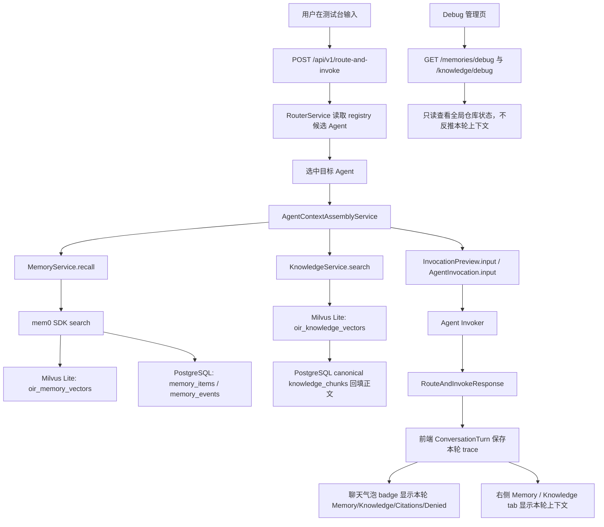

# 记忆与知识库调试台端到端测试方案

版本：v0.1
日期：2026-07-09
适用范围：`add-memory-knowledge-debug-console`、mem0 记忆闭环、knowledge Milvus Lite 检索闭环、本地可视化测试台

## 1. 目标

本方案用于验收“用户输入 -> 路由 -> Agent 调用 -> memory/knowledge 上下文注入 -> 前端每轮展示 -> 只读调试管理页”的完整闭环。当前本地环境应按真实后端验收：PostgreSQL 使用 OIR 专属库，memory 使用 mem0 SDK + Milvus Lite，knowledge 使用 PostgreSQL canonical chunks + Milvus Lite 向量索引，embedding 沿用阿里 DashScope OpenAI-compatible 配置，LLM 复用 DeepSeek。

重点不是只证明接口能返回 200，而是验证：

- 测试数据可以从近似空库状态自行创造，并且不依赖历史 smoke 残留。
- 注册表里现有子智能体/意图信息被重新核对，前端和后端使用的是同一份 Agent Definition。
- 每轮对话只展示本轮实际使用的 memory/knowledge，不拿全局 debug 数据冒充本轮上下文。
- Memory 与 Knowledge 在 UI、API、PostgreSQL、Milvus Lite 中的边界清楚。
- `oir_knowledge_vectors` 与历史 `oac_knowledge_chunks` 的过渡边界不被混淆。
- 异常、空结果、权限拒绝、超时、失败轮次、敏感字段脱敏都有明确表现。

## 2. 当前环境预检记录

以下是 2026-07-09 本地服务当前观测值，后续正式跑测前需要重新确认一次。

| 项目 | 当前值 | 验收关注 |
| --- | --- | --- |
| Frontend | `http://127.0.0.1:5173/` | Vite 测试台可访问 |
| Backend | `http://127.0.0.1:8000/` | FastAPI 可访问 |
| `storage_backend` | `database` | 应写入真实 PostgreSQL |
| `registry_backend` | `file` | 注册表只读，来源为 `config/agents.example.yaml` |
| `registry_agent_count` | `4` | 与 `/api/v1/agents` 一致 |
| Router LLM | `openai_compatible` / `deepseek-chat` | 不在响应中暴露 key |
| Memory | `mem0` / `oir_memory_vectors` / `.data/oir_memory_milvus.db` | mem0 + Milvus Lite |
| Memory history | `postgresql` | OIR ledger 为 `memory_items` / `memory_events` |
| Knowledge | `milvus` / `oir_knowledge_vectors` / `.data/oir_knowledge_milvus.db` | 正文以 PostgreSQL canonical chunk 为准 |

当前库不是完全空库：debug API 中已有历史 smoke 数据，例如 `smoke_user/smoke_tenant` 的 memory，以及 `smoke_knowledge_*` source/chunk/log。正式验收不要删除这些证据；本轮使用 `e2e_20260709_*` 前缀造隔离数据，并且所有断言只针对该前缀。

## 3. 注册表基线

正式跑测前先固定当前注册表基线：

```bash
curl -sS http://127.0.0.1:8000/api/v1/runtime/config
curl -sS http://127.0.0.1:8000/api/v1/agents
```

预期 Agent：

| Agent ID | 名称 | 优先级 | 类型 | Memory | Knowledge | 用途 |
| --- | --- | ---: | --- | --- | --- | --- |
| `visit_preparation` | 访前准备 | 30 | `mock` | `prefetch`: `user_preference`, `stable_fact`, `session_summary` | `controlled_retrieval`: `visit_playbook` | 访前准备、controlled retrieval 边界 |
| `script_writer` | 话术生成 | 20 | `mock` | `prefetch`: `user_preference`, `stable_fact`, `task_memory` | `disabled` | memory-only 主路径 |
| `wealth_knowledge` | 理财知识 | 15 | `mock` | `prefetch`: `user_preference`, `stable_fact` | `prefetch`: `wealth_product_docs`, `risk_policy_docs` | memory + knowledge 主路径 |
| `system_usage_guide` | 系统使用指引 | 10 | `ui_handoff` | `disabled` | `disabled` | context disabled 与 UI handoff |

注册表验收点：

- `/api/v1/agents` 返回 4 个 Agent，排序应按优先级降序。
- `source` 为 `file`，runtime 中 `registry_mutation_mode=read_only_file`。
- `/api/v1/agents/available` 对 `operator/default` 用户返回 4 个可用 Agent。
- 无 `operator` 角色或不在允许 tenant 时，不应得到这些 Agent。
- 每个 Agent 的 `trigger.keywords`、`positive_examples`、`negative_examples` 与 `config/agents.example.yaml` 一致。
- Agent 的 `context.memory`、`context.knowledge` 与上表一致；尤其确认 `visit_preparation` 是 `controlled_retrieval`，不是普通 prefetch。

## 4. 造数策略

### 4.1 数据命名

统一使用以下前缀，避免和 smoke 残留混在一起：

| 类型 | 命名 |
| --- | --- |
| 用户 | `e2e_user_a`, `e2e_user_b`, `e2e_admin_a`, `e2e_no_role` |
| 租户 | `e2e_tenant_a`, `e2e_tenant_b` |
| Session | `e2e_session_memory`, `e2e_session_knowledge`, `e2e_session_edges` |
| Memory source | `e2e_seed`, `e2e_negative_seed`, `e2e_agent_result` |
| Knowledge source | `wealth_product_docs`, `risk_policy_docs`, `visit_playbook`, `e2e_admin_docs`, `e2e_disabled_docs`, `e2e_tenant_b_docs` |
| Knowledge chunk | `e2e_chunk_*` |

`wealth_product_docs`、`risk_policy_docs`、`visit_playbook` 必须用这些精确 ID，因为现有 Agent Definition 已经引用它们。

### 4.2 Memory 造数

通过公开 API 写入 accepted / rejected / filtered 数据：

```bash
curl -sS -X POST 'http://127.0.0.1:8000/api/v1/memories/write-candidates?user_id=e2e_user_a&tenant_id=e2e_tenant_a' \
  -H 'Content-Type: application/json' \
  -d '[
    {
      "scope": "user_preference",
      "content": "e2e_user_a prefers concise Chinese answers and dislikes overly salesy wording.",
      "source": "e2e_seed",
      "confidence": 0.95,
      "importance": 0.8
    },
    {
      "scope": "stable_fact",
      "content": "e2e_user_a usually prepares client visits for cautious wealth-management customers.",
      "source": "e2e_seed",
      "confidence": 0.9,
      "importance": 0.7
    },
    {
      "scope": "task_memory",
      "content": "For the current campaign, e2e_user_a wants WeChat copy to mention liquidity buffers.",
      "source": "e2e_seed",
      "confidence": 0.85,
      "importance": 0.7
    },
    {
      "scope": "session_summary",
      "content": "The latest e2e session focused on capital preservation and follow-up questions.",
      "source": "e2e_seed",
      "confidence": 0.8,
      "importance": 0.6
    }
  ]'
```

隔离数据：

```bash
curl -sS -X POST 'http://127.0.0.1:8000/api/v1/memories/write-candidates?user_id=e2e_user_b&tenant_id=e2e_tenant_b' \
  -H 'Content-Type: application/json' \
  -d '[
    {
      "scope": "user_preference",
      "content": "e2e_user_b prefers English summaries for overseas bond products.",
      "source": "e2e_seed",
      "confidence": 0.95
    }
  ]'
```

拒绝数据：

```bash
curl -sS -X POST 'http://127.0.0.1:8000/api/v1/memories/write-candidates?user_id=e2e_user_a&tenant_id=e2e_tenant_a' \
  -H 'Content-Type: application/json' \
  -d '[
    {
      "scope": "stable_fact",
      "content": "This low-confidence memory should be rejected.",
      "source": "e2e_negative_seed",
      "confidence": 0.2
    },
    {
      "scope": "stable_fact",
      "content": "This sensitive memory should be rejected.",
      "source": "e2e_negative_seed",
      "confidence": 0.9,
      "metadata": {"sensitive": true}
    },
    {
      "scope": "task_memory",
      "content": "   ",
      "source": "e2e_negative_seed",
      "confidence": 0.9
    }
  ]'
```

验收期望：

- accepted 数据进入 `memory_items`，并写入 `memory_events`。
- rejected 数据只产生拒绝决策，不进入 active memory。
- Debug 管理页按 `user_id=e2e_user_a`、`tenant_id=e2e_tenant_a`、`scopes=user_preference,stable_fact` 能过滤。
- 前端展示和 API 原始 JSON 中不得出现 API key、数据库密码、token。

### 4.3 Knowledge 造数

当前没有创建 knowledge source/chunk 的公开管理 API。测试阶段使用一个临时 seed helper 或 Python 片段调用 repository + `MilvusKnowledgeVectorStore.upsert_chunks()`，同时写 PostgreSQL canonical 数据和 Milvus Lite 派生向量索引。

必须创建的 canonical sources：

| Source ID | 权限 | 状态 | 目的 |
| --- | --- | --- | --- |
| `wealth_product_docs` | `allow_tenants=["e2e_tenant_a"]` | enabled | `wealth_knowledge` 正常命中 |
| `risk_policy_docs` | `allow_tenants=["e2e_tenant_a"]` | enabled | `wealth_knowledge` 第二来源与 citation |
| `visit_playbook` | `allow_tenants=["e2e_tenant_a"]` | enabled | `visit_preparation` controlled retrieval |
| `e2e_admin_docs` | `allow_roles=["admin"]` | enabled | 普通用户 denied，管理员可见 |
| `e2e_disabled_docs` | `allow_tenants=["e2e_tenant_a"]` | disabled | disabled denied |
| `e2e_tenant_b_docs` | `allow_tenants=["e2e_tenant_b"]` | enabled | 跨租户隔离 |

建议 chunks：

| Chunk ID | Source | 内容主题 | 断言 |
| --- | --- | --- | --- |
| `e2e_chunk_wealth_liquidity` | `wealth_product_docs` | 流动性缓冲、低波动配置、回撤控制 | “保本/稳健/流动性”查询首位命中 |
| `e2e_chunk_wealth_duration` | `wealth_product_docs` | 久期风险、利率变动、净值波动 | “久期风险”查询命中 |
| `e2e_chunk_risk_suitability` | `risk_policy_docs` | 风险等级、适当性、不得承诺收益 | citation 来自 risk policy |
| `e2e_chunk_visit_questionnaire` | `visit_playbook` | 访前准备问题清单 | controlled retrieval 可检索 |
| `e2e_chunk_admin_only` | `e2e_admin_docs` | 内部合规升级口径 | operator denied |
| `e2e_chunk_disabled` | `e2e_disabled_docs` | 禁用源内容 | 不得命中 |
| `e2e_chunk_tenant_b` | `e2e_tenant_b_docs` | B 租户专属内容 | A 租户不得命中 |

验收期望：

- PostgreSQL `knowledge_sources` / `knowledge_chunks` 是 canonical 正文来源。
- Milvus Lite `oir_knowledge_vectors` 只保存 `chunk_id`、`source_id`、`title`、`uri` 和向量等索引元数据。
- 检索结果正文必须由 PostgreSQL chunk 回填；不要信任 Milvus 中的正文。
- 本轮不写 `oac_knowledge_chunks`。如果后续需要 IRS 过渡验证，应保留 collection provenance，并从 canonical chunks 重新索引到 `oir_knowledge_vectors`。

## 5. 端到端流程



## 6. 测试场景矩阵

### 6.1 环境与健康检查

| ID | 场景 | 操作 | 预期 |
| --- | --- | --- | --- |
| ENV-01 | 后端健康 | `GET /health`, `GET /ready` | 均返回可用 |
| ENV-02 | runtime 配置 | `GET /api/v1/runtime/config` | backend、collection、URI、provider 与本方案一致；只显示 `*_configured`，不显示 key |
| ENV-03 | debug 空/非空识别 | `GET /memories/debug`, `GET /knowledge/debug` | 能看到历史 smoke；后续断言只使用 `e2e_20260709_*` |
| ENV-04 | 前端加载 | 打开 `http://127.0.0.1:5173/` | 无白屏；runtime 摘要可见 |

### 6.2 注册表与意图核对

| ID | 场景 | 输入/操作 | 预期 |
| --- | --- | --- | --- |
| REG-01 | Agent 列表 | `GET /api/v1/agents` | 4 个 Agent，来源 `file` |
| REG-02 | 可用性 | `/agents/available`，用户 roles=`operator`, groups=`default`, tenant=`e2e_tenant_a` | 4 个 Agent 可用 |
| REG-03 | 权限拒绝 | 用户无 `operator` role | 候选集为空或不包含 demo Agent |
| REG-04 | 话术意图 | “帮我写一段客户邀约话术，强调稳健和流动性” | 路由到 `script_writer` |
| REG-05 | 知识意图 | “帮我解释久期风险和净值波动” | 路由到 `wealth_knowledge` |
| REG-06 | 访前准备意图 | “帮我做明天客户拜访的访前准备” | 路由到 `visit_preparation` |
| REG-07 | 系统指引意图 | “子牙系统里客户画像在哪里” | 路由到 `system_usage_guide`，返回 UI handoff |

### 6.3 Memory API 与 mem0 闭环

| ID | 场景 | 操作 | 预期 |
| --- | --- | --- | --- |
| MEM-01 | accepted 写入 | 写入 `user_preference` / `stable_fact` / `task_memory` / `session_summary` | 返回 `accepted`，debug 有 item 和 event |
| MEM-02 | 低置信度拒绝 | `confidence=0.2` | 返回 `rejected: low_confidence` |
| MEM-03 | 敏感拒绝 | `metadata.sensitive=true` | 返回 `rejected: sensitive`，UI/API 不泄露敏感 metadata 中的 secret-like 字段 |
| MEM-04 | 空内容拒绝 | content 为空白 | 返回 `rejected: empty_content` |
| MEM-05 | scope 过滤 | recall scopes=`user_preference` | 只召回用户偏好 |
| MEM-06 | 多 scope 过滤 | recall scopes=`user_preference,stable_fact,task_memory` | 不触发 mem0 filter 类型错误；若返回 error，记录为 P0 bug |
| MEM-07 | 租户隔离 | `e2e_user_a/e2e_tenant_a` 查询 `e2e_user_b` 内容 | 不命中 |
| MEM-08 | `max_items=0` | recall `max_items=0` | 返回空/disabled，不回落默认 5 |
| MEM-09 | task TTL | `task_memory` 写入后检查 `ttl_expires_at` | 有过期时间 |
| MEM-10 | cleanup | 制造过期 task memory 后 `POST /memories/cleanup` | 过期 item 不再 active，产生 `memory_expired` event |

特别关注：当前历史 smoke 曾出现 `mem0 search failed: Filter value for 'scope' must be str, int, float, or bool, got dict`。本轮必须用 MEM-06 和 `script_writer` 主路径复现验证，确认多 scope 搜索是否已稳定。

### 6.4 Knowledge API 与 Milvus Lite 闭环

| ID | 场景 | 操作 | 预期 |
| --- | --- | --- | --- |
| KNO-01 | 正常向量命中 | query “稳健配置如何处理流动性缓冲” source=`wealth_product_docs` | `status=ok`，首位命中 `e2e_chunk_wealth_liquidity` |
| KNO-02 | 多来源 citation | source=`wealth_product_docs,risk_policy_docs` | items/citations 覆盖两个 source |
| KNO-03 | source 缺失 | source=`missing_source` | `denied_source_ids` 包含 missing source，status empty/denied，不 500 |
| KNO-04 | disabled source | source=`e2e_disabled_docs` | denied，不返回 chunk |
| KNO-05 | role 权限 | operator 查 `e2e_admin_docs` | denied；admin 查询可命中 |
| KNO-06 | tenant 隔离 | tenant A 查 `e2e_tenant_b_docs` | denied |
| KNO-07 | tag 过滤 | `source_tags=["product"]` | 只在含 tag 的 source 中检索 |
| KNO-08 | `top_k=0` | search top_k=0 | 不调用 Milvus 或返回空 items |
| KNO-09 | `top_k=51` | search top_k=51 | 422 |
| KNO-10 | retrieval log | 每次 search 后查 `/knowledge/debug` | log 记录 caller、purpose、selected、denied、hit_count、collection |
| KNO-11 | 不信任 Milvus 正文 | 人为让 Milvus metadata 与 PostgreSQL chunk 标题/正文不同 | 响应正文以 PostgreSQL canonical chunk 为准 |

### 6.5 Route + Invoke 主路径

所有请求都使用 `POST /api/v1/route-and-invoke`，用户上下文：

```json
{
  "id": "e2e_user_a",
  "roles": ["operator"],
  "groups": ["default"],
  "attributes": {"tenant_id": "e2e_tenant_a"}
}
```

| ID | Agent | 用户输入 | 预期上下文 |
| --- | --- | --- | --- |
| E2E-01 | `script_writer` | “帮我写一段客户邀约话术，强调稳健、流动性和不要太销售化。” | Memory `ok` 且 item > 0；Knowledge `disabled`；聊天气泡显示 Memory badge |
| E2E-02 | `wealth_knowledge` | “给客户解释一下久期风险、净值波动和流动性缓冲。” | Memory `ok` 或 `empty`；Knowledge `ok` 且 citation > 0；右侧 Knowledge tab 展示本轮 source/chunk |
| E2E-03 | `visit_preparation` | “帮我做明天客户拜访的访前准备，目标是解释稳健配置。” | Memory prefetch；Knowledge 在普通 route/invoke 中应保持 `disabled`，controlled retrieval 不应被前端误报为已使用 |
| E2E-04 | `system_usage_guide` | “子牙系统里客户画像在哪里？” | Memory/Knowledge 均 disabled；返回 UI handoff |
| E2E-05 | route-only | UI 切到 route-only 后发送知识问题 | 不展示 invocation input；Memory/Knowledge 显示 unavailable/空态，不复用上一轮 |
| E2E-06 | 失败轮次 | 人为触发后端错误或断开后端后发送 | 当前失败 turn 清空 trace，不沿用上一轮 badges/tab |
| E2E-07 | 连续多轮 | 先 `wealth_knowledge`，再 `script_writer`，再点击第一轮 | 右侧 tab 跟随选中 turn，而不是始终显示最新轮 |

### 6.6 前端调试台与只读管理页

| ID | 场景 | 操作 | 预期 |
| --- | --- | --- | --- |
| UI-01 | 聊天气泡 badge | 完成 E2E-01/E2E-02 | badge 显示 Memory 数、Knowledge 数、citation 数、denied 数和 status |
| UI-02 | 右侧 tab | 切换 Memory / Knowledge | 分别展示本轮上下文，不混在一个 tab |
| UI-03 | 历史 turn 选择 | 点击历史中控气泡 | 右侧 Route/Memory/Knowledge/Debug 切到该轮 |
| UI-04 | Memory 管理页过滤 | 输入 `user_id=e2e_user_a`, `tenant_id=e2e_tenant_a` | 只显示对应 items/events |
| UI-05 | Knowledge 管理页过滤 | 输入 source=`wealth_product_docs` | 只显示该 source/chunks/logs |
| UI-06 | backend 摘要 | 查看管理页面 runtime 摘要 | 显示 collection/URI/provider，不显示 key |
| UI-07 | 空态 | 使用无数据用户 `e2e_new_user` | 清楚显示空态，不当作错误 |
| UI-08 | 长文本 | knowledge chunk 内容较长 | 文本不溢出、不遮挡、不撑坏布局 |

### 6.7 安全与脱敏

| ID | 场景 | 操作 | 预期 |
| --- | --- | --- | --- |
| SEC-01 | runtime 脱敏 | `/runtime/config` | 只显示 key configured，不显示真实 key |
| SEC-02 | debug metadata 脱敏 | metadata 中塞入 `api_key`, `password`, `token`, `secret` | 前端 debug 视图显示 redacted 或不展示原值 |
| SEC-03 | 跨租户 memory | tenant A 查询 tenant B | 不命中、不泄露 count 以外敏感内容 |
| SEC-04 | 跨租户 knowledge | tenant A 查询 tenant B source | denied，不返回正文 |
| SEC-05 | source policy | operator 查询 admin source | denied source 可见，但正文不可见 |

### 6.8 基础设施异常

这些可以作为后续专项，不要求在第一次本地 UI smoke 全部破坏环境执行，但方案需要覆盖。

| ID | 场景 | 操作 | 预期 |
| --- | --- | --- | --- |
| INF-01 | PostgreSQL 不可用 | 暂停数据库后启动后端 | `/ready` 或相关 API 明确 degraded/error |
| INF-02 | Milvus Lite 文件不可写 | 指向不可写 URI | memory/knowledge 返回结构化 error，不误报 ok |
| INF-03 | embedding 维度错误 | 临时设置 `EMBEDDING_DIM=1536` | knowledge smoke 明确 dimension mismatch |
| INF-04 | embedding API 失败 | 临时使用无效 embedding key | search/write 返回 error，debug 记录错误摘要但不泄露 key |
| INF-05 | DeepSeek 失败 | 临时使用无效 router key | route 失败可见，不污染 memory/knowledge debug |
| INF-06 | mem0 fail-closed | `MEMORY_MEM0_FAIL_CLOSED=true` 且 mem0 search 失败 | memory status 为 error，不声称已召回 |
| INF-07 | local fallback | `APP_ENV=local`, `MEMORY_MEM0_FAIL_CLOSED=false` | 允许 repository fallback，并在 metadata/events 标记 degraded |

## 7. 执行顺序

1. 环境预检：确认服务、runtime、registry、debug 当前状态。
2. 造 memory 数据：accepted、rejected、跨租户、TTL。
3. 造 knowledge 数据：PostgreSQL canonical sources/chunks + Milvus Lite upsert。
4. API 层验证：memory recall/debug、knowledge search/debug。
5. route-and-invoke 主路径验证：四个 Agent 分别覆盖。
6. 前端 UI 验证：每轮 badges、右侧 tabs、历史 turn、只读管理页过滤。
7. 边界与异常：先跑非破坏性边界，再按需要单独跑基础设施异常。
8. 记录证据：保存 API 响应摘要、前端截图、失败日志和未通过项。

## 8. 通过标准

P0 必须通过：

- `script_writer` memory-only 闭环可用，且多 scope mem0 search 不再出现 filter 类型错误。
- `wealth_knowledge` 能从 `oir_knowledge_vectors` 真实向量检索命中，并从 PostgreSQL canonical chunk 回填正文/citation。
- 前端每轮气泡与右侧 Memory/Knowledge tab 显示的是本轮 trace，不复用上一轮或 debug 全局数据。
- 注册表基线与实际 `/api/v1/agents` 一致，没有旧子智能体/意图残留或丢失。
- Debug API 和前端不泄露真实凭证。

P1 必须记录结果：

- `visit_preparation` controlled retrieval 是否仅按需使用；当前 route/invoke 不应假装已有 knowledge context。
- 权限拒绝、disabled source、missing source、跨租户隔离有明确 denied/empty 表现。
- `max_items=0`、`top_k=0`、`top_k=51` 等边界行为符合 schema。
- 失败轮次清空 trace，历史 turn 可回看。

## 9. 待实现或待确认的测试辅助

正式执行前建议新增一个只在本地验收使用的 seed helper，避免手工 SQL 与 Milvus upsert 分散：

- `scripts/seed_memory_knowledge_debug_console_data.py`
- 输入固定前缀或 run id。
- 写入 memory candidates。
- 写入 knowledge sources/chunks。
- 调用 `MilvusKnowledgeVectorStore.upsert_chunks()`。
- 输出 created source/chunk/memory IDs。
- 不写真实 API key，不打印数据库密码。

如果不新增 helper，也可以复用 `scripts/smoke_knowledge_milvus_vector_search.py` 的模式，但需要扩展 source IDs 为现有 Agent 引用的 `wealth_product_docs`、`risk_policy_docs`、`visit_playbook`。

## 10. 已知风险

- 当前 registry 是 file 后端，前端管理页若展示 Agent 编辑能力必须清楚标记只读；本方案只验收 memory/knowledge debug 只读管理。
- 当前已有 smoke 数据，不能把“debug 里有数据”当作本轮造数成功。
- `visit_preparation` 的 `controlled_retrieval` 目前不是普通 prefetch，端到端主路径可能看不到 knowledge item；如果产品预期“访前准备自动展示知识库”，需要另开后端行为变更。
- mem0 多 scope filter 之前出现过兼容问题，本轮必须优先验证。
- Knowledge source/chunk 暂无公开写入 API，验收数据需要脚本或 repository 层造数；这不是产品管理能力，只是测试准备能力。

## 11. Conversation Memory Formation 增量验收

本节覆盖 `add-conversation-memory-auto-formation` 的最终链路，执行细节和上线 gate 见 [`conversation-memory-formation-rollout.md`](conversation-memory-formation-rollout.md)。

| ID | 场景 | 预期 |
| --- | --- | --- |
| FM-01 | mode=`off` 完整调用 | 不缓存自动 formation turn、不创建 job；显式 write-candidates、recall、index/TTL maintenance 保持可用 |
| FM-02 | mode=`observe` 连续 5 轮 | 创建冻结 turn range/job，运行 model+policy 并记录 decisions，但不改变 current/revision/provider |
| FM-03 | 30 秒 idle 且无 session close | durable sweeper 创建唯一 idle job；与第五轮竞态收敛，不重复推进 watermark |
| FM-04 | mode=`enforced` preference ADD/UPDATE | revision 1→2，稳定 OIR/mem0 ID，provider 只有一个 vector |
| FM-05 | Plan structured event | 立即产生 owner-scoped `task_memory`；“继续上次任务”命中，无关新任务不命中；不增加 Router intent |
| FM-06 | 用户/TTL 删除 | deletion pending 立即停止 recall；provider 成功后 current/revisions/vector 均无正文，只留 tombstone |
| FM-07 | 跨 tenant/user/subject | formation、dedupe、consolidation、debug、management、recall 均不越权或泄露存在性 |
| FM-08 | temporary/private request | buffer 前跳过，仅保留 redacted skipped trace，pending payload 不落库 |
| FM-09 | provider/index 失败与 repair | PostgreSQL 保持 canonical，outbox retry/dead-letter 可见，rebuild 仅从 active projection 恢复 |
| FM-10 | selected-turn console | Recall Used 与 Formation/Write Decisions 分开；延迟 job 回挂 source range，旧 turn 不读取全局 debug |
| FM-11 | 三层 semantic policy | 多语言语义由 formation fixture 输出；字段冲突/unknown/Assistant-only 为 PENDING/REJECT；临时语言 filter 只能降级 |
| FM-12 | verifier 复核 | absent/error/invalid/uncertain 保持 PENDING；confirmed 后制造 current revision 竞态，必须重新检查且不得覆盖 |

Formation Trace 只展示 `semantic_contract_version`、validation/verifier outcome 和计数，不展示 semantic value、完整 quote 或 prompt。汇报演示应在前端测试台提交“记住我喜欢中文回答”，等待 idle job 完成后同时展示选中轮次 Formation Decision 和全局 Memory Debug current/revision；不得只用接口响应代替 UI 流程。

后端验收矩阵由 `tests/test_memory_acceptance_matrix.py` 校验全部 OpenSpec Requirement 与 reason code 均映射到真实测试；跨租户完整闭环由 `tests/test_memory_end_to_end_acceptance.py` 覆盖。真实 provider 闭环运行：

```bash
.venv/bin/python scripts/smoke_mem0_memory_loop.py
```

通过时必须看到 `SMOKE_OK`，且不得把 PostHog、gRPC fork 或可选 spaCy extra 提示误判为业务成功或失败。
