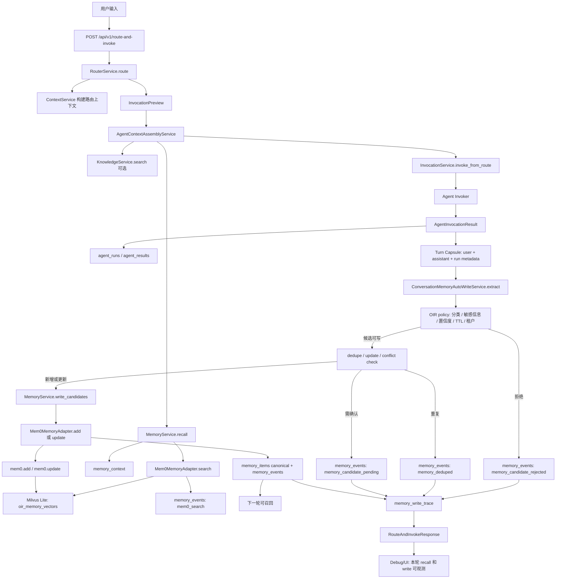

# OIR 对话记忆自动写入策略

本文调研并设计 `route-and-invoke` 对话链路的“召回 -> 调用 -> 自动抽取 -> 写入/拒绝 -> 可观测”闭环。调研更新日期：2026-07-10。

## 调研范围与来源

本次先阅读了仓库现有实现与文档：

- `docs/mem0-memory-integration.md`
- `docs/api.md`
- `docs/memory-knowledge-debug-console-e2e-test-plan.md`
- `docs/memory-knowledge-debug-console-e2e-test-report.md`
- `app/services/memory_service.py`
- `app/services/memory_adapter.py`
- `app/services/agent_context_service.py`
- `app/services/invocation_service.py`
- `app/api/router.py`
- `app/api/memory.py`
- `app/schemas/memory.py`
- `app/schemas/agent_context.py`
- `app/repositories/context_stores.py`
- `app/db/models.py`
- `sql/postgresql_schema.sql`
- `web/src/App.tsx`
- `web/src/types.ts`

按项目规则使用 Context7 查询 mem0 当前文档：

- `npx ctx7@latest library mem0 "..."`
- 选中 `/mem0ai/mem0` 和 `/websites/mem0_ai`
- `npx ctx7@latest docs /mem0ai/mem0 "..."`
- `npx ctx7@latest docs /websites/mem0_ai "..."`

外部公开来源：

| 来源 | 关键结论 |
| --- | --- |
| [Mem0 Add Memory](https://docs.mem0.ai/core-concepts/memory-operations/add) | `add` 接收有序 user/assistant messages，`infer=True` 默认抽取结构化记忆；平台 API 返回 `PENDING` + `event_id`；建议在 agent 学到偏好、事实、决策、任务完成、反馈时写入。 |
| [Mem0 Update Memory](https://docs.mem0.ai/core-concepts/memory-operations/update) | 用户纠正或事实变化时用 `update` 修正已有 memory；Platform 支持 batch update，OSS Python SDK 支持 update，JS OSS 当前需 REST/API 或自建循环。 |
| [Mem0 Advanced Memory Operations](https://docs.mem0.ai/platform/advanced-memory-operations) | conversation add 可携带 metadata 和 `run_id`；search 支持 metadata filter/rerank；更新应命中既有 memory ID；可按 user/run scope 删除。 |
| [Mem0 Custom Instructions](https://docs.mem0.ai/platform/features/custom-instructions) | 用项目级自然语言规则控制抽取范围、分类和排除项；官方强调隐私排除、规则一致性和上线前用真实对话测试。 |
| [Mem0 Memory Decay](https://docs.mem0.ai/platform/features/memory-decay) | decay 是 search-time 软排序偏置，不删除 memory；可用最近访问和访问频次弱化陈旧记忆。 |
| [LangGraph Memory Overview](https://docs.langchain.com/oss/python/concepts/memory) | 长期记忆写入分为 hot path 和 background；后台常见触发包括延时并在新事件到来时重排、cron、用户或应用手动触发。Profile 与 collection 分别对应整档更新和细粒度记忆集合。 |
| [Zep Adding Messages](https://help.getzep.com/adding-messages) | 建议每轮 chat turn 按顺序添加 human 和 AI messages；可忽略 assistant role，但仍用 assistant 消息为用户短回复补上下文。 |
| [Zep Batch Ingestion](https://help.getzep.com/adding-batch-data) | 大规模历史数据/迁移/回填应走 batch，异步处理并可追踪 item 状态，不干扰实时写入。 |
| [Zep Key Concepts](https://help.getzep.com/concepts) | Zep 从 chat/business/doc/json 构建 temporal graph，更新时会 invalidating outdated facts 并保留历史。 |
| [OpenAI ChatGPT Memory FAQ](https://help.openai.com/en/articles/8590148-memory-faq) | 产品实践强调自动更新/合并/移除、按最近性和频率维护 top-of-mind、版本历史恢复、sources、用户可关闭/删除/纠错、Temporary Chat 和敏感信息治理。 |
| [Letta Stateful Agents](https://docs.letta.com/guides/core-concepts/stateful-agents) | 状态化 Agent 会持久化 messages、memory blocks、tool calls，核心 memory 可被 Agent 通过 tools 修改，也可由开发者 API 修改。 |

2026-07-10 使用 Firecrawl 对上述官方页面完成补查，并直接抓取 Zep Adding Messages、Zep Batch Ingestion 和 Mem0 Advanced Memory Operations。Firecrawl 结果与 Context7、浏览器公开页面结论一致；本次没有发现需要因来源冲突而保留的待验证项。产品能力和托管平台套餐可能继续变化，实施前仍应按锁定版本复核 SDK/API 契约。

## 调研结论摘要

1. 主流记忆系统不会只靠“固定轮次抽取”。固定 N 轮更适合作为 session summary 或后台 consolidation 的触发器；对于用户明确偏好、纠正、任务状态、重要决策，应在 turn 结束后尽快生成候选。
2. 实时写入有两类：hot path 写入和 post-response/background 写入。LangGraph 将二者作为一等取舍：hot path 可让用户立刻看到“记住了什么”，但增加延迟；background 不拖慢主响应，但下一轮可能暂时召回不到。
3. mem0 和 Zep 都把“按 conversation messages ingest”作为核心入口。mem0 `add(messages, user_id=...)` 负责抽取/存储；Zep 建议每轮添加 human/AI messages 并保留顺序。
4. 生产系统通常采用混合策略：高置信、低敏感、低风险事实自动写；低置信、敏感、跨主体、合规相关内容进入 pending 或拒绝；用户显式“记住/忘记/不要记住”优先级最高。
5. 记忆不是单纯 append。需要在写前分类和治理，在写中查重、冲突判断、更新或跳过，在写后做 consolidation、TTL 清理、用户删除、审计和可迁移性保障。
6. 对 OIR 来说，PostgreSQL `memory_items` / `memory_events` 必须继续是 canonical ledger。mem0/Milvus `oir_memory_vectors` 是策略层和向量索引，不应成为唯一事实源。
7. 成熟产品还会维护 memory 的优先级和版本：最近性、访问频率、用户手动优先/降级影响召回；自动合并或移除必须有历史和恢复能力，不能只覆盖当前值。

## 现状判断

当前 OIR 已具备这些基础能力：

- `MemoryService.recall()` 已由 Agent context prefetch 链路调用，输出稳定 `memory_context`。
- `POST /api/v1/memories/write-candidates` 已接入 `MemoryService.write_candidates()`，会先执行 OIR policy，再调用 adapter。
- `Mem0MemoryAdapter.add/search/delete_many()` 已接入 mem0，记录 `mem0_add/search/delete` 事件，并保存 `memory_id` 到 `mem0_memory_id` 映射。
- Milvus Lite memory collection 为 `oir_memory_vectors`。
- OIR PostgreSQL canonical ledger 为 `memory_items` / `memory_events`。
- Debug console 已能展示每轮 `memory_context`、Memory Items、Memory Events 和 mem0 provider 状态。

当前缺口：

- `route-and-invoke` 只完成 route、context prefetch、invoke、run/result 记录，没有 turn 结束后的自动抽取 hook。
- `MemoryStrategyAdapter.extract()` 目前是 no-op，不能从 transcript 产出结构化 `MemoryWriteCandidate`。
- 当前 `MemoryWriteCandidate` 是显式输入，不含 `request_id`、`run_id`、`session_id`、`turn_id`、候选 hash、操作类型、拒绝说明等自动写入 trace 字段。
- Debug/UI 只有 recall trace 和全局 debug state，缺少“本轮 write trace”。

## 方案目标与非目标

目标：

- 在 `route-and-invoke` 每轮调用后，自动抽取可长期复用的低风险记忆候选。
- 候选必须经过 OIR 分类、隐私/敏感信息过滤、置信度、TTL、租户隔离和审计，再进入 mem0。
- 每轮能看到 recall 用了哪些 memory，write 产生、跳过、拒绝、更新了哪些 memory。
- 不让下游 Agent 感知 mem0、Milvus 或 PostgreSQL 细节；Agent 仍只消费 `memory_context`。
- 保持 `memory_items` / `memory_events` 为 canonical ledger，mem0/Milvus 为派生能力。
- 支持后续迁移到其他 memory provider。

非目标：

- 不在本方案中实现完整后台队列、重试调度器或管理 UI。
- 不让 Router LLM 自由决定写入长期记忆。
- 不把完整聊天 transcript 原文直接存入 `memory_items` 作为长期事实。
- 不把知识库向量 collection 与 memory collection 混用。
- 不把敏感信息、密钥、账号、身份证件号、原始合同正文等自动写入长期记忆。

## 推荐抽取时机策略

### P0：每轮 `route-and-invoke` 后的受限 hot-path 写入

推荐作为最小闭环。

触发条件：

- `MEMORY_AUTO_WRITE_ENABLED=true`。
- 仅对 `POST /api/v1/route-and-invoke` 且存在实际 `AgentInvocationResult` 的轮次触发。
- `result.status` 为 `completed` 或业务定义的可用状态；失败轮次默认只记录事件，不写长期记忆。
- `request.frontend_context.memory_auto_write=false` 或用户输入命中“不要记住/临时对话”等禁用信号时跳过。

执行方式：

- 在 `InvocationService.invoke_from_route()` 完成 Agent 调用并记录 run/result 后，调用新的 `ConversationMemoryAutoWriteService`.
- 给抽取和写入一个小 timeout，例如 800 到 1500ms。超时不影响主调用结果，返回 `memory_write_trace.status=timeout|pending`。
- P0 为了 UI 可见性，可以在 local/debug 模式同步等待决策；生产可先返回 pending trace，再由 debug endpoint 查询最终事件。

优点：

- 最快补上闭环。
- 下一轮大概率可召回新记忆。
- Debug console 能直接展示本轮 accepted/rejected。

代价：

- 增加一次 LLM 抽取和 mem0 add 的链路耗时。
- 需要非常保守的候选过滤，否则错误记忆会被快速放大。

### P1：post-response 异步写入队列

适合流量增大和真实生产。

触发条件：

- 同 P0，但 `route-and-invoke` 返回后写入任务进入本地队列或 durable job queue。
- 响应中只返回 `memory_write_trace.status=pending`、`job_id`、候选摘要或 “未完成” 状态。

执行方式：

- 新增 `memory_write_jobs` 或复用 `memory_events` payload 记录 `memory_extraction_queued`。
- worker 根据 `request_id + run_id + extractor_version` 做幂等。
- 支持 retry、dead-letter、任务状态查询和 UI 轮询。
- 支持三类后台触发：短延时且新 turn 到来时重排、周期 cron、用户/应用显式触发。
- 历史回填或系统迁移走独立 batch，不与实时 turn 写入争抢主链路资源；任务和 item 都应有可查询状态。

优点：

- 不拖慢主对话。
- 失败可重试，便于批量回补。
- 更容易引入人工审核或策略模型。

代价：

- 下一轮可能还召回不到。
- UI 需要 pending/polling 设计。

### P2：固定轮次、会话结束与后台 consolidation

适合作为质量治理，不建议替代每轮低风险候选抽取。

触发条件：

- 每 8 到 12 轮，或 context token/char 超阈值。
- session 明确结束、Agent exit、plan 完成、用户长期离线。
- 每日/每周后台任务对同一用户/租户/agent scope 做 consolidation。

执行方式：

- 生成或更新 `session_summary`，TTL 使用现有 `memory_session_summary_ttl_days`。
- 合并重复偏好、过期 task memory、陈旧 artifact reference。
- 对冲突事实生成 `memory_conflict_detected` 事件，不自动覆盖高风险字段。
- 用 recency、使用频次、importance 和用户手动 priority 维护 top-of-mind；衰减只影响排序，不等于删除 canonical memory。
- consolidation 保留变更前版本或 superseded 关系，允许调试和用户恢复。

优点：

- 减少碎片化和重复。
- 能处理跨轮、跨会话的主题演进。

代价：

- 时效性弱。
- 需要更强审计和回滚能力。

### 用户显式确认策略

用户显式意图必须优先：

- “记住...”：提高候选优先级，但仍过敏感信息过滤。
- “不要记住/临时聊/这段别保存”：本轮禁写，并记录 `memory_write_skipped`。
- “忘记/删除...”：转成删除请求，不再通过普通抽取写入。
- “不是这样/我改主意了”：触发 update 或 conflict resolution，而不是新增一条相反事实。

P0 可先只支持跳过和记住；P1 开始支持 pending confirmation；P2 支持完整 memory management。

## 记忆分类、更新、去重、生成流程

推荐采用“OIR 先生成候选，mem0 负责存储/检索/向量索引”的模式。原因是 `memory_items` 是 canonical ledger，不能把未治理 transcript 原文直接当成 accepted memory。mem0 的 conversation extraction 能力后续可以作为 adapter 的 `extract_messages()` 能力接入，但必须返回归一化候选后再进入 OIR policy。

### 1. 构建 Turn Capsule

每轮只给抽取器一个有界对象：

```json
{
  "request_id": "req_x",
  "session_id": "sess_x",
  "run_id": "run_x",
  "agent_id": "agent_x",
  "user_id": "u_x",
  "tenant_id": "t_x",
  "user_message": "...",
  "assistant_message": "...",
  "agent_output_summary": "...",
  "used_memory_ids": ["mem_..."],
  "artifact_refs": [],
  "timestamp": "..."
}
```

要求：

- user/assistant 文本按 `context_per_item_char_limit` 截断。
- 不传入完整 `memory_context.summary` 作为新事实来源，只传 `used_memory_ids` 和必要摘要，避免“模型复述旧记忆再写成新记忆”。
- 附件、文件、知识 citation 只存引用，不直接存大段正文。

### 2. 写前分类

抽取器输出结构化候选：

```json
{
  "operation": "add|update|forget|ignore|needs_confirmation",
  "scope": "user_preference|stable_fact|task_memory|artifact_reference|session_summary",
  "content": "用户偏好中文、简洁回答。",
  "subject_type": "user",
  "subject_id": "u_x",
  "confidence": 0.86,
  "importance": 0.6,
  "sensitivity": "none|personal|secret|regulated|unknown",
  "reason": "用户明确表达偏好",
  "evidence": {
    "message_roles": ["user"],
    "quote": "..."
  },
  "metadata": {
    "request_id": "req_x",
    "run_id": "run_x",
    "session_id": "sess_x",
    "extractor_version": "conversation_memory_v1"
  }
}
```

分类规则：

| scope | 写入内容 | 默认 TTL |
| --- | --- | --- |
| `user_preference` | 输出语言、格式偏好、沟通风格、稳定选择偏好 | 不自动过期，除非用户撤回 |
| `stable_fact` | 用户/组织的长期事实、角色、常用工作场景 | 不自动过期，变更时 update |
| `task_memory` | 当前任务目标、待办、临时约束、下一步动作 | 现有默认 14 天 |
| `artifact_reference` | 生成物、外部文档、计划、结果的引用 | 现有默认 14 天 |
| `session_summary` | 多轮对话压缩摘要 | 现有默认 14 天 |

直接拒绝：

- 空内容、低置信、只是一句寒暄。
- API key、密码、token、数据库密码、密钥路径、cookie、验证码。
- 明确金融账户号、证件号、医疗隐私等，除非后续有合规白名单和用户确认。
- 从 assistant 幻觉中推断出的用户事实。
- 只来自被召回 memory 的复述，没有新证据。

### 3. 写中 dedupe/update

在调用 `MemoryService.write_candidates()` 前增加候选治理层：

1. 生成 `candidate_hash = sha256(tenant_id, user_id, subject_type, subject_id, scope, normalized_content)`。
2. 查 `memory_items.metadata.candidate_hash` 或内容归一化 hash，命中则跳过并记录 `memory_deduped`。
3. 用 `MemoryService.recall()` 或 repository 查询同 scope/subject 的近似记忆，判定：
   - 同义重复：跳过或补强 importance，不新增。
   - 同槽位更新：例如“我现在更喜欢英文摘要”，应 update 原 `user_preference`。
   - 明确冲突：记录 `memory_conflict_detected`，低风险偏好可 update，高风险事实进入 `needs_confirmation`。
   - 临时覆盖：例如“这次请用英文”，只写 `task_memory` 或不写 `user_preference`。
4. 对 accepted 新增候选调用 `MemoryService.write_candidates()`，继续复用现有 policy、TTL、mem0 adapter 和 ledger。

更新时建议保留 `supersedes_memory_id`、`valid_from`、`invalidated_at` 和 revision metadata。Zep 的 temporal fact invalidation 与 ChatGPT Memory 的历史恢复都说明，冲突处理应是“当前有效值 + 可追溯历史”，而不是静默覆盖。

P0 可以只实现 exact hash dedupe + 明确用户 correction 的简单 update；P1 再引入语义相似度和 operation-level update/delete。

### 4. mem0 写入与 OIR ledger

推荐 P0 仍走内部 service，不调用 HTTP：

```python
decisions = await memory_service.write_candidates(
    candidates=auto_candidates,
    user_id=route_request.user.id,
    tenant_id=route_request.user.tenant_id,
)
```

每个 candidate metadata 至少包含：

- `request_id`
- `run_id`
- `session_id`
- `turn_id`
- `extractor_version`
- `candidate_hash`
- `source_message_roles`
- `source_memory_ids`
- `dedupe_status`
- `policy_reason`

`Mem0MemoryAdapter.add()` 继续负责：

- 调用 mem0 add。
- 写 `memory_items` canonical item。
- 写 `mem0_add` 事件。
- 保存 `mem0_memory_id`、collection、embedding model/dims 等 metadata。

P1 增加：

- `MemoryStrategyAdapter.update(item, new_content, metadata)`。
- `MemoryStrategyAdapter.delete_many()` 用于用户撤回和 TTL。
- `memory_updated`、`memory_deleted_by_user`、`memory_forget_requested`、`memory_deduped`、`memory_candidate_rejected` 等事件类型。

### 5. 写后 consolidation

后台任务建议：

- `cleanup_expired()`：继续清理 TTL 过期项，并调用 mem0 delete。
- `consolidate_user_memories(user_id, tenant_id)`：合并重复偏好、压缩 session summaries、弱化长期未用的低 importance 记忆。
- `repair_external_mappings()`：校验 `memory_id` 和 `mem0_memory_id` 映射。
- `export_memory_ledger()`：按 tenant/user 导出 OIR canonical ledger，保证 provider 可迁移。
- `rebuild_memory_priority()`：根据 recency、access count、importance 和用户 priority 重算召回排序字段，不删除 canonical item。

## 与现有 OIR 接口和 ledger 的集成方式

### 后端 hook 位置

不建议放在 `RouterService._after_route()`，因为 route-only 没有 Agent 结果，且路由阶段不应写长期记忆。

推荐：

1. `route-and-invoke` 调用 `router_service.route(payload)`。
2. `invocation_service.invoke_from_route(payload, route_response)` 完成 Agent 调用。
3. 在 `InvocationService._invoke_definition()` 记录 `AgentRun` / `AgentResult` 后，触发 `ConversationMemoryAutoWriteService`.
4. `route-and-invoke` 响应带上可选 `memory_write_trace`。

这样 `/invoke` 将来也可复用同一 hook，但 P0 可只在 `invoke_from_route` 的 context 里启用。

### 建议响应扩展

保持兼容，新增可选字段：

```json
{
  "route": {},
  "result": {},
  "memory_write_trace": {
    "status": "ok|skipped|pending|timeout|error",
    "mode": "hot_path|background",
    "request_id": "req_x",
    "run_id": "run_x",
    "used_memory_ids": ["mem_1"],
    "decisions": [
      {
        "status": "accepted|rejected|pending",
        "memory_id": "mem_x",
        "scope": "user_preference",
        "content_preview": "用户偏好中文、简洁回答。",
        "reason": "low_confidence|sensitive|dedupe|memory_write_failed|...",
        "metadata": {
          "mem0_memory_id": "..."
        }
      }
    ]
  }
}
```

如果暂不改顶层 schema，可先放入 `route.context.metadata.memory_write_trace` 或 `result.usage.memory_write_trace`，但长期建议顶层字段，便于前端和 Host App 稳定读取。

### Debug API

现有 `GET /api/v1/memories/debug` 已能按 user/tenant/agent/scope 查询 items/events。建议增强：

- 支持 `request_id`、`run_id`、`session_id` 过滤，先从 `memory_events.payload` 过滤，P1 再考虑列化。
- `MemoryEvent.payload` 增加 `trace_type=auto_write|recall|manual_write|cleanup`。
- 返回 `metadata.recent_auto_write_traces`，便于 UI 直接展示本轮写入链路。

### PostgreSQL ledger

P0 不必新建表，继续写：

- `memory_items.metadata_text`：保存 trace metadata、candidate hash、source ids、mem0 mapping。
- `memory_events.payload_text`：保存抽取、拒绝、dedupe、mem0 add/search/delete 的审计事件。

P1 若需要 durable async queue，再考虑新表：

- `memory_write_jobs(job_id, request_id, run_id, session_id, user_id, tenant_id, status, attempts, payload_text, error_text, created_at, updated_at)`

### mem0/Milvus 边界

- `oir_memory_vectors` 继续只做 memory vector index。
- `memory_items` 才是 accepted memory 的治理事实。
- 删除、撤回和迁移以 PostgreSQL ledger 为准，再同步 mem0/Milvus。
- `memory_events` 记录 mem0 external ID 和错误，不把 mem0 SDK 内部 history 当 canonical。

## 用户输入开始的流程图



## Debug/UI 可观测设计

已有 UI 能展示：

- 聊天气泡 badge：Memory/Knowledge/Citations/Denied。
- 右侧 Memory tab：本轮 `memory_context.items`、status、errors、JSON。
- Debug 管理页：`/memories/debug` 的 items/events/provider metadata。

建议新增本轮 write trace：

1. 聊天气泡增加 `Write accepted/rejected/pending` 数字 badge。
2. 右侧 Memory tab 分成两个区块：
   - `Recall used`：来自 `memory_context.items`，展示 `memory_id`、scope、relevance、confidence、source、TTL。
   - `Write decisions`：来自 `memory_write_trace.decisions`，展示状态、scope、content preview、reason、`memory_id`、`mem0_memory_id`、TTL。
3. Debug tab 增加 `Turn Memory Trace JSON`，包含 turn capsule 摘要、抽取器版本、候选 hash、policy decisions、mem0 events。
4. Memory 管理页增加 request/run/session 过滤，帮助从某轮对话回溯到 ledger。
5. 所有 UI 预览必须走 `redactSensitive` 或后端脱敏，不展示 API key、token、数据库密码、完整证件号等。

建议事件类型：

| event_type | 说明 |
| --- | --- |
| `memory_extraction_started` | 开始从 turn capsule 抽取 |
| `memory_extraction_completed` | 抽取完成，含候选数量 |
| `memory_write_skipped` | 本轮因配置、用户禁写、route-only 等跳过 |
| `memory_candidate_rejected` | policy 拒绝，含 reason |
| `memory_candidate_pending` | 需要用户确认 |
| `memory_deduped` | 与已有记忆重复 |
| `memory_conflict_detected` | 与已有记忆冲突 |
| `memory_updated` | 更新已有 canonical memory |
| `memory_written` | 现有 accepted 事件，可继续复用 |
| `mem0_add` / `mem0_search` / `mem0_delete` | 现有 adapter 事件，可继续复用 |

## 风险与治理

### 隐私和敏感信息

风险：模型可能把用户无意透露的敏感信息写入长期记忆。

治理：

- 抽取 prompt 明确排除 credentials、tokens、账号、证件号、密码、验证码、原始金融金额/账户等。
- OIR policy 做二次规则过滤，不只依赖 LLM。
- 对 `sensitivity != none` 的候选默认拒绝或 pending。
- 支持 `Temporary Chat` 类禁写开关。
- Debug/API 响应统一脱敏。

### 错误记忆和幻觉

风险：Agent 输出或旧 memory 被误写成用户事实。

治理：

- 候选必须能指向本轮 user evidence；assistant 只能作为上下文，不能单独证明用户长期事实。
- 对“本轮临时要求”写 `task_memory` 或不写，不覆盖 `user_preference`。
- 低置信进入 rejected/pending。
- 用户纠错触发 update，而非 append 相反事实。

### 跨租户隔离

风险：召回或写入跨 tenant/user/session。

治理：

- metadata 必须写入 `tenant_id`、`user_id`、`subject_type`、`subject_id`。
- mem0 search filters 继续包含顶层 `user_id` 和 metadata tenant/subject。
- 所有 debug 查询默认按当前用户/租户过滤；admin 模式也要审计。
- 并发测试验证 user A 无法召回 user B memory。

### 用户撤回和删除

风险：删除 UI 只删 OIR，不删 mem0/Milvus，导致之后又被召回。

治理：

- 删除以 `memory_items` 中 `mem0_memory_id` 为目标调用 adapter delete。
- 记录 `memory_deleted_by_user` 和 `mem0_delete`。
- 对 session/chat/source 文件中的同源内容给出“完全删除需要删除源”的产品提示，参照 ChatGPT Memory FAQ 的来源治理思路。

### 可迁移性

风险：把 mem0 当唯一事实源，后续 provider 替换困难。

治理：

- `memory_items` 保存 canonical content、scope、subject、TTL、metadata。
- `memory_events` 保存所有外部 ID、provider、collection、embedding model/dims。
- mem0/Milvus 可由 ledger 重新索引。
- adapter 协议保持 `search/add/update/delete/extract_messages`，避免业务层绑定 provider。

### 性能和稳定性

风险：每轮抽取增加 LLM 和 embedding 成本。

治理：

- P0 只抽取短 turn capsule，不传无界历史。
- 超时后返回 pending/timeout，不阻塞主结果。
- P1 引入队列、retry、dead-letter。
- P2 批处理和 consolidation 避免每轮重复大整理。

## 验收测试建议

### 单元测试

- `ConversationMemoryAutoWriteService` 从 turn capsule 生成候选，覆盖偏好、稳定事实、任务记忆、artifact reference、session summary。
- 敏感信息候选被拒绝，不进入 adapter。
- `remember`、`forget`、`do not remember` 显式指令优先。
- 同 `request_id/run_id/candidate_hash` 重放不重复写入。
- 与已有 memory 内容相同的候选产生 `memory_deduped`。
- 用户纠正偏好时产生 update/pending，而不是 append 相反事实。
- `MemoryWriteCandidate.metadata` 正确带上 request/run/session/turn/extractor_version。

### 服务集成测试

- `route-and-invoke` 成功调用后触发 auto write；`route` 不触发。
- auto write 被 feature flag 关闭时返回 skipped trace。
- mem0 add 失败时，local fallback 和 production fail-closed 行为符合现有策略。
- accepted memory 下一轮通过 `MemoryService.recall()` 可召回。
- `memory_events` 中能按 request/run/session 找到 extraction、decision、mem0 add 事件。
- tenant/user 隔离：user A 写入后 user B 召回不到。
- TTL：`task_memory`、`artifact_reference`、`session_summary` 使用现有 14 天配置。

### 前端/E2E

- 聊天气泡展示 recall count 和 write accepted/rejected/pending count。
- Memory tab 同时展示 `Recall used` 和 `Write decisions`，历史 turn 切换不串数据。
- Debug 管理页按 user/tenant/request/run/session 过滤出本轮 memory events。
- 敏感信息拒绝项只显示 reason，不显示原始敏感内容。
- 用户纠错后 UI 显示 update 或 pending，不新增冲突偏好。

### 真实基础设施 smoke

- `MEMORY_STRATEGY_PROVIDER=mem0`、PostgreSQL OIR ledger、Milvus Lite `oir_memory_vectors`、embedding/LLM 配置可用时，跑端到端：
  - 第一轮 route-and-invoke 写入用户偏好。
  - `/api/v1/memories/debug` 可见 `memory_written`、`mem0_add` 和 external ID。
  - 第二轮同 user/tenant 可召回该偏好。
  - 删除或 cleanup 后 mem0 search 不再返回该 memory。

## 最小实施任务拆分

1. 新增配置和 schema：
   - `MEMORY_AUTO_WRITE_ENABLED`
   - `MEMORY_AUTO_WRITE_MODE=hot_path|background|off`
   - `MEMORY_AUTO_WRITE_TIMEOUT_SECONDS`
   - `MemoryWriteTrace` / `MemoryWriteTraceDecision`
   - `RouteAndInvokeResponse.memory_write_trace`
2. 新增 `ConversationMemoryAutoWriteService`：
   - 构建 turn capsule。
   - 调用抽取器生成 `MemoryWriteCandidate[]`。
   - 生成 candidate hash 和 metadata。
   - 调用 `MemoryService.write_candidates()`。
3. 新增抽取器接口：
   - P0 可用 deterministic + LLM JSON extractor。
   - 输出严格 schema，失败时返回 skipped/error trace。
   - 抽取 prompt 写清分类、排除项、证据要求。
4. 新增写前治理：
   - 显式禁写/记住/忘记解析。
   - 敏感信息规则过滤。
   - exact hash dedupe。
   - 低置信拒绝。
5. 接入 `route-and-invoke`：
   - 在 invocation result 记录后触发。
   - local/debug 可同步等待；生产可 pending。
   - route-only 不触发。
6. 增强 observability：
   - 新事件类型写入 `memory_events`。
   - `memory_items.metadata` 增加 request/run/session/candidate_hash。
   - `/memories/debug` 支持 request/run/session 过滤。
   - 前端 Memory tab 展示 write trace。
7. 补测试：
   - 单元、服务集成、前端、真实 mem0 smoke。
   - 补跨租户、敏感信息、幂等、故障模式测试。
8. P1/P2 预留：
   - durable job queue。
   - adapter update。
   - 用户确认/删除 UI。
   - session summary 和后台 consolidation。

## 推荐结论

OIR 最适合采用“P0 受限 hot-path + P1 异步队列 + P2 consolidation”的混合策略。P0 先在 `route-and-invoke` 结束后生成少量高置信候选，并复用现有 `MemoryService.write_candidates()`、mem0 adapter、`memory_items` / `memory_events` ledger；P1 再把写入移到队列并加确认流；P2 处理固定轮次摘要、去重压缩、冲突修复和长期治理。

关键边界是：自动抽取可以快，但长期记忆必须慢一点、可解释一点、能撤回一点。只有这样，mem0 的自动化能力才不会绕过 OIR 的治理事实。
