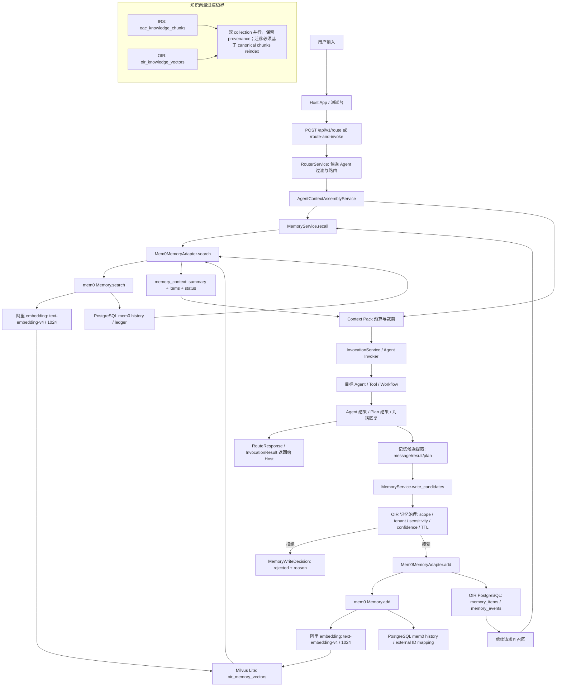

## Context

`add-agent-context-memory-knowledge` 已经完成 Agent context、`memory_context`、`MemoryService`、mem0 adapter 边界、database-backed repository 和 debug API 的基础实现，但测试报告明确保留了三个条件项：真实 PostgreSQL 实例冒烟、真实 mem0 服务集成、真实 Milvus 向量检索闭环。

当前 `Mem0MemoryAdapter` 仍偏向占位实现：可从 `mem0_config_json` 初始化 `Memory.from_config()`，但失败时会 fallback 到 repository；`add()` 失败会静默继续写 OIR repository。这对本地开发友好，但会让生产或验收环境误以为 mem0 已接入成功。

IRS 本地 PostgreSQL 已有 `oac` 数据库和知识库表，Milvus 规划使用 `oac_knowledge_chunks`。OIR 最终要替代 IRS，因此本 change 复用 PostgreSQL 基础设施，但保持数据域隔离：mem0 记忆向量写入 `oir_memory_vectors`，知识侧先保留 `oac_knowledge_chunks` 与 `oir_knowledge_vectors` 双 collection 过渡。

本地 Milvus 统一使用 Milvus Lite，不再为本 change 要求 standalone Milvus 服务。mem0 history 接入 PostgreSQL：如果当前 mem0 Python SDK 没有直接 PostgreSQL history 配置，OIR 仍必须通过 adapter/history ledger 层把 mem0 add/search/update/delete、外部 ID 映射和治理事件写入 PostgreSQL，避免把 SDK 默认 SQLite history 当成长期事实来源。embedding 沿用 IRS 的阿里 embedding 配置，即 DashScope/OpenAI-compatible endpoint、`text-embedding-v4` 和 1024 维默认值。

Context7 当前 mem0 文档确认：Python OSS 使用 `Memory.from_config(config)` 初始化；Milvus vector store 配置包含 `collection_name`、`embedding_model_dims`、`url`、`token`、`db_name`；写入可使用 `m.add(messages, user_id=..., metadata=...)`，搜索可使用 query + filters。Context7 当前未显示 Python SDK 直接 PostgreSQL history 参数，文档中的 `history_db_path` 仍是 SQLite path，因此 PostgreSQL history 需要在实现时优先验证 SDK 扩展点；若没有直接支持，则由 OIR 自有 PostgreSQL history/ledger 实现。

## Goals / Non-Goals

**Goals:**

- 完成 OIR 真实 mem0 记忆闭环：写入候选、治理决策、mem0 add、OIR 审计、mem0 search、`memory_context` 注入。
- 使用独立 `oir_memory_vectors` collection 保存 mem0 记忆向量，避免与知识向量或 IRS collection 混用。
- 本地 Milvus 固定使用 Milvus Lite，并以文件型 URI 支持可重复开发和验收。
- 接入 PostgreSQL history，确保 mem0 交互历史、外部 ID 映射和治理事件不依赖本地 SQLite history 作为事实来源。
- 沿用 IRS 阿里 embedding 配置，默认使用 `text-embedding-v4` 和 1024 维 embedding。
- 将 mem0 配置从单一 JSON 扩展为可审计、可文档化的 Settings 字段，同时保留 JSON override 能力。
- 明确 mem0 故障策略：本地开发可 fallback，生产/验收必须显式失败、记录错误并暴露健康状态。
- 复用本地 PostgreSQL 基础设施，并统一使用 Milvus Lite 承接本地向量索引；PostgreSQL 表、Milvus collection、ID 命名和迁移状态必须有边界。
- 为 `oac_knowledge_chunks` 与 `oir_knowledge_vectors` 的双 collection 过渡建立可迁移性约束。
- 更新中文文档和可选真实基础设施验收步骤。

**Non-Goals:**

- 不实现完整知识库迁移，不把 `oac_knowledge_chunks` 全量搬到 `oir_knowledge_vectors`。
- 不替换现有 `memory_context`、Agent Definition context 或 Context Pack 合约。
- 不让目标 Agent 直接调用 mem0 或 Milvus。
- 不在普通聊天 UI 中增加逐条记忆确认提示。
- 不把 IRS 业务表结构或业务字段写入 OIR 核心 schema。

## Decisions

### Decision 1: OIR 继续拥有记忆治理事实，mem0 只做策略引擎

OIR 的 `memory_items` 和 `memory_events` 继续保存已接受记忆、TTL、scope、subject、user、tenant、agent、confidence、importance、policy decision 和审计事件。mem0 负责 extraction、semantic search、merge/update 和向量索引。

这样做的原因是：mem0 可以提供成熟记忆能力，但 OIR 必须对权限、可见性、TTL、脱敏、debug 和 Host 可控性负责。下游 Agent 仍只看到稳定的 `memory_context`。

Alternative considered: 只依赖 mem0 自身存储。这个方案实现更快，但会削弱 OIR 的租户治理、审计和未来替代 IRS 时的数据可解释性。

### Decision 2: 本地 Milvus 使用 Milvus Lite，且记忆向量 collection 与知识向量 collection 严格分离

本 change 使用：

- `oir_memory_vectors`: mem0/OIR 记忆向量。
- `oac_knowledge_chunks`: IRS 现有知识向量，迁移期保留。
- `oir_knowledge_vectors`: OIR 后续知识向量目标 collection，暂不要求本 change 写入。

本地 Milvus 统一使用 Milvus Lite，例如使用 `.data/oir_memory_milvus.db` 作为 memory vector store URI。记忆是可变主体状态，知识是有来源、引用和权限的证据。两者 TTL、权限、过滤字段、召回解释和删除语义不同，不能为了复用基础设施而共享一个 collection。

Alternative considered: 使用 standalone Milvus 作为本地标准，或用单一 collection 加 metadata 区分 memory/knowledge。前者增加本地启动成本，后者会让过滤、迁移、删除和审计边界变脆。

### Decision 3: mem0 配置支持显式字段和 JSON override

新增或完善配置字段应覆盖：

- `MEMORY_STRATEGY_PROVIDER=mem0`
- `MEMORY_MEM0_FAIL_CLOSED`
- `MEMORY_MEM0_VECTOR_PROVIDER=milvus`
- `MEMORY_MEM0_MILVUS_COLLECTION=oir_memory_vectors`
- `MEMORY_MEM0_MILVUS_URI=.data/oir_memory_milvus.db`
- `MEMORY_MEM0_MILVUS_TOKEN`
- `MEMORY_MEM0_MILVUS_DB_NAME`
- `MEMORY_MEM0_HISTORY_BACKEND=postgresql`
- `MEMORY_MEM0_HISTORY_DATABASE_URL`，默认复用 OIR `DATABASE_URL` 或独立 schema/table
- `MEMORY_MEM0_EMBEDDING_BASE_URL`，默认沿用 IRS `KNOWLEDGE_EMBEDDING_BASE_URL`
- `MEMORY_MEM0_EMBEDDING_API_KEY`
- `MEMORY_MEM0_EMBEDDING_MODEL=text-embedding-v4`
- `MEMORY_MEM0_EMBEDDING_DIMS=1024`
- `MEMORY_MEM0_LLM_PROVIDER` / `MEMORY_MEM0_LLM_MODEL`
- `MEMORY_MEM0_EMBEDDER_PROVIDER` / `MEMORY_MEM0_EMBEDDER_MODEL`
- `MEM0_CONFIG_JSON` 作为高级覆盖。

默认 `.env.example` 只放占位值，不提交真实 key。构造 mem0 config 时，显式字段生成默认安全配置；`MEM0_CONFIG_JSON` 存在时可覆盖，用于高级部署。

Alternative considered: 只保留 `mem0_config_json`。这个方案灵活但不可发现、不可校验，也不利于中文文档和验收。

### Decision 4: mem0 history 接入 PostgreSQL，不把 SQLite history 作为事实来源

OIR 必须在 PostgreSQL 中保存 mem0 记忆操作 history/ledger，至少覆盖 operation、OIR memory ID、mem0 memory ID、user、tenant、subject、agent、scope、collection、embedding model、request metadata、status、error 和 timestamp。

如果实现时确认当前 mem0 Python SDK 已支持 PostgreSQL history backend，则优先使用 SDK 的 PostgreSQL history 配置，并同步必要索引到 OIR ledger。如果 SDK 仍只支持 `history_db_path` SQLite，则 OIR adapter 禁止把 SQLite history 当作 canonical truth，只把它视作 SDK 内部临时实现，并以 PostgreSQL ledger 为验收依据。

Alternative considered: 继续使用 mem0 默认 SQLite history。这个方案实现轻，但与复用本地 PostgreSQL、后续替代 IRS 和生产可观测目标冲突。

### Decision 5: 失败策略区分 local fallback 与 production fail-closed

本地开发默认可 fallback 到 repository，并在 debug metadata、日志和 runtime config 中标记 `mem0_status=degraded`。当 `MEMORY_MEM0_FAIL_CLOSED=true` 或 `APP_ENV != local` 时，mem0 初始化、add、search 失败必须返回结构化错误，不得静默写入成功。

这样可以同时满足本地易用和验收可信。测试报告中的 RISK-ACMK-006 必须通过这个 change 关闭。

Alternative considered: 永远 fallback。这个方案减少中断，但会继续掩盖生产配置失败。

### Decision 6: add/search 需要做双侧 ID 和 metadata 映射

OIR 写入 mem0 时必须携带 `memory_id`、`scope`、`subject_type`、`subject_id`、`tenant_id`、`agent_id`、`visibility`、`source`、`ttl_expires_at` 等 metadata。mem0 返回结果时，adapter 必须映射回 `MemoryItem` 或 `MemoryContextItem` 所需字段，并记录原始 mem0 ID。

当 mem0 生成的 ID 与 OIR `memory_id` 不同时，OIR metadata 中保留 `mem0_memory_id`；删除和清理时优先使用该映射删除 mem0 侧记录。

Alternative considered: 直接使用 mem0 ID 作为 OIR 主键。这个方案简单，但会让已有 OIR repository、debug API 和 TTL 清理更难保持向后兼容。

### Decision 7: 知识双 collection 只建立迁移护栏，不阻塞 mem0

本 change 不实现 `oac_knowledge_chunks` 到 `oir_knowledge_vectors` 的实际迁移，但必须写清以下约束：

- Milvus 是派生索引，PostgreSQL canonical knowledge asset/chunk 才是可迁移事实。
- 两个 collection 不能混查后合并为一个未标注结果集；结果必须保留 collection/source/citation。
- 如果 embedding 模型、维度、chunk 策略或 schema 不一致，必须 reindex，不得复制向量冒充迁移。
- OIR 后续迁移应有 mapping 表或 manifest，记录 old asset/chunk/index 与 new asset/chunk/index 的关系。

Alternative considered: 现在就实现知识迁移。这个会扩大范围，抢走 mem0 记忆闭环的主线。

## End-to-End Flow

## Risks / Trade-offs

- [Risk] mem0 Python SDK 返回结构在版本间变化。 -> Mitigation: adapter 做兼容解析，并用 fake client 和真实 smoke test 分层验证。
- [Risk] mem0 add 成功但 OIR repository 写入失败，或反向失败。 -> Mitigation: 先执行 OIR policy，写入时记录 pending/failed 事件；失败必须可见，支持重试或清理。
- [Risk] Milvus Lite 文件、collection 或维度不匹配。 -> Mitigation: 启动时/健康检查中验证 Milvus Lite URI、collection、dimension、provider config；验收 smoke test 覆盖文件不可写、collection 缺失和维度错误。
- [Risk] mem0 Python SDK 不直接支持 PostgreSQL history。 -> Mitigation: OIR adapter/history ledger 在 PostgreSQL 中保存 canonical history，并把 SDK SQLite history 限定为内部临时实现。
- [Risk] 阿里 embedding 与 mem0 embedder provider 兼容性不足。 -> Mitigation: 优先使用 OpenAI-compatible provider 配置；若 SDK 不支持 base URL 或返回格式，则实现 OIR embedder adapter 或把不兼容作为验收阻塞项。
- [Risk] local fallback 被误用于生产。 -> Mitigation: `fail_closed` 随环境默认收紧，runtime/debug 输出明确显示 provider、fallback、degraded 状态。
- [Risk] `oac_knowledge_chunks` 和 `oir_knowledge_vectors` 语义漂移。 -> Mitigation: 双 collection 过渡必须带迁移 manifest 和 reindex 判定规则；不得把向量 collection 当 canonical truth。

## Migration Plan

1. 增加 mem0 显式配置字段和 `.env.example` 中文说明，默认仍保持本地可运行。
2. 增加 mem0 client factory，使 adapter 可注入 fake client，真实配置由 Settings 生成。
3. 改造 `Mem0MemoryAdapter.search/add/delete_many` 的 ID、metadata、错误处理和失败策略。
4. 增加 memory debug/runtime metadata，显示 mem0 provider、collection、degraded/fail-closed 状态。
5. 增加单元测试与 fake mem0 集成测试，覆盖 add/search/delete、metadata filters、fallback 与 fail-closed。
6. 增加可选真实基础设施 smoke test 文档或脚本，验证 PostgreSQL + mem0 + Milvus Lite + 阿里 embedding 最小闭环。
7. 文档化 `oac_knowledge_chunks` 与 `oir_knowledge_vectors` 双 collection 过渡约束。

Rollback strategy: 将 `MEMORY_STRATEGY_PROVIDER` 切回 `memory` 即可恢复 repository-only 行为；OIR `memory_items` 和 `memory_events` 保持可读。已写入 mem0 的记录可按 `mem0_memory_id` 或 metadata 执行清理。

## Open Questions

- mem0 Python SDK 当前版本是否存在可直接替换 history backend 的扩展点；若没有，实现必须使用 OIR PostgreSQL history/ledger 作为 canonical。
- mem0 OpenAI-compatible embedder 对阿里 DashScope compatible-mode 的参数名是否完全兼容；若不兼容，需要实现 OIR embedder adapter。
